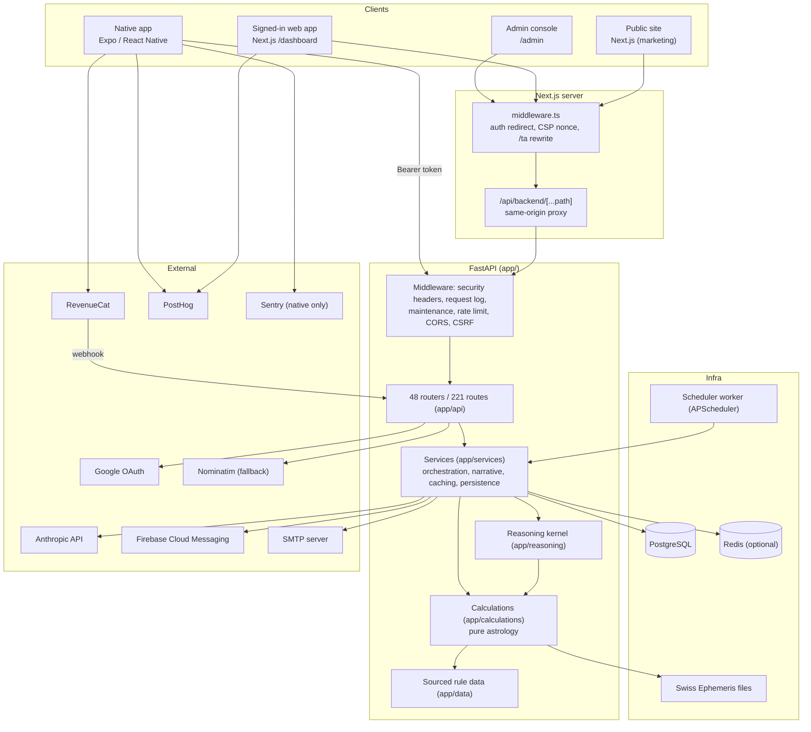
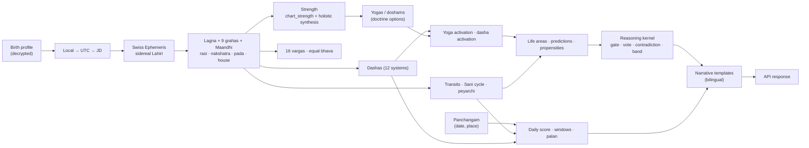
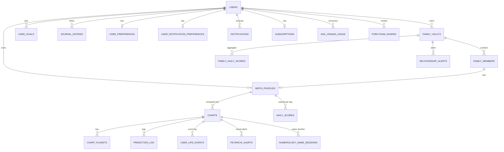
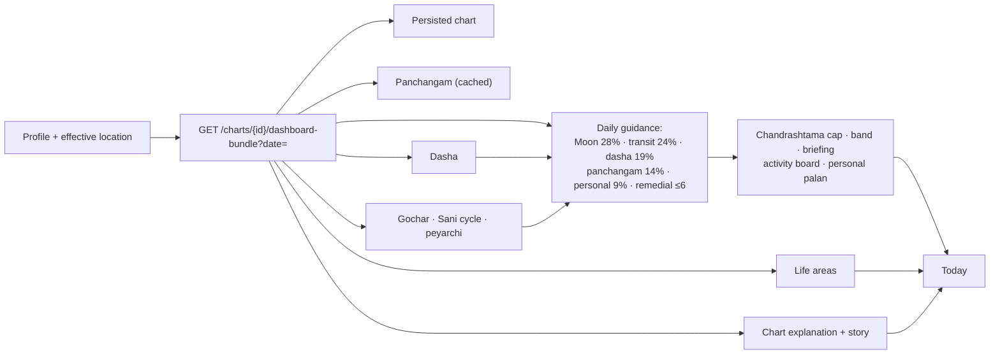
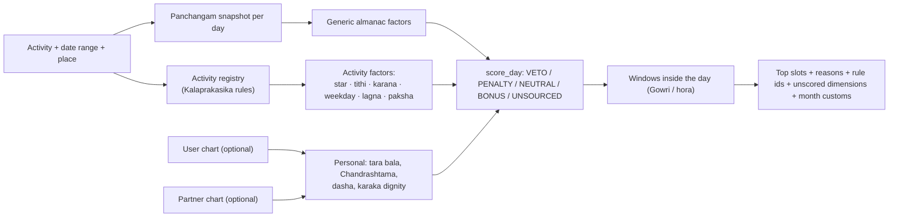
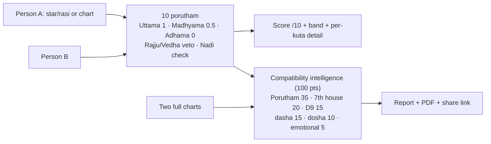
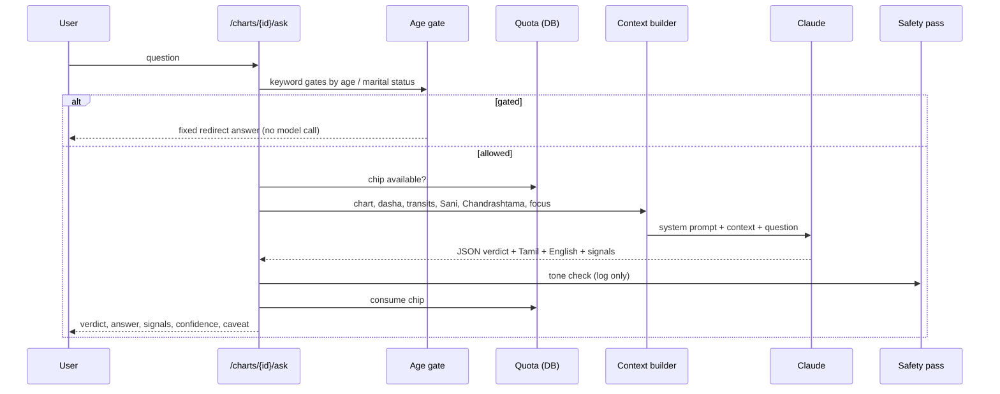

# Vinaadi — Product & Technical Capability Documentation

**As-built audit of the whole repository** · 2026-10-06 · branch `harden/production-readiness` · commit `8913117`
**Repo:** `D:\sanstro` (internal package name `jothidam-ai`; brand **Vinaadi**)

This is the current product and technical source of truth: what Vinaadi can do, where each
capability appears, how it is computed, how the parts connect, and what is missing or broken.
It was reverse-engineered from code. Where an older document or a code comment disagrees with
the code, the code wins and the discrepancy is named.

It supersedes, for orientation, the two August references
(`VINAADI_DASHBOARD_SYSTEM_REFERENCE_2026-08-25.md`,
`VINAADI_MARKETING_SITE_SYSTEM_REFERENCE_2026-08-25.md`). Those remain useful for depth, but
several of their statements are now stale (see §41.4).

---

## How to read this document

| If you are a… | Read first |
|---|---|
| Product owner / BA | §1–§4, then the domain chapters §7–§23, then §38–§42 |
| UX designer | §5, §6, §36, §34, §35, §40 |
| Frontend engineer | §5, §6, §26, §37, §41 |
| Backend engineer | §27, §28, §29, §32, §41 |
| Architect | §24–§33, §41 |
| QA engineer | §4, §35, §36, §37, §38, appendix §43 |

### Status labels used throughout

| Label | Meaning |
|---|---|
| **LIVE** | Implemented, wired end to end, reachable by a user in the UI |
| **HIDDEN** | Implemented and working, but no UI reaches it (API-only, or a screen with no inbound navigation) |
| **PARTIAL** | Some layers exist, but the end-to-end capability is incomplete or degraded |
| **INTERNAL** | Supports other features; never shown to a user directly |
| **LEGACY / DEAD** | Present in the repo but disconnected, superseded, or never populated |
| **PLANNED** | Named as future work in code or docs. Never counted as a feature |

"Desktop" means the web app at desktop width. "Mobile" means **two different things** in this
repo and the document always says which: the **native app** (`mobile/`, Expo / React Native) and
the **responsive web app** at phone width. They are different products with different feature sets.

### What this audit could not see

Stated so nobody inherits a tick that was never checked:

- **No running app was exercised.** Every claim comes from reading source, route tables and
  call graphs. Nothing here was clicked in a browser or on a device.
- **No production data or analytics.** Usage, traffic and error rates are unknown.
- **Copy quality was not judged.** Much Tamil copy is marked "pending native review" in the code
  itself; this document reports that status, it does not assess the Tamil.
- **Doctrine correctness was not judged.** Whether a rule is astrologically right belongs to the
  rulebook and the practitioner sign-off documents. This document describes what the code does.
- Consumer mapping (which UI calls which endpoint) was done by static search of path strings and
  wrapper names (§43.2). A path built dynamically from parts could be missed; spot checks found none.

---

## 1. Executive summary

**Vinaadi is a Tamil-first, bilingual (Tamil / English) Vedic astrology product in the Tamil
Thirukanitham (drik, true-position) tradition.** A person enters birth details once; Vinaadi
computes a full sidereal birth chart from the Swiss Ephemeris and then answers, every day, the
questions people take to an astrologer: what today is like for me, when to do something, whether
a match is good, what my running dasha means, what my chart promises in each part of life, and
what remedies apply. It serves the user and their family from one account.

**Three client surfaces share one FastAPI backend:**

| Surface | Stack | Scale | Role |
|---|---|---|---|
| Public website | Next.js 15 `(marketing)` route group | 121 pages (+ `/ta/…` Tamil twins) | SEO acquisition: free tools, encyclopedia, almanac pages |
| Signed-in web app | Next.js 15 `/dashboard` workspace | 11 tab destinations, 11 tools | The full daily product. The most complete surface |
| Native app | Expo 54 / React Native 0.81 | 5 bottom tabs, ~65 screen files | Companion app; a subset of the web product plus mobile-only features |
| Backend | FastAPI + PostgreSQL + Swiss Ephemeris | 221 HTTP routes in 48 routers; 74 calculation modules; 100 services | All astrology is computed here, deterministically |

**What it does particularly well**

- **Deterministic, explained astrology.** Every number a user sees comes from rule code, not an
  LLM. Most outputs ship with their reasons: dosham cards say *where the count starts, what
  formed it, what softened it and what remains*; muhurta factors carry a rule ID that leads back
  to a page of Kalaprakasika; Porutham shows each of the ten kutas with its grade.
- **Doctrine governance.** Open doctrine questions are switches with recorded defaults
  (`doctrine_options.py`, 30+ `doctrine_*` flags), rulings are dated, and a per-yoga rule registry
  (`yoga_rules.py`) gives each of its 42 yoga definitions its own auditable row.
- **Breadth.** Birth chart with 16 divisional charts, 12 dasha systems, 20+ yoga families, 8 dosham
  types, 41 life-propensity signatures, a panchangam with intra-day transitions, a 37-activity
  muhurta engine, 10-porutham matching, a full Chaldean numerology suite, family vaults, and an
  LLM assistant grounded in the user's chart.

**What is missing or at risk (top items; full list §38–§41)**

1. **Paid tiers are not enforced on the server.** Only five caps are checked server-side (birth
   profiles, family members, goals, Ask Vinaadi quota, report purchase). Premium-only features
   (Varshaphala, Vargas, Synastry, Retrospective, Remedies, Life-event log, Rectification) are gated
   only in the *native app's* UI; the web app and the API serve them to everyone. The open beta
   (`open_beta = true`) currently hides this. Ending the beta without server gates would give
   premium away on web.
2. **No working payment path outside the native app.** Web has no checkout. "Buy" on
   `/dashboard/reports` calls an endpoint that returns a random reference and stores nothing; the
   page has no inbound links. Ads are placeholder boxes.
3. **Baby Name Finder returns 503 in production** by design: its pada-akshara table is draft
   (0/108 rows verified), and the engine refuses to serve unverified canon outside dev.
4. **Native-app gaps against web:** no numerology, no Life-Area predictions, no "Chances &
   Cautions", no What-if, no compatibility intelligence, no muhurta beyond a basic picker, no
   personal palan. Two native screens (`/chandrashtama`, `/shadbala`) cannot be reached.
5. **Operational blind spots:** no error monitoring on backend or web (Sentry is mobile-only);
   runtime feature-flag overrides live in process memory; mobile CI does not run the Jest suite.

---

## 2. What Vinaadi is

### 2.1 Product thesis (as expressed by the code)

- **A daily habit, not a one-off report.** The default screen is *Today*. A streak counter,
  morning push notifications, a journal and a day-by-day calendar all exist to bring the user back.
- **A verdict without its reason is worthless.** A whole package (`app/reasoning/`) exists so prose
  agrees with numbers: a *promise gate* (does the birth chart allow this at all?), a *timing vote*
  (is now the time?), a *contradiction classifier* (promised but not now / active but not
  promised), ordinal bands instead of percentages, and a calibration log.
- **Tamil almanac register.** Tamil is the default language; one language is shown at a time (no
  bilingual echo — an owner ruling); Tamil almanac names win over Sanskrit ones.
- **The astrologer is the authority.** Rules carry provenance and markers (`CLASSICAL`,
  `TRADITION`, `PRODUCT`, `VARIANT`, `LIMIT`), and Vinaadi-invented weights are labelled as such.

### 2.2 Who it serves

- **Primary:** a Tamil-speaking adult (Tamil Nadu or diaspora) who uses jothidam as a decision
  input and wants the calculation right and the reasoning shown.
- **Secondary:** the same person acting for their family — matching a son's or daughter's horoscope,
  picking a muhurtham, naming a baby, watching a parent's Sani period.
- **Tertiary:** anonymous visitors to the public tools and encyclopedia (acquisition funnel).

### 2.3 Launch state (verified in code)

- **Open beta is on** (`app/core/config.py: open_beta = True`; mirrored by
  `packages/shared/src/constants/launch.ts: OPEN_BETA = true`, held equal by
  `tests/test_launch_parity.py`). While on, every signed-in account gets premium limits except Ask
  Vinaadi, which keeps a daily fair-use cap (`OPEN_BETA_LIMITS` in `app/core/tier_limits.py`).
- **No Google Play listing yet** (`PLAY_STORE_URL = null`).
- Interactive API docs are disabled in production (`app/main.py`).

---

## 3. Product capability map

Generated from the code, not from a template.

```
Vinaadi
├── Identity & access
│   ├── Email/password accounts (web cookie session; native bearer + refresh tokens)
│   ├── Google sign-in (optional, self-describing)
│   ├── Password reset by email · consent record (DPDP) · account deletion
│   ├── Admin access by email allow-list + short-lived elevation
│   └── Guest mode (public tools; native-app rasi-only guest flow)
├── Profiles & family
│   ├── Birth profiles (self + others; encrypted at rest)
│   ├── Current-location vs birth-location for daily timings
│   ├── Family vault (members, relationships, weights)
│   ├── Family "today" (per-member day), composite timeline, harmony remedies
│   └── Birth-time rectification (heuristic, event-based)
├── Horoscope (Jadhagam)
│   ├── Birth chart: lagna, 9 grahas + Maandhi, rasi/nakshatra/pada, houses
│   ├── Rasi (D1) + Navamsa (D9) charts, 14 more vargas (D2…D60)
│   ├── Planet strength (product score + classical Shadbala) · Ashtakavarga
│   ├── House lords (adhipathi) · Bhava palan (per-house verdict)
│   ├── Birth conditions (cazimi, sankranti, eclipse, gandanta…) · lagna-edge notes
│   ├── Chart explanation (10-section "Astrologer view") · Story view (5 chapters)
│   ├── Readings: short (≈2 min) / long (≈4 min)
│   └── Jadhagam PDF (summary or astrologer detail) · Jadhagam report
├── Yogas  (42 rule rows, 20+ families; strength, cancellation, activation, reach, effects)
├── Doshams (Sevvai, Rahu–Ketu, Kala Sarpa, Pitru, Kalathra, Putra Sarpa, Badhaka,
│            Marana Karaka Sthana; counted-from, residual, context, remedies)
├── Dasha  (Vimshottari + Ashtottari, Yogini, Kalachakra, Jaimini Chara, 7 conditional dashas;
│           transition alerts; Varshaphala / solar return)
├── Transits (gochar, Sade Sati phases, Ashtama/Ardhashtama/Kandaka Sani, peyarchi alerts,
│             Guru/Sani gochara grade, double transit)
├── Daily guidance
│   ├── Daily score (6 components) + label + confidence band + briefing
│   ├── Best/caution windows, hora, emotional weather, activity board
│   ├── Personal palan (Chandra gochara + tara bala + Chandrashtama)
│   ├── Panchangam (daily / monthly / Tamil months / festivals / events)
│   └── Rasi palan (public, by Moon sign)
├── Life areas
│   ├── 7 area scores + forward horizons · promise gate + timing vote
│   ├── Predictions: marriage, career, wealth, health
│   ├── Chances & Cautions (41 propensity signatures)
│   ├── Event windows (3–5 yr) · life-event log · what-if · decision brief · retrospective
│   └── Remedies: remedy plan, gemstone advice, family harmony remedies
├── Muhurtham (37 activities: 30 sourced to Kalaprakasika + 7 generic; personal & couple mode;
│             curated muhurtham-naal list with personal matching)
├── Compatibility (10 porutham · synastry · 8-layer compatibility intelligence ·
│                  friendship · public share links · PDFs)
├── Numerology (Chaldean profile, Fortune Alignment, personal year/month/day, name correction,
│               saved name sessions, object numbers, baby names [prod-blocked])
├── Prasna (horary) · Annual Wrapped · Goals · Journal · Streaks
├── AI assistant — Ask Vinaadi (Claude, chart-grounded, quota-limited)
├── Sharing & export (PNG cards, Web Share, WhatsApp links, PDFs, print, porutham share links,
│                    embeddable panchangam widget, native home-screen widget)
├── Notifications (morning alert, dasha transition, Pirantha Naal, peyarchi email,
│                  in-app inbox, web push, native local Kalam reminders)
├── Monetisation (tiers, open beta, RevenueCat on native, PPU catalogue [not live], ads [placeholder])
├── Settings & localisation (Tamil/English, /ta URLs, theme, complexity mode, life focus)
├── Public website (tools, 27 nakshatra pages, dosham/yogam/pariharam/temples encyclopedias,
│                   Tamil calendar, muhurtham-naal by year, learn articles)
└── Admin & internal (admin console, flags, jobs, audit log, calibration, QA golden runner)
```

---

## 4. Master functionality table

ID prefixes: **ACC** account · **PRO** profiles/family · **AST** horoscope · **YOG** yoga ·
**DOS** dosham · **DAS** dasha · **TRN** transit · **DAY** daily · **LIF** life areas ·
**MUH** muhurtham · **CMP** compatibility · **NUM** numerology · **AI** assistant · **SHR** sharing ·
**NOT** notifications · **MON** monetisation · **SET** settings · **PUB** public site · **ADM** admin.

"Desktop" = web app at desktop width. "Mobile" = **native app** (responsive web is §6.6).
"Explain" = does the user see *why* (Y full / P partial / N none).

| ID | Domain | Feature | User capability | Desktop | Mobile (native) | Status | Main engine / service | Explain |
|---|---|---|---|---|---|---|---|---|
| ACC-01 | Account | Email sign-up / login | Create account, sign in | Yes | Yes | LIVE | `api/auth.py`, `api/mobile_auth.py` | — |
| ACC-02 | Account | Google sign-in | Sign in with Google when configured | Yes | No | LIVE (config-dependent) | `api/auth.py` OAuth | — |
| ACC-03 | Account | Password reset | Email link → new password | Yes | Yes | LIVE (needs SMTP) | `email_service.py` | — |
| ACC-04 | Account | Delete account | Delete own account | Yes | Yes | LIVE | `DELETE /auth/me` | — |
| ACC-05 | Account | Consent record (DPDP) | Explicit unticked checkbox at sign-up; re-consent when the policy version changes | Yes | Yes | LIVE | `POST /auth/register` (`consentGiven`), `POST /auth/consent`, `core/privacy_policy.py` | — |
| PRO-01 | Profiles | Birth profile CRUD | Save self/others' birth details | Yes | Yes (create; manager screen) | LIVE | `birth_profile_service.py` | — |
| PRO-02 | Profiles | Current location | Timings for where you are now | Yes (location strip) | Yes (device location) | LIVE | `location_service.py` | Y |
| PRO-03 | Family | Family vault + members | Add spouse/children/parents | Yes | Yes | LIVE | `family_vault_service.py` | — |
| PRO-04 | Family | Family today / composite | Per-member day & family timeline | Yes | Yes (today only) | LIVE | `family_vault_service.py` | P |
| PRO-05 | Family | Family harmony remedies | One remedy list across all charts | Yes | No | LIVE | `family_harmony_remedies.py` | Y |
| PRO-06 | Family | Reading switcher | Same reading section, another member | Yes | No | LIVE | `family-reading-switcher.tsx` | — |
| PRO-07 | Profiles | Birth-time rectification | Estimate time from life events | Yes (setup) | Yes | LIVE (premium on native) | `rectification_service.py` | P |
| AST-01 | Horoscope | Birth chart calculation | Generate personal Jadhagam | Yes | Yes | LIVE | `_chart_build.py`, `ephemeris.py` | Y |
| AST-02 | Horoscope | Rasi + Navamsa charts | South-Indian D1/D9 grids | Yes | Yes | LIVE | `dashboard-charts.tsx`, `JadhagamChart.tsx` | — |
| AST-03 | Horoscope | Divisional charts (vargas) | D2–D60 | Yes | Yes (premium-gated) | LIVE | `divisional_charts.py` | P |
| AST-04 | Horoscope | Planet strength | Strength score + term breakdown | Yes | Partial | LIVE | `chart_strength.py` | Y |
| AST-05 | Horoscope | Classical Shadbala | Six-fold strength in rupas | Yes | Screen exists, unreachable | LIVE web / HIDDEN native | `shadbala.py` | Y |
| AST-06 | Horoscope | House lords + bhava palan | Per-house verdict, why, conduct | Yes | No | LIVE | `house_lords.py`, `bhava_palan.py` | Y |
| AST-07 | Horoscope | Chart explanation (Astrologer view) | 10-section reading of the chart | Yes | Partial (`reading/[id]`) | LIVE | `chart_explanation_service.py` | Y |
| AST-08 | Horoscope | Story view | 5-chapter plain reading | Yes | Yes | LIVE | `reading_story.py` + web selectors | Y |
| AST-09 | Horoscope | Short/long reading | ≈2-min / ≈4-min narrative | Yes | No | LIVE (flags on) | `one_minute_reading_service.py`, `five_minute_reading_service.py` | Y |
| AST-10 | Horoscope | Jadhagam PDF | Download summary / astrologer PDF | Yes | Yes | LIVE | `pdf_export_service.py` | — |
| AST-11 | Horoscope | Birth conditions & lagna edge | Border alerts, uncertain lagna | Yes | Partial | LIVE | `birth_conditions.py`, `lagna_edge.py` | Y |
| AST-12 | Horoscope | Public Jadhagam generator | Chart for any details, no account | Yes | Yes (tool) | LIVE | `POST /public/chart[-preview]` | P |
| YOG-01 | Yoga | Yoga detection | 42 rule rows, 20+ families | Yes | Yes | LIVE | `_yoga_detect.py`, `yoga_rules.py` | Y |
| YOG-02 | Yoga | Yoga activation by dasha | "Running now" vs dormant | Yes | Yes | LIVE | `yoga_activation.py` | P |
| YOG-03 | Yoga | Top yogas / lasting gifts | Ranked top lists | Yes | Yes | LIVE | `reading_story.py` (O-25 reach) | P |
| DOS-01 | Dosham | Dosham detection + reckoning | 8 types, counted-from, residual | Yes | Yes | LIVE | `_yoga_dosham.py` | Y |
| DOS-02 | Dosham | Dosham verdict line (L2) | One-sentence summary under chips | Yes | Yes (reading) | LIVE | `packages/shared/src/doshamReckoning.ts` | Y |
| DOS-03 | Dosham | Dosham remedies | Remedies per dosham | Yes | Yes | LIVE | `remedies.py`, web `getDoshamRemedies` | P |
| DAS-01 | Dasha | Vimshottari timeline | Maha/antar/pratyantar | Yes | Yes | LIVE | `dasha.py`, `dasha_service.py` | P |
| DAS-02 | Dasha | Secondary dashas | Ashtottari, Yogini, Kalachakra, Chara | Yes | Yes (not conditional) | LIVE | `*_dasha.py` | P |
| DAS-03 | Dasha | Conditional dashas (7) | Applicability + timelines | Yes | No | LIVE | `conditional_dashas.py` | Y |
| DAS-04 | Dasha | Varshaphala / solar return | Annual Tajaka chart | Yes | Yes (premium-gated) | LIVE | `tajaka.py` | P |
| DAS-05 | Dasha | Dasha transition alerts | 90/30/7/0-day alerts | Via push | Via push | LIVE (needs channel) | `dasha_transition_service.py` | P |
| TRN-01 | Transit | Current gochar | Planets from Moon/Lagna | Yes | Yes | LIVE | `transit_service.py` | Y |
| TRN-02 | Transit | Sani cycle | Sade Sati phase, Ashtama, Kandaka | Yes | Yes | LIVE | `transits.py`, `sade_sati.py` | Y |
| TRN-03 | Transit | Peyarchi (sign changes) | Upcoming Guru/Sani/Rahu/Ketu moves | Yes | Yes | LIVE | `peyarchi_service.py` | Y |
| TRN-04 | Transit | Peyarchi email alerts | 30/7/1/0-day emails | Email | Email | LIVE (needs SMTP) | `peyarchi_alert_service.py` | P |
| DAY-01 | Daily | Daily score & guidance | Score/100, label, reasons, windows | Yes | Yes | LIVE | `daily_guidance_service.py` | Y |
| DAY-02 | Daily | Personal palan | "Today by your chart" per area | Yes | No | LIVE (draft copy) | `personal_palan.py` | Y |
| DAY-03 | Daily | Activity board | What today supports, by activity | Yes | No | LIVE | `activity_timing_rules.py` | Y |
| DAY-04 | Daily | Panchangam (daily) | Full almanac for any date/place | Yes | Yes | LIVE | `panchangam.py` | P |
| DAY-05 | Daily | Monthly calendar | Month grid, categories, day drawer | Yes | Yes | LIVE | `panchangam_service.py` | P |
| DAY-06 | Daily | Rasi palan | Day's forecast by Moon sign | Yes (tool) | Yes (Today) | LIVE | `public_tools.py` | P |
| DAY-07 | Daily | Week ahead | Best day, Chandrashtama days | Yes | No | LIVE | `daily_guidance_service.py` | P |
| DAY-08 | Daily | Activity timing tool | Best dates for an activity | Yes | No | LIVE | `GET /activity-timing` | Y |
| DAY-09 | Daily | Ambient alerts | Significant transits in hero | Yes | No | LIVE | `ambient_alerts_service.py` | P |
| LIF-01 | Life areas | 7 area scores | Score, band, tier, factors | Yes | Yes (list) | LIVE | `life_areas_service.py` | Y |
| LIF-02 | Life areas | Predictions | Marriage/career/wealth/health | Yes | No | LIVE | `marriage_service.py` etc. | Y |
| LIF-03 | Life areas | Chances & Cautions | 41 propensity cards | Yes | No | LIVE | `propensities.py` | Y |
| LIF-04 | Life areas | Event windows | Marriage/career/finance windows | Yes | No | LIVE | `event_windows.py` | Y |
| LIF-05 | Life areas | Life-event windows (3–5 yr) | Career/marriage/study/relocation/health | Yes | Yes | LIVE | `life_event_service.py` | P |
| LIF-06 | Life areas | Life-event log | Log real events; retro correlation | Yes | Yes (premium-gated) | LIVE | `life_event_log_service.py` | P |
| LIF-07 | Life areas | What-if simulator | Triple-confirmation on a scenario | Yes | No | LIVE | `whatif_service.py` | Y |
| LIF-08 | Life areas | Decision brief | Compare options for a decision | Yes | Yes (in muhurta) | LIVE | `decisions_service.py` | Y |
| LIF-09 | Life areas | Retrospective | Read a past event against chart | Yes | Yes (premium-gated) | LIVE | `retrospective_service.py` | P |
| LIF-10 | Life areas | Remedy plan | Area/planet remedies, disclaimers | Yes | Yes (Pariharam) | LIVE | `remedies.py` | P |
| LIF-11 | Life areas | Gemstone advice | Gemstone guidance | Yes | No | LIVE | `GET /gemstone-advice` | P |
| LIF-12 | Goals | Goals | Declare a goal; shapes guidance | Yes | Yes | LIVE | `goals_service.py` | — |
| LIF-13 | Goals | Life focus (life mode) | Declare current focus | Yes | Yes | LIVE | `core/life_mode.py` | — |
| MUH-01 | Muhurtham | Muhurta finder | Top windows for 37 activities | Yes | Yes (basic) | LIVE | `muhurta_engine.py`, `muhurta_service.py` | Y |
| MUH-02 | Muhurtham | Couple mode | Wedding date for two charts | Yes | No | LIVE | `muhurta_engine.py` co-subject | Y |
| MUH-03 | Muhurtham | Muhurtham naal | Curated list + personal match | Yes | Yes | LIVE | `muhurtham_naal_service.py` | Y |
| CMP-01 | Compatibility | 10 Porutham | Match two stars/charts | Yes | Yes | LIVE | `porutham.py` | Y |
| CMP-02 | Compatibility | Compatibility intelligence | 8-layer 100-pt report + PDF | Yes | No | LIVE | `compatibility_intelligence.py` | Y |
| CMP-03 | Compatibility | Synastry (family) | Member-to-member reading | Yes | Yes (premium-gated) | LIVE | `synastry_service.py` | P |
| CMP-04 | Compatibility | Friendship compatibility | Positive-framed porutham | Yes (public) | Yes | LIVE | `friendship_compatibility_service.py` | P |
| CMP-05 | Compatibility | Porutham share links | Tokenised public link, revoke | Yes | No | LIVE | `porutham_share_service.py` | — |
| CMP-06 | Compatibility | Relationship alerts | Transit triggers across family | Yes | No | LIVE | `synastry_service.py` | P |
| NUM-01 | Numerology | Profile & object numbers | Name/birth numbers, phone/vehicle | Public tool | No | LIVE (numbers only) | `numerology.py` | P |
| NUM-02 | Numerology | Fortune Alignment | Numbers judged against own chart | Yes | No | LIVE | `numerology_alignment.py` | P |
| NUM-03 | Numerology | Personal cycle | Personal year/month/day | Yes | No | LIVE | `numerology_timing.py` | P |
| NUM-04 | Numerology | Name correction + sessions | Spelling variants; shortlist | Yes | No | LIVE | `numerology_correction.py` | P |
| NUM-05 | Numerology | Baby names | Pada-akshara names | Yes | No | PARTIAL (503 in prod) | `numerology_naming.py` | P |
| NUM-06 | Numerology | Compatibility / lucky & marriage dates | Number-layer readings | No | No | HIDDEN | `numerology_*_service.py` | — |
| AI-01 | AI | Ask Vinaadi | Ask a question about own chart | Yes | Yes | LIVE (needs API key) | `ask_vinaadi_service.py` | P |
| AI-02 | AI | Prasna (horary) | Question-time chart outlook | Yes | Yes | LIVE | `prasna.py` | P |
| SHR-01 | Sharing | Share cards (PNG) | Chart/porutham/panchangam/wrapped cards | Yes | Yes | LIVE | `share-card-canvas.ts`, `ShareCard.tsx` | — |
| SHR-02 | Sharing | Annual Wrapped | Year in review | Yes | Yes | LIVE | `annual_wrapped_service.py` | P |
| SHR-03 | Sharing | Panchangam widget | Embeddable iframe | Public | — | LIVE | `/widget/panchangam` | — |
| SHR-04 | Sharing | Home-screen widget | Today's timings on device | — | Yes | LIVE (native build) | `widgetBridge.ts` | — |
| NOT-01 | Notifications | Morning alert | Daily push/email at chosen time | Yes | Yes | LIVE (needs FCM/SMTP) | `daily_push_cron.py` | — |
| NOT-02 | Notifications | In-app inbox | Bell / inbox | Yes | Yes | LIVE | `api/notifications.py` | — |
| NOT-03 | Notifications | Kalam reminders | Local alert 10 min before Rahu/Yama | — | Yes | LIVE | `kalamNotificationScheduler.ts` | — |
| MON-01 | Monetisation | Tiers & open beta | Limits by tier | Yes | Yes | LIVE (beta on) | `tier_limits.py` | — |
| MON-02 | Monetisation | Subscription (native) | Monthly/annual via RevenueCat | No | Yes | LIVE (needs keys) | `premium.tsx`, webhook | — |
| MON-03 | Monetisation | Pay-per-use reports | Buy 1–10 page reports | Waitlist only | Catalogue only | PARTIAL | `api/reports.py` | — |
| MON-04 | Monetisation | Ads | Ads for guests | No | Placeholder | PARTIAL | `AdUnit.tsx` | — |
| SET-01 | Settings | Language Tamil/English | Toggle; `/ta` URLs | Yes | Yes | LIVE | `lib/i18n.ts`, `ta-routes.ts` | — |
| SET-02 | Settings | Theme | System/light/dark | Yes | System only | LIVE | `useTheme` | — |
| SET-03 | Settings | Complexity mode | Beginner/Balanced/Traditional | Yes | No | LIVE | `users.user_mode` | — |
| SET-04 | Settings | Journal + retention + export | Diary, reflections, export | Yes | Local + sync | LIVE | `journal_service.py` | P |
| SET-05 | Settings | Streak | Consecutive-day counter | Yes | Yes | LIVE | `streak_service.py` | — |
| PUB-01 | Public | Encyclopedia & almanac pages | Nakshatra, dosham, yogam, temples, calendar | Yes | Learn subset | LIVE | `web/app/(marketing)` | P |
| ADM-01 | Admin | Admin console | Users, flags, jobs, audit, analytics | Yes | No | LIVE | `admin-console.tsx`, `api/admin*.py` | — |
| ADM-02 | Admin | Calibration log | Prediction hit-rates | Admin | — | INTERNAL | `reasoning/calibration.py` | — |
| ADM-03 | QA | Golden validation | Run golden calc checks | Dev tab | — | INTERNAL (dev only) | `qa_service.py` | — |

---

## 5. Desktop experience (signed-in web app)

### 5.1 Shell and navigation

The whole signed-in product is **one client component**, `DashboardWorkspace`
(`web/components/dashboard-workspace.tsx`, 129 KB), mounted in a route-group **layout**
(`web/app/dashboard/(workspace)/layout.tsx`) so it never unmounts when the URL changes. Both pages
under it render `null`. Each tab body is a `next/dynamic` import, mounted on first visit and then
kept alive (CSS show/hide), so switching tabs never reloads data.

**Top bar** (`dashboard-hero.tsx`), left to right: brand · tab strip · "✦ Ask Vinaadi anything… ⌘K"
pill · date picker (drives every date-dependent surface) · notification bell (inbox popover with
mark-read and a shortcut to notification settings) · language toggle · theme · avatar menu.
A sub-bar shows whose chart is being read, the family selector, and a status line ("panchangam
computed for <place> at sunrise <time>").

**Tab strip** — six first-class destinations plus "More":

| Nav label | Tab id | URL | Primary purpose |
|---|---|---|---|
| Today | `personal` | `/dashboard` (alias `/dashboard/today`) | The day, personally |
| Calendar | `calendar` | `/dashboard/calendar` | Any day/month; best dates & muhurta |
| Family & Charts | `family` | `/dashboard/family` | The chart home, for self and family |
| Goals | `plan` | `/dashboard/goals` | Goals, life events, what-if, decisions |
| Life Areas | `life-areas` | `/dashboard/life-areas` | Area scores, predictions, propensities |
| Settings | `settings` | `/dashboard/settings/<section>` | 9-section settings rail |
| More → Tools | `tools` | `/dashboard/tools[/<tool>]` | 11 tools + featured Porutham |
| More → Understand | `explore` | `/dashboard/explore` | Chart-relative knowledge library |
| More → QA | `qa` | `/dashboard/qa` | **Dev builds only** (`NODE_ENV !== "production"`) |
| (no nav entry) | `journal` | `/dashboard/journal` | Reached from links in Today / Life Areas |
| (derived) | `onboarding` | not addressable | Shown when no birth profile exists |

Outside the workspace: `/dashboard/glossary` (bilingual glossary page), `/dashboard/reports`
(pay-per-use page — **no inbound link anywhere in the app**), `/admin`.

URLs are real path segments (`lib/dashboard-tabs.ts`); slugs follow the visible label
(`/dashboard/goals`, `/dashboard/tools/jadhagam-generator`); unknown slugs degrade to Today
instead of 404; the legacy `?tab=` parameter is read once and rewritten. Signed-out visits to any
`/dashboard` or `/admin` URL redirect to `/login?next=<url>` (`web/middleware.ts`).

### 5.2 Entry: login, guest chart, onboarding

- **`/login`** — four modes (login, sign-up, forgot, reset). Google button only renders when the
  backend reports Google configured (`GET /auth/oauth/providers`). A **guest chart modal** lets a
  visitor generate a chart (`POST /public/chart`) before registering. A welcome animation plays on
  sign-in.
- **Onboarding** — if `GET /birth-profiles/me/latest` finds nothing, the workspace shows
  `DashboardSetupTab`: name, relationship, birth date/time/place, **birth-time source and
  confidence (minutes)**, current place, marital status, employment, children. Place search uses a
  **bundled offline place dataset** (`GET /places/search`, table `places`), with the Nominatim
  geocoder (`POST /geo/geocode`) as an opt-in fallback. The rectification wizard is reachable here.

### 5.3 Today (`/dashboard`)

`dashboard-today-tab-nova.tsx` (116 KB) with ribbon, activity board, palan and glance modules.
Shared with mobile web; the native app has its own Today (§6.2).

| Block | What the user gets | Source |
|---|---|---|
| Hero | Greeting, date, place, **score dial /100**, verdict label, emotional weather (tone, physical tendency, best use of day), Chandrashtama badge, best window with "Remind me" (turns on the morning alert; never silently picks a channel) | `dailyGuidance` in the bundle |
| Key timings | Always visible: Nalla Neram / Gowri windows (each labelled by its Gowri kala), Rahu Kalam, Yamagandam, Kuligai | panchangam |
| Day ribbon | Live timeline with NOW marker, current hora, windows on a real clock; computed in the **panchangam's** timezone, not the browser's | panchangam + hora |
| Personal palan | "Today by your chart": overall polarity + per-area lines, best part of day, lucky colour/number/direction; can switch to a family member | `personalPalan` |
| Activity board | Activities today supports / opposes, with reasons | `activityBoard` |
| Short reading | The ≈2-minute chart reading, collapses once read | `/charts/{id}/one-minute` |
| Life areas · dasa row | Area pulse + running dasa | bundle `lifeAreas`, `dasha` |
| Quick links | Tiles into tools; chart-dependent tiles disabled without a profile | — |
| Family remedy row | Family harmony remedy cue | family vault |
| Streak chip, focus nudge, location check | Habit, life-focus re-prompt, "are you still in <place>?" | streak, life mode, profile |
| Evening preview | After a threshold, tomorrow's item, from the already-loaded 3-day range | `dailyGuidanceRange` |
| "The astrology behind today" | Link card to the full chart ("Open Chart & Explanations") | — |
| Journal quick note | "Write a quick note" / "Log a moment" | `/journal` |

Per-section failures arrive in the bundle's `errors` map and render as a "some sections couldn't
load" chip with retry, instead of blanking the screen.

### 5.4 Calendar (`/dashboard/calendar`)

Three views (`dashboard-calendar-tab-nova.tsx`):

1. **Panchangam** (daily) — tithi, nakshatra, yogam, karanam (each with end time and next value),
   Tamil date, sunrise/solar noon/sunset, Rahu/Yama/Kuligai, Durmuhurtham, Abhijit, Gowri
   panchangam, hora table, soolam + parigaram, nethiram/jeevan, lagna schedule, Amirdhadhi yogam,
   Chandrashtamam (which janma stars are affected), festivals.
2. **Monthly** — grid with a control rail that filters by one calendar category and a day-detail
   drawer (`dashboard-calendar-monthly-nova.tsx`).
3. **Best Dates & Muhurta** — the muhurta picker (37 activities, personal and couple mode) and the
   Muhurtham Naal panel (§14). *Note:* the August reference placed muhurta under Goals; it now
   lives here.

### 5.5 Family & Charts (`/dashboard/family`)

`dashboard-family-charts-hybrid.tsx` + `dashboard-hybrid-parts.tsx` (160 KB). A single scrolling,
section-railed page. Selecting a member at the top drives every section below it. A **sticky
reading switcher** (`family-reading-switcher.tsx`) lets the reader jump to the same section for
another member; below 1024 px it tucks under the top bar. Every section heading names whose chart
it shows.

| Section (rail id) | Contents |
|---|---|
| Overview (`hy-overview`) | Identity, score, care reasons |
| Charts & houses (`hy-charts`) | Rasi D1 + Navamsa D9 (South-Indian fixed-sign grid), houses, bhava palan |
| Planet positions (`hy-planets`) | Graha table: rasi, nakshatra, pada, house, dignity, retro/combust, strength |
| Dashas (`hy-dashas`) | Vimshottari timeline; Ashtottari, Yogini, Kalachakra, Chara and conditional dasha panels |
| Yogas, strengths & remedies (`hy-insights`) | Compact yoga/dosham rows with standing chips and the dosham verdict line (L2); strengths; remedies; family harmony remedies; Vargas and Shadbala panels |
| Predictions & forecast (`hy-forecast`) | **Link-out** card to Life Areas (never a second implementation) |
| Full chart reading (`hy-explain`) | Short/long reading switch; **Story view** (5 chapters: Who you are · Your nine planets · Running now · Gifts & care · What's coming) or **Astrologer view** (10 sticky-tab sections, §7.6); method note; "Share with my astrologer" PDF |

### 5.6 Goals (`/dashboard/goals`)

Four sub-tabs (`dashboard-plan-tab-nova.tsx`): **Goals** (12 goal types; cap per tier) ·
**Events** (forward life-event windows and the life-event log) · **What-if** (scenario simulator) ·
**Decisions** (decision brief).

### 5.7 Life Areas (`/dashboard/life-areas`)

Six sub-tabs (`dashboard-life-areas-tab-nova.tsx`): **Overview** (7 areas grouped *Needs
attention / Steady / Supportive*, with a goal/focus strip) · **Predictions** (marriage, career,
wealth, health — fetched only when this tab is open) · **Chances & Cautions** (propensities) ·
**Yogas & Doshams** (grouped by dasha activation, plus a dedicated "Marriage doshams" block) ·
**Remedies** · **Full report** (Jadhagam report incl. the full yoga/dosham panel). Event windows
also render here.

### 5.8 Tools (`/dashboard/tools`)

A featured **Porutham** card plus 11 tool cards. Opening a tool pushes a URL segment.

| Tool | Slug | Notes |
|---|---|---|
| Porutham (featured) | `porutham` | Stars or full charts; Rajju/Sevvai cross-checks; compatibility intelligence; PDF |
| Jadhagam Generator | `jadhagam-generator` | Chart for any birth details; print |
| Annual Wrapped | `annual-wrapped` | Year in review + share card |
| Retrospective | `retrospective` | A past event read against the chart |
| Muhurta | `muhurta-finder` | Reuses the public `MuhurtaTool` |
| Panchangam | — | Card leading to the Calendar |
| Rasipalan | `rasipalan` | Reuses the public `RasippalanTool` |
| Activity Timing | `activity-timing` | Best dates for an activity |
| Varshaphala | `varshaphala` | Annual chart |
| Compatibility | `compatibility` | Family synastry + compatibility intelligence |
| Numerology | `numerology` | Alignment · Cycle · Names views; reads for any family member |
| Baby Name Finder | `baby-name-finder` | Uses the public preview endpoint (prod-blocked, §16.6) |

### 5.9 Understand (`/dashboard/explore`)

Hub → list → detail for **Natchathiram, Dosham, Yogam**; a "start from your own chart" row (your
nakshatra, your active dosham, your active yoga — enabled once chart data has loaded); guide and
learn articles; links into the public encyclopedia pages.

### 5.10 Journal (`/dashboard/journal`)

**Write** (prompted entry tagged to a life area) · **Entries** (edit, delete) · **Reflections**
(correlations between what was logged and the engine's scores, `lookbackDays=30`). Retention
window, archive and export live in Settings → Journal & Data.

### 5.11 Settings (`/dashboard/settings/<section>`)

Setup & Family · Account · Life context · Experience (complexity mode, life focus, language) ·
Appearance (theme) · Notifications (channel, time, per-type toggles, web push token) · Journal &
Data · Privacy & Legal · **Danger Zone** (separated). Each section is deep-linkable.

### 5.12 Global overlays

Ask Vinaadi panel (⌘K / Ctrl-K and a floating widget) · feedback modal · edit-profile and
edit-member modals · confirm dialog · glossary pop-overs on technical terms (`<GlossaryTerm>`) ·
Sonner toasts.

### 5.13 Desktop-only or desktop-optimised

There is no feature that exists *only* at desktop width; the web app is one responsive codebase.
Desktop-optimised: the section rail on Family & Charts, multi-column grids (Today glance,
Life Areas 4-up rows), the Astrologer view tab strip, the admin console. Desktop-only in practice:
**the admin console** (no mobile-specific layout work found) and **keyboard shortcut ⌘K**.

---

## 6. Mobile experience

### 6.1 Native app shell

Expo Router app (`mobile/app/`). **Bottom tab bar** with five tabs, each with a light haptic tap:
**Today · Panchangam · Insights · Tools · Me**. Everything else is a stack screen pushed from a tab.
Portrait only; iPhone only (no tablet); automatic light/dark from the OS.

App-wide: offline banner ("No internet"), TanStack Query cache **persisted encrypted** on device
(`encryptedQueryPersister.ts`), tokens in SecureStore, confirm and toast contexts, Sentry +
PostHog (opt-in consent restored at boot), RevenueCat configured at module load.

### 6.2 Onboarding and guest mode (native only)

Two paths:

- **Guest:** device location (or skip) → **rasi picker** (choose rasi and nakshatra, saved locally)
  → **jadhagam teaser** → Today in guest mode (rasi palan for the chosen sign; ad placeholder).
- **Registered:** register → **birth details** (place search, then `createBirthProfile`) →
  **jadhagam reveal** (`getChartFull`) → Today; optional upsell screen.

The web app has no rasi-only guest mode; its guest experience is the public site.

### 6.3 Tabs and screens

| Tab | What it shows | API |
|---|---|---|
| **Today** | Score ring, panchangam times, rasi palan, guidance, life-area pulse filtered by Life Focus, Moon-house transit impact, quick journal, Kalam reminders, push opt-in prompt, WhatsApp share, guest ad placeholder, home-widget refresh, conversion prompt, links to Ask Vinaadi / daily score / inbox | `GET /daily-snapshot` (one composite call), `moonHouseImpact`, `POST /streak/ping` |
| **Panchangam** | Daily panchangam; monthly calendar | `/panchangam/daily`, `/panchangam/monthly` |
| **Insights** | Dasha, daily score, life areas, life events, transits; cards to Annual Wrapped, Varshaphala, Vargas, Retrospective, Synastry, Life-event log (each **premium-gated in the client**), Family vault, Journal, Goals, Learn articles | `getDashaTimeline`, `getLifeAreas`, `getLifeEvents`, `getUpcomingTransits` |
| **Tools** | 20 entries: Porutham, Natchathiram, Friendship, Jadhagam, Dosham, Yogam, Pariharam, Daily panchangam, Muhurtham naal, Nakshatra list, Pancha Bhoota temples, Arupadai Veedu, Muhurta, Prashan, Dasha, Varshaphala, Rectification, Wrapped, Family vault, Reports | per tool |
| **Me** | Chart link, Wrapped, Rectification, Dasha, Varshaphala, profile manager, Transits, inbox, notification settings, Premium, manage subscription, privacy, terms, logout | `getMySubscription` |

Stack screens: `ask-vinaadi`, `daily-score`, `family-vault`, `dasha` (Vimshottari + Ashtottari,
Yogini, Kalachakra, Chara), `transits`, `varshaphala`, `vargas`, `rectification`, `wrapped`,
`goals`, `journal`, `life-event-log`, `retrospective`, `synastry`, `muhurtham-naal`,
`jadhagam/[id]` (+ `upsell`), `reading/[id]` (story reading with "Marriage doshams" card),
`notifications/inbox|settings`, `premium`, `reports`, `learn/*` (articles, nakshatra list/detail),
`temples/*`, `privacy`, `terms`, `profile-manager`.

**Unreachable screens:** `app/chandrashtama.tsx` and `app/shadbala/index.tsx` exist and work but
nothing navigates to them (no `router.push`, no notification deep-link handler). Status: **HIDDEN**.

### 6.4 Mobile-only capabilities

| Capability | Where | Notes |
|---|---|---|
| Local **Kalam reminders** | `src/lib/kalamNotificationScheduler.ts` | Local notification 10 minutes before Rahu Kalam / Yamagandam, rebuilt each morning and on location change; advisory wording |
| **Home-screen widget** (iOS WidgetKit, Android AppWidget) | `widgets/`, `src/lib/widgetBridge.ts` | Today's Nalla Neram, Rahu Kalam, rasi palan, Tamil date via shared app-group storage |
| Device location for timings | `expo-location` | Reverse-geocodes for guest prefs |
| Guest rasi-only mode | `(onboarding)/rasi-picker` | Local only |
| Offline-tolerant cache | encrypted persisted query cache + offline banner | |
| Journal offline-first | `features/journal/journalStore.ts` | Encrypted local store, synced to `/journal` when signed in |
| WhatsApp deep link share | `today.tsx` (`whatsapp://send`) | |
| Haptics, swipe-between-routes | `expo-haptics`, `SwipeRouteView` | |
| In-app subscription | `premium.tsx` (RevenueCat) | Monthly/annual, restore purchases |

### 6.5 Removed or simplified on native (vs web)

Not present at all on native: numerology (all of it), Life-Area predictions, Chances & Cautions,
What-if, compatibility intelligence, couple-mode muhurta, the 37-activity muhurta picker (native
uses a simpler `getMuhurta` list + decision brief), personal palan, activity board, short/long
reading, Astrologer-view sections, family harmony remedies, family composite timeline, conditional
dashas, porutham share links, relationship alerts, complexity mode, theme choice, journal
reflections, admin.

### 6.6 Responsive web at phone width

The signed-in web app is the same codebase at every width; there is **no bottom navigation** on
web. Behaviour at narrow widths (from `dashboard.css` / `dashboard-nova.css`):

- ≤ 1024 px: the top bar wraps; identity controls drop to a second row.
- The tab strip becomes a **horizontally scrollable rail** with edge fades and a right chevron.
- ≤ 720 px: status text hides; chart identity re-stacks under the name.
- ≤ 600 px: the notification popover becomes a full-width sheet.
- ≤ 860 / 640 px: multi-column grids collapse to one column; hour ticks hide on the ribbon.
- < 1024 px: the family reading switcher tucks under the top bar.
- Coarse-pointer-without-hover devices get 44 px touch targets (`(pointer: coarse) and (hover: none)`).

Every web feature is therefore available on a phone browser, including the ones the native app
lacks.

### 6.7 Desktop vs native comparison (summary; full matrix in §36)

| Feature | Desktop web | Native app | Behaviour difference |
|---|---|---|---|
| Today | Bundle-driven, many blocks | Snapshot-driven, compact | Different composite endpoints; native lacks palan, activity board, reading |
| Panchangam | Daily + monthly + best dates | Daily + monthly | No muhurta view inside native calendar |
| Chart reading | Story + Astrologer view (10 sections) | Story reading + chart screen | Native lacks Astrologer view sections |
| Yogas/doshams | Full cards with reckoning | Dosham tool shows full card; reading shows chip + L2 line | Comparable for doshams |
| Life areas | 6 sub-tabs | One list in Insights | Native has scores only |
| Muhurta | 37 activities, couple mode | Basic picker + decision brief | Native is much shallower |
| Numerology | Full suite | Absent | — |
| Premium gating | None (beyond Ask quota) | Client-side locks on 6 features | Same user, different access by surface |
| Notifications | Web push + inbox | Push + inbox + local Kalam reminders | Native richer |
| Widget | — | Home-screen widget | Native only |

---

## 7. Horoscope / Jadhagam

### 7.1 Birth chart generation

**Status:** LIVE · **Available on:** Desktop, responsive web, native app, public tool (no account)

**Purpose.** Everything else in Vinaadi is computed from this chart. It is the foundational object.

**What the user can do.** Save a birth profile (own or a family member's) and get a chart; or, on
the public site and the Tools tab, generate a chart for any details without saving it.

**Inputs.**

| Input | Notes |
|---|---|
| Display name, relationship | Relationship drives family weighting and wording |
| Birth date, birth time (local) | Time is optional in principle; a missing/approximate time is flagged |
| Birth place → latitude, longitude, IANA timezone | From the bundled `places` table (GeoNames-derived), or Nominatim fallback |
| Birth-time source + confidence in minutes | Drives varga reliability, lagna-edge notes, AI caveats, rectification |
| Gender for traditional rules | Used only by rules that are classically gendered |
| Current place (optional) | Used for *daily* timings, never for the natal chart |
| Life context: marital status, employment, children | Used for age/life-stage gating of readings |

Birth date, time and coordinates are stored **encrypted at rest** (Fernet column types,
`app/services/encryption.py`, keys and rotation in `app/core/encryption.py`).

**Processing** (`app/services/_chart_build.py::_chart_response_from_profile`):

1. Local birth date/time + IANA zone → UTC → Julian Day (`astro.py`).
2. Swiss Ephemeris sidereal positions, **Lahiri ayanamsa**, **mean node** for Rahu/Ketu
   (`ephemeris.py`; `pyswisseph`, or `swisseph-ffi` on Python ≥ 3.14; ephemeris files in `ephe/`,
   with a recorded Moshier fallback warning).
3. Ascendant (Lagna) degree from latitude/longitude; rasi = 30° sign.
4. Per graha: rasi, degree in rasi, nakshatra (1–27), pada (1–4), house from Lagna (**whole-sign**),
   speed, retrograde, combustion (cazimi excluded), Navamsa rasi and dignity, vargottama.
5. **Maandhi** upagraha longitude (proportional nāzhigai rule).
6. Planetary wars, benefic/malefic aspect counts (paksha-aware Moon), strength score with
   **holistic strength synthesis** (functional lordship, company kept, neecha bhanga, aspect relief;
   bounded ±22).
7. **Equal-bhava** cusp map (secondary house view).
8. **Yogas, doshams and nakshatra cautions** (§8, §9).
9. 16 divisional charts (D1, D2, D3, D4, D7, D9, D10, D12, D16, D20, D24, D27, D30, D40, D45, D60)
   with a **reliability label** per varga derived from birth-time confidence.
10. Nakshatra analysis (dispositor chains, pushkara, gandanta), **birth conditions** (cazimi,
    sankranti birth, eclipse birth, dagda rasi, …) and their strength penalties.
11. Birth-moment panchangam signature (tithi, yoga, karana, weekday at birth).

The chart is **persisted** (`charts`, `chart_planets`) and re-read later through a second
assembly path, `_chart_response_from_record` (see §41.2 for the duplication risk). Calculation
version: `jothidam-formula-engine-v1.7-2026`; API response version `thirukanitham-2026-v1`.

**Output** (`ChartCalculateResponseData`, `app/schemas/charts.py`): lagna (rasi, degree,
nakshatra, pada, D9), planets[], equalBhava, vargas, vargaReliability, nakshatraAnalysis,
birthConditions, birthPanchangamSignature, yogas[], doshams[], nakshatraCautions[], warnings,
ephemeris backend.

**Visualisation.** South-Indian fixed-sign 4×4 grid for D1 and D9 (`web/components/dashboard-charts.tsx`;
native `JadhagamChart.tsx`), with lagna marker and a legend; Maandhi shown as an occupant.

**Explanation / transparency.** Strong. Planet strength carries `scoreTerms` (each additive term
with its reason key). A **method note** states house system and node treatment before the reading.
**Lagna-edge notes** recompute the lagna at birth time ± the confidence window and say when the
lagna or D9 lagna would change sign. Birth-time confidence produces caveats on AI answers and
varga reliability.

**Dependencies.** Birth profile → **chart** → yogas/doshams, dasha, daily guidance, life areas,
muhurta personal layer, compatibility, numerology alignment, readings, AI context.

**Known limitations.**
- `nakshatraAnalysis`, `nakshatraCautions` (Ayilyam/Kettai/Moolam cautions) and yoga
  `peakWindow` are computed and sent but **no web or native UI reads them** (§38).
- `dasha_periods` and `varga_positions` tables exist but are never written; dashas and vargas
  are recomputed per request.

### 7.2 Planet strength and Shadbala

**Status:** LIVE (web) · HIDDEN (native screen unreachable)

Two separate strength systems, deliberately kept apart:

| | Product strength score | Classical Shadbala |
|---|---|---|
| Module | `chart_strength.py` (+ holistic synthesis) | `shadbala.py` |
| Scale | 0–100 per graha, with term breakdown | Virupas → Rupas, against classical minimums |
| Used by | Everything (yogas, life areas, daily score, readings) | Display only (`GET /charts/{id}/shadbala`) |
| Label in code | "Product-level" | "ADVANCED / EXPERIMENTAL" |

Also: **Ashtakavarga** (BAV per planet + SAV, `ashtakavarga.py`) feeds transit bindus and the
Jadhagam screen; **BAV-derived indications** (`bav_derived.py`, counting from a karaka) feed
Life-Area factors internally.

### 7.3 House lords (adhipathi) and Bhava Palan

**Status:** LIVE (web) · not on native

- **House-lord report** (`house_lords.py`): for each of 12 houses, its lord, where the lord sits,
  its strength band and functional nature, with a sentence such as "your 9th lord Guru is in the
  5th". Shown in the Jadhagam report and the five-minute reading.
- **Bhava Palan** (`bhava_palan.py`, `bhava_palan_copy.py`): turns `bhava_bala` into a per-house
  **verdict, reason and conduct guidance**, with conduct keyed to the *responsible graha* rather
  than to a band. Delivered inside the chart explanation and shown under Charts & houses.

### 7.4 Readings (short and long)

**Status:** LIVE (flags `one_minute_reading`, `five_minute_reading` both on)

- **Short reading** — "Your Chart in Two Minutes" (`one_minute_reading_service.py`, 244 KB, the
  largest service). A fixed sequence of beats composed from existing engines (dasha, strengths,
  age gates, dasha/area affinity). Shown on Today (collapses once read) and in Family & Charts.
- **Long reading** — ≈4 minutes (`five_minute_reading_service.py`). Built beats for the "self"
  register; a reduced set for `client_with_guardian`; returns 404 for other registers, so the length
  switch only appears when the long reading actually loaded (`dashboard-chart-reading.tsx`).
- Deterministic templates, **no LLM**. Tamil marked pending native review in the service docstrings.

### 7.5 Story view

**Status:** LIVE · web and native

Five chapters (`packages/shared/src/reading.ts`): **Who you are · Your nine planets · Running now ·
Gifts & care · What's coming**. Fact selection is computed **server-side**
(`app/services/reading_story.py`, the optional `story` field on the explanation) so web and native
show the same picks; web also keeps a TypeScript copy held equal by a parity test. "Gifts & care"
now carries a **Marriage doshams** card with *Needs attention* / *Checked & softened* groups.

### 7.6 Astrologer view (chart explanation)

**Status:** LIVE · web (native has a reduced story reading)

`GET /charts/{id}/explanation` (`chart_explanation_service.py`, 140 KB) drives ten sticky-tab
sections (`web/components/dashboard-chart-explanation-data.ts`):

1. What your chart is built around (Lagna, Moon, current dasa)
2. What is active for you now (dasa/bhukti/antaram + transit)
3. Where your planets are placed (house, sign, nakshatra, strength)
4. Friends standing together (conjunctions)
5. Which planets look at which (7th aspect, Guru/Sani transit aspects)
6. Which parts of life your planets sit in (house groups)
7. How each planet works for you (functional nature for this Lagna)
8. Chart patterns and difficult placements (**Yogas & Doshams panel**)
9. Your strengths and areas for care
10. Big planet moves coming for you (Guru, Sani, Rahu, Ketu)

Includes per-planet condition meanings (combust/retrograde translated per planet,
`planet_conditions.py`), nakshatra-lord colouring (`nakshatra_lord_dynamics.py`), and a
"Share with my astrologer" PDF (`/export/pdf?detail=astrologer`).

### 7.7 Jadhagam report and PDFs

- **Jadhagam report** (`GET /charts/{id}/jadhagam-report`): birth profile, core identity with
  lagna-edge notes, rasi + navamsa summaries, functional-nature table, adhipathi report,
  yoga/dosham summary, strength buckets, dasha, life-area predictions, age-wise focus,
  **primary concerns** (age × gender × dasha-activated house × Saturn stress,
  `primary_concern_service.py`), year guidance, practical guidance, optional remedies,
  executive summary. Shown in Life Areas → Full report.
- **PDFs** (`pdf_export_service.py`, ReportLab): one-page Jadhagam (planets, current dasha, daily
  snapshot), astrologer-detail variant, Porutham PDF, Compatibility Intelligence PDF.

### 7.8 Birth-time rectification

**Status:** LIVE (web Setup; native screen, premium-gated in the client)

Heuristic, labelled as such (`rectification_service.py`): sweeps candidate times every 30 minutes
across the day; for each user-supplied life event, awards a point when the event-year chart's
lagna-based signification matches the event type; returns the top 3 candidates (~30–60 min
precision). Applying one updates the profile (`birth_time_source = ESTIMATED_RECTIFIED`).

---

## 8. Yogas

**Status:** LIVE · **Available on:** web (full), native (dosham/yogam tools, story reading)

**Purpose.** Name the standing promises in a chart, say how strong they are, whether anything
weakens them, and — separately — whether they are *running now*.

**Catalogue** (`app/calculations/yoga_rules.py`, 42 rule rows; detectors in `_yoga_detect.py`):

| Family | Codes emitted |
|---|---|
| Gaja Kesari | `GAJA_KESARI_PARASHARA` (strict), `GAJA_KESARI_YOGA` (pattern) |
| Raja | `RAJA_YOGA` (association, exchange), `YOGAKARAKA_RAJA_YOGA`; one row records formulations *deliberately not implemented* |
| Dhana | `DHANA_YOGA`, `DHANA_SUPPORTIVE_YOGA` |
| Neecha Bhanga | `NEECHA_BHANGA_RAJA_YOGA`, `NEECHA_NIVARTHI`, `RETROGRADE_DEBILITATED_RAJA_YOGA` (flag-gated, off) |
| Pancha Mahapurusha | `RUCHAKA`, `BHADRA`, `HAMSA`, `MALAVYA`, `SASA` |
| Others | Budha Aditya, Vipareetha Raja (Harsha/Sarala/Vimala), Parivartana (Maha/Dainya/Kahala), Chandra Mangala, Amala, Adhi (base / raja-grade), Lakshmi (+ Phaladeepika form, flag-gated), Bhagya support, Sunapha / Anapha / Durudhura, Vasumati, Kartari (papa/shubha) |
| Adverse | Sakata, Kemadruma, Guru Chandala (+ Ketu variant), Daridra (+ Vinaadi proxy) |
| Nakshatra cautions | Ayilyam, Kettai, Moolam (computed; **not rendered**) |

**Processing.** Each detector returns a `YogaResult` (present, strength, conditions met,
cancellation factors, key grahas). The chart build then adds:

- **Strength gating** (`gate_yoga_strength`) and functional-status rules for Raja yogas
  (`functional_status.py`: a reviewed 12-lagna × 7-graha matrix, re-derived in a test).
- **Activation** (`yoga_activation.py`): tier and 0–100 score from whether a *forming* graha is the
  running Mahadasha or Antardasha lord (+10 when both). Pratyantar alone never activates.
- **Structural reach** (O-25): a Vinaadi tie-break (houses ruled → houses occupied → Lagna
  involvement) used to rank Top-3 lists; explicitly marked "not classical doctrine".
- **Effect text** (`yoga_effects.py`): the plain-language "so what", separate from the mechanism.
- **Doctrine switches** (`doctrine_options.py`) for unresolved items (e.g. O-5 Gaja Kesari base,
  O-13 neecha-bhanga Raja Yoga points, O-23/O-24 co-lord modes).

**Output per yoga** (`ChartYogaInsight`): name, isPresent, strength, conditionsMet,
cancellationFactors, dashaActivated, activationScore, isCurrentlyActive, activationTier,
structuralReach, description, effect, peakWindow.

**Surfaces.**

| Surface | Depth |
|---|---|
| Astrologer view → Yogas & Doshams (`NovaYogaDoshamPanel`) | Full card: conditions, cancellations, strength, activation, effect, remedies |
| Life Areas → Full report | Same full panel |
| Life Areas → Yogas & Doshams | Chips grouped by dasha activation ("running now" vs dormant) |
| Family § Yogas, strengths & remedies | Compact rows with standing chip |
| Story → Gifts & care / Running now | Top natal yogas and top active yogas (server-picked) |
| Understand → Yogam | Chart-relative detail page |
| Native: Yogam tool, story reading | Card list; "running" list |
| Public `/yogam/*` | Encyclopedia (not chart-specific) |

**Explainability.** WHAT ✓ · WHY ✓ (conditions met) · HOW STRONG ✓ (strength + cancellations) ·
WHEN ✓ for "is it running" (activation), ✗ for "peak window" (computed, not shown) · MEANING ✓.

**Known limitations.** `peakWindow` unused by any UI. A nine-yoga activation bug (near-miss code
names) was fixed 2026-08-27; the registry now derives activation keys, so this class of drift is
guarded.

---

## 9. Doshams

**Status:** LIVE · **Available on:** web (full card on three surfaces), native (Dosham tool full;
reading chip + verdict line)

**Catalogue** (`app/calculations/_yoga_dosham.py`): **Sevvai** (Chevvai/Mangal), **Rahu–Ketu**
(2/8 axis; badged "2/8 axis"), **Kala Sarpa** (with naga variant), **Pitru**, **Kalathra**,
**Putra Sarpa**, **Badhaka**, **Marana Karaka Sthana**. Nadi dosha is a *porutham* concept and lives
in `porutham.py`; **dosha samyam** (both partners carry comparable doshas) lives in
`dosha_samyam.py` and is used only in matching.

**What each dosham result carries** (`ChartDoshamInsight`):

| Field | What it answers |
|---|---|
| `referenceHouses` (LAGNA / MOON / VENUS / D9_LAGNA, houses, counts?) | **Counted from where?** e.g. Mars in the 7th from Moon and Venus, not from Lagna |
| `conditionsMet` | What formed it |
| `cancellationFactors` | What lowered the grade (never erases a placement; DD-17) |
| `isCancelled`, `residual`, `formationStrength`, `strength`, `label` | How much remains ("Mitigated · mild residual") |
| `contextNotes`, `variant` | Context (e.g. Kalathra: where the 7th lord sits) |
| `explanationWhat/Why/How`, `meaning` (bilingual) | What it is · why this chart has it · how it may affect you · "in your chart" |
| `dashaActivated` | Whether the related dasha is running |
| `missingData` | Inputs the rule needed but did not have |

Doctrine switches O-6/O-18/O-26/O-27 (Sevvai), O-28/O-29 (Rahu–Ketu) and O-32 (Putra Sarpa for
Thulam lagna with Sani in Kumbam → "Neutralized") are runtime-readable flags with ruled defaults.

**Surface depth** (verified against `docs/DOSHAM_EXPLANATION_SURFACES_PLAN_2026-10-06.md` §1 and §8):

| Surface | What the reader sees |
|---|---|
| Astrologer view → Yogas & Doshams | **Full** reckoning: chips, counted-from, what remains, context, in your chart, why, remedies |
| Life Areas → Full report | **Full** (same panel) |
| Understand → Dosham detail | **Full**, plus residual in the hero |
| Native → Dosha Check tool | **Full** in the expanded card |
| Family § Yogas, strengths & remedies | Chip + **verdict line (L2)** + "See how this was calculated" deep link that opens the exact card |
| Life Areas → Yogas & Doshams | "Marriage doshams" block: chip + L2 + link; others as activation chips |
| Life Areas → Marriage (`RELATIONSHIPS`) detail drawer | Marriage doshams list in the footer |
| Story → Gifts & care | "Marriage doshams" card (Needs attention / Checked & softened) |
| Native → reading | "Marriage doshams" card with chip + L2 |
| Family → member page | Chip + chart-specific meaning line |

The **L2 verdict line** is composed client-side from engine facts
(`packages/shared/src/doshamReckoning.ts`), not stored as prose, so web and native agree.

**Remedies.** Per-dosham remedies (weekday, navagraha sthalam, practice) via
`getDoshamRemedies` (web) and the remedy plan (`remedies.py`), with a mandatory disclaimer.

**Explainability.** The strongest in the product: WHAT ✓ WHY ✓ HOW STRONG ✓ WHEN ✓ (dasha
activation) MEANING ✓ — **on the full-card surfaces**. Elsewhere the reader gets the one-line
summary and a link.

**Known limitations.** Owner verification on the real app is still open (plan doc item 1); new
Tamil copy is unreviewed; O-31 (a mild–moderate grade for Rahu–Ketu) is open with the practitioner.

---

## 10. Dasha & Bhukti

**Status:** LIVE

| System | Module | Web | Native | Notes |
|---|---|---|---|---|
| **Vimshottari** (primary) | `dasha.py`, `dasha_service.py` | Yes | Yes | Maha → Antar → Pratyantar; timeline + current periods |
| Ashtottari (108 y) | `ashtottari_dasha.py` | Yes | Yes | Applicability evaluated; secondary |
| Yogini (36 y) | `yogini_dasha.py` | Yes | Yes | Secondary |
| Kalachakra | `kalachakra_dasha.py` | Yes | Yes | Marked experimental |
| Jaimini Chara | `jaimini_dasha.py`, `jaimini_karakas.py` | Yes | Yes | Rasi dasha + karakas/karakamsa |
| 7 conditional dashas (Shodashottari … Shashtihayani) | `conditional_dashas.py` | Yes | No | One endpoint; informational applicability selector |
| Varshaphala / solar return | `tajaka.py`, `tajaka_service.py` | Yes | Yes (premium-gated) | Tajaka chart, Muntha |

**What the user sees.** Running Mahadasha/Antardasha/Pratyantar with dates and ages, the lord's
functional nature for the lagna, houses activated (`dasha_house_mapping.py`), a dasha "story"
(`_dg_peyarchi.get_dasha_story`), and, in the Astrologer view, the dasa chain with period tone.

**Interpretation and activation.**
- **Dasha activation** (`dasha_activation.py`): a dasha lord delivers a bhava's results when
  *connected* to it (owns it or a related house, occupies it, aspects it…), not only when it is
  its lord. Feeds life-area predictions, event windows and what-if.
- **Yoga activation** reads the running lords (§8).
- **Maturation** (`maturation.py`): planet maturity ages modulate dasha strength.
- **Transition alerts** (`dasha_transition_service.py`): 90/30/7-day and day-of, delivered by the
  daily cron (§20).

**Certification guard.** `dasha_certification.py` records what is and is not certified about each
secondary system (rulebook markers DAS-06/07/08) — **but nothing imports it**; the "secondary
dashas never override Vimshottari" rule is enforced by design (separate routes, display only),
not by this module. Status of the module: **LEGACY / unwired**.

**Tier note.** `dasha_depth` ("none" / "current_only" / "full") is defined per tier but **not
enforced anywhere** (§21).

---

## 11. Transits & current influences

**Status:** LIVE

| Capability | Module | What it computes |
|---|---|---|
| Current gochar | `transit_service.get_gochar_current` | Each graha's house from natal Moon and Lagna, retrograde, interpretation key; Guru/Sani/Mars special aspects |
| Sani cycle | `transits.classify_sani_cycle`, `sade_sati.py` | **Ezharai Sani** (Sade Sati) phase 1 / Janma Sani / phase 3, **Ardhashtama**, **Ashtama**, plus **Kandaka** (4/7/10 from Moon), with month-by-month severity (A26), mitigation (A25) and the 5th-house insight (A27) |
| Guru/Sani gochara grade | `gochara_grade.py` | Classical favourable houses (Guru 2/5/7/9/11; Sani 3/6/11) graded, with a Vinaadi layer kept separate |
| Peyarchi | `peyarchi_service.py` | Next sign change for Guru, Sani, Rahu, Ketu (incl. "permanent" vs retrograde back-and-forth), house from Moon/Lagna, Sani cycle after |
| Peyarchi report | `_dg_peyarchi.get_peyarchi_report` | Narrative report for a chart |
| Double transit | `double_transit.py` | Jupiter + Saturn both touching a house — feeds event windows and life areas |
| Chandrashtama | `panchangam.own_chandrashtama_windows`, `is_chandrashtama_day` | The reader's **own star window** (ruling D11), not just "Moon in 8th rasi"; one shared test used by daily guidance, life areas, transits, Ask Vinaadi and muhurtham naal |
| Ambient alerts | `ambient_alerts_service.py` | Significant transit events for the hero bell (min significance 70) |
| Emotional weather | `emotional_weather.py` | Mood/physical tendency from Moon/Venus vs transits |

**Surfaces.** Today hero (Chandrashtama badge, Sani alert), Astrologer view §2 and §10, Family
dashas section, native Transits screen (`getUpcomingTransits`, `moonHouseImpact`) and inbox
deep-link to Transits.

**Known limitations.** The endpoints `GET /charts/{id}/gochar/current` and `/sani-cycle` have no
direct client caller; web gets the same data through the dashboard bundle, native through other
endpoints. The **public** Chandrashtama tool (`/tools/chandrashtama`) is client-side arithmetic
(8th rasi from a chosen rasi), gives no dates, and does not use the engine's star-window rule —
the one remaining divergent definition (§34.4).

---

## 12. Daily guidance

### 12.1 Daily score and guidance

**Status:** LIVE · web (Today), native (Today + Daily score screen)

**Inputs.** The chart, the date, and the **effective daily location** (saved current location if
complete, else birth place — `location_service.py`); active goals; life focus; journal history.

**Processing** (`daily_guidance_service.build_daily_guidance_response`):

| Component | Weight | Built from |
|---|---|---|
| Moon transit | 28% | Moon's house from natal Moon, **duration-weighted** across the day; Chandrashtama share |
| Gochar support | 24% | Slow-planet transit support |
| Dasha support | 19% | Maha (45%) + Antar (30%) lord strength incl. transit and age modifiers + lord relationship (25%) |
| Panchangam | 14% | Tithi, yoga, karana penalties **weighted by how long each held** (ruling R-1), weekday terms, lagna-lord and maha-lord affinities |
| Personal cautions | 9% | Personal safety deductions |
| Remedial support | +0/3/6 | 6 if a personal-hora window exists, 3 for generic good windows |

Score = sum (max 100) → label (`_score_label`). **A Chandrashtama day can never be labelled
GOOD/STRONG_SUPPORT** (capped to BALANCED). Confidence band from how many of Moon/dasha/transit
are ≥ 60 (3 → LIKELY, 2 → MIXED, ≤1 → WEAK — "daily alignment is timing-only evidence", so never
STRONG). Scores are cached per profile per day in `daily_scores` (engine-version keyed).

**Output** (`DailyGuidanceData`): score, label, band, `scoreBreakdown` (six parts), six bilingual
`reasons`, a synthesised **briefing** (verdict lead → 1–2 salient signals → one action,
`daily_briefing_synth.py`), best/caution windows (with hora lord, personal flag, conflicts),
nakshatra perspective, emotional weather, context and journal insights, action/caution
suggestions, remedy focus, current hora lord, pratyantar narrative, tithi card, Chandrashtama
(ends at, star, rasi), Saturn-cycle alert, **activity board**, **personal palan**.

**Explainability.** WHAT ✓ WHY ✓ (six reasons + briefing) HOW STRONG ✓ (band) WHEN ✓ (windows)
MEANING ✓ (action/caution). One of the best-explained surfaces.

### 12.2 Personal palan ("இன்றைய பலன் · உங்கள் ஜாதகப்படி")

**Status:** LIVE on web · not on native · copy status `OWNER_COMMISSIONED_DRAFT`

Reads Chandra gochara from the reader's *own* natal Moon (12 classical house results), modulates
by **tara bala** (9 taras from the janma star) and leads with **Chandrashtama** when present (no
area may read favourable then). Per-area lines (partners/customers via 7th, home/vehicle via 4th,
etc.), best part of the day (the hero's own window), lucky colour/number/direction from one graha.
Its headline polarity is *read from the hero label*, so the two cannot disagree.

### 12.3 Activity board and activity timing

- **Activity board** (`activity_timing_rules.daily_activity_board`): which everyday activities the
  day supports, opposes or is neutral for, with reasons; personalised to the chart. Today tab only.
- **Activity timing tool** (`GET /activity-timing[/batch]`): best dates in a range for a goal
  type, optionally with a partner chart.

### 12.4 Panchangam

**Status:** LIVE · public, web, native

Per date and location (`panchangam.calculate_daily_panchangam`, 130 KB): sunrise (apparent
upper limb + refraction), solar noon, sunset; weekday and lord; **tithi, nakshatra (+pada), yoga,
karana** each with end time, next value, **intra-day spans** and the dominant value; Rahu Kalam,
Yamagandam, Kuligai; Gowri panchangam; Nalla Neram and Gowri Nalla Neram (best Gowri kala wins,
avoid-kalas veto); Durmuhurtham; Abhijit (with restriction flag); hora table; Subha Muhurtham
flags (broad and strict) with reasons; moon phase; special tithi day; soolam direction and
parigaram; nethiram/jeevan; daylight lagna schedule; Amirdhadhi yogam; Chandrashtamam (Moon rasi,
affected janma rasi and stars, janma-star windows). Polar day/night returns HTTP 422, not 500.

Also: **Tamil solar calendar** (month by sankranti, `tamil_calendar.py`), **festivals**
(gazetted coverage bounds; `festivals.py`), **Tamil calendar events and categories** (curated
2026 data: Pournami, Amavasai, Pradosham, Ekadasi…; Karinaal flag), **monthly** grid.
Results are cached in `panchangam_cache` and **pre-warmed nightly** for popular locations.

### 12.5 Rasi palan

**Status:** LIVE · public tool, web Tools, native Today

`GET /public/rasi-palan[/grid]`: today's Moon rasi (default Chennai) → house from the chosen janma
rasi → one of 12 template predictions. Not personal. The tier field `rasi_palan_window_days`
(today / 7 / 30 days) is **not enforced** — the endpoint accepts any date.

### 12.6 Week ahead, evening preview, streak

- **Week ahead**: best day and score, Chandrashtama days, special tithi days, dasha theme.
- **Evening preview**: Today swaps to tomorrow after a threshold using the 3-day range already loaded.
- **Streak** (`streak_service.py`): consecutive days opened (Asia/Kolkata day boundary).

---

## 13. Life areas and predictions

### 13.1 Area scores

**Status:** LIVE · web (6 sub-tabs), native (one list)

**Areas (wire keys):** CAREER, MONEY, HEALTH, RELATIONSHIPS (labelled Marriage in UI), EDUCATION,
SPIRITUAL, FAMILY_HARMONY. Age phase decides which areas a person sees (INFANT: health, family;
CHILD: + education; TEEN: education, health, spiritual, family, foreign; adults: all; ELDER: a
reduced set).

**Processing** (`life_areas_service.get_life_areas`, 140 KB): 0–100 per area from house
significations, the area karaka's transit, dasha relevance (maha 70% + antar 30%), Sani-cycle
penalties (Sade Sati phases, Ardhashtama, Ashtama, Kandaka), Chandrashtama share for mind-sensitive
areas, bhava afflictions (named malefic signatures, `bhava_afflictions.py`), karaka chains,
BAV-derived indications, double transit, maraka guard, maturation; **forward horizons** at
+6 and +12 months. Gate and timing via the reasoning kernel (§28.4).

**Output.** Score, band, tone, caution, factors with status, causal chain for low-confidence areas,
chart signature framing, horizons.

**UI.** Overview groups areas into *Needs attention / Steady / Supportive* (attention if tone is low
**or** a caution exists), with a goal/focus strip.

### 13.2 Predictions (marriage, career, wealth, health)

**Status:** LIVE · web only

`GET /charts/{id}/predictions/{marriage|career|wealth|health}` → `LifeAreaPrediction`: main
prediction, astrological factors with status, dasha support, transit support, timing window,
confidence, challenges, supports, **band** (STRONG/LIKELY/MIXED/WEAK/BLOCKED/SILENT), and — for
marriage only — chart signature and causal chain. Health is preventive-only with a disclaimer.

### 13.3 Chances & Cautions (propensities)

**Status:** LIVE (flag `propensity_insights` on) · web only

41 signature evaluators (`propensities.py`), all wired in `propensity_service.py` (its docstring's
"13" is stale): love, breakup, higher education, dropout risk, career mode, government job, job
loss, child delay, accident care, depression vulnerability, loneliness, stubbornness, severe loss,
marriage harmony, business partnership, foreign settlement, income growth, savings, inheritance,
litigation season, debt watch, competitive edge, swabhava profile, promotion, entrepreneurial
timing, workplace conflict, skill mastery, networking, career change, property acquisition and
timing, ancestral property, windfalls, speculative risk, early marriage readiness, marriage delay,
spousal support, PR/immigration, legal outcome.

Graded into **ordinal levels, never percentages** (chance: STRONG/PROMISING/MIXED/LIMITED/QUIET;
caution: STEADY/WATCHFUL/EXTRA_CARE/QUIET), with factor rows and "what helps". Sensitive
(WELLBEING/CAUTION) cards are **hard-suppressed for minors** and carry reviewed disclaimers.

### 13.4 Event windows, life events, what-if, decisions, retrospective

| Feature | Status | What it does |
|---|---|---|
| Event windows (`event_windows.py`) | LIVE web | Marriage/career/finance windows: dasha activation + transit checkpoints → 0–100 *product heuristic* score; age-gated with alternative framing |
| Life-event windows (`life_event_service.py`) | LIVE web + native | 3–5-year forward windows for career, marriage, studies, relocation, health caution; confidence HIGH/MEDIUM/LOW by count of timing categories |
| Life-event log (`life_event_log_service.py`) | LIVE (premium-gated on native only) | User logs real events; each is correlated with the dasha/transit active then; joins the calibration log |
| What-if (`whatif_service.py`) | LIVE web | Scenario (12 goal types + foreign settlement, litigation) on a date → **triple confirmation**: natal promise, dasha timing, gochar support |
| Decision brief (`decisions_service.py`) | LIVE web + native (in muhurta) | Compare options for a decision against the chart |
| Retrospective (`retrospective_service.py`) | LIVE (premium-gated on native) | Analyse a past event against the chart; saved list |

### 13.5 Remedies

**Status:** LIVE

- **Remedy plan** (`GET /charts/{id}/remedy-plan`, `remedies.py`): per planet — day, temple,
  mantra (seed + full Tamil), japa count, daanam items, gemstone, metal, finger, fasting rule,
  behavioural practice; area remedies; mandatory disclaimer; **remedy focus** chooses the one remedy
  to lead with today. Native "Pariharam" tool uses it.
- **Gemstone advice** (`GET /charts/{id}/gemstone-advice`): web.
- **Family harmony remedies** (§17).
- Tier flag `remedies_enabled` (premium) is **not enforced**.

---

## 14. Muhurtham

### 14.1 Muhurta finder

**Status:** LIVE · web (Calendar → Best Dates & Muhurta; Tools → Muhurta), public tool, native (basic)

**Activities offered on web** (`dashboard-plan-muhurta-picker-nova.tsx`, 37):

| Group | Activities | Rule source |
|---|---|---|
| Family | Marriage; Naming (Namakarana); First milk feeding; Annaprasana; Ear boring (Karnavedha); Tonsure (Choulam); Upanayanam; Seemantham/Valaikappu; Arranging the lying-in chamber | Kalaprakasika (marriage via its own branch) |
| Learning | Vidyarambham; Starting education; Mantra initiation; Veda study; Samavarthanam bath | Kalaprakasika |
| Wealth | Gold; Gems; New gold ornament; Laying up treasure; Land possession; Land purchase; Cattle purchase | Kalaprakasika |
| Home | New clothes; Storing grain; Harvest start; Bringing the crop in; Drawing down grain | Kalaprakasika |
| Field | Starting work on the land; Ploughing; Sowing; First meal of new grain | Kalaprakasika |
| General | Job start; Exam/course; Travel; Investment; Medical procedure; Property/major purchase; Grihapravesh/religious event | **Generic almanac only — no primary-text table** |

**Inputs.** Activity, date range, location; optionally the user's chart (personal layer) and a
partner chart (couple mode).

**Processing** (`muhurta_engine.score_day` — pure, no DB/HTTP; `muhurta_service.find_best_muhurta_slots`):
- Generic almanac layer from the panchangam snapshot.
- Activity layer from the **sourced registry** (`app/data/muhurta_activity_registry.py` + seven
  `kalaprakasika_*_rules.py` files): nakshatra star groups (best / middling, exhaustive or not),
  prohibited stars, tithi best/avoid, karana avoid, weekday good/avoid, lagna best/middling/avoid,
  paksha preference, personal janma-nakshatra and janma-tara prohibitions.
- **Severity read from the source's verb:** VETO for categorical prohibitions on nakshatra and
  tithi; weekday-avoid is a VETO by owner ruling; karana vetoes only when both supplied karanas are
  prohibited; everything softer is a PENALTY.
- Personal layer: tara bala, Chandrashtama, dasha support, karaka dignity, Jupiter gochara for
  marriage, lagna-lord hora.
- **Couple mode:** per check, the weaker of the two readings is priced; Chandrashtama on either
  side removes the date; nothing is averaged.
- Window selection: best Gowri/hora windows inside the day, evening policy per activity.

**Output.** Top slots (top-5 by default) with score, verdict per factor
(`VETO | PENALTY | NEUTRAL | BONUS | UNSOURCED`), each factor's bilingual reason and **rule ID
(provenance back to page)**, conflicts, **unscored dimensions** disclosed ("what we are not
judging"), wedding-month family customs (Aadi, Purattasi, Margazhi, Thai) shown as notes that
**do not change the score**.

**Explainability.** The most transparent engine in the product: every point is attributable.

**Known limitations.** Vehicle purchase, house-warming (only as the generic "Grihapravesh /
religious event"), business opening, job joining and travel have **no sourced table**; the engine
cannot certify karana transitions beyond the two the snapshot carries (stated in the output).
Native uses a simpler list (`getMuhurta`) without couple mode or the 37-activity picker.

### 14.2 Muhurtham naal (curated wedding dates)

**Status:** LIVE · public `/muhurtham-naal[/year]`, web Calendar panel, native screen

A curated list from a published almanac (`app/data/muhurtham_naals.py`), deliberately **not** the
engine's broad subha-muhurtham flag. Personal matching: Chandrashtama (reader's own star window) is
a hard avoid; tara bala favourable/avoid; couples ranked by the weaker reading. All dates returned,
annotated; matches surfaced first. (The service docstring still describes the old rasi-based
Chandrashtama test; the code uses the star-window rule.)

---

## 15. Compatibility / Porutham

### 15.1 Ten Porutham

**Status:** LIVE · public tool, web Tools, native tool

`porutham.compute_porutham` — the Tamil 10 poruthams, each graded **Uttama / Madhyama (0.5) /
Adhama** and summed out of 10:

| # | Porutham | Rule (as coded) |
|---|---|---|
| 1 | Dinam | Count boy's star from girl's; classical good-count table |
| 2 | Ganam | Deva / Manushya / Rakshasa compatibility |
| 3 | Mahendra | Count ∈ {4,7,10,13,16,19,22,25} |
| 4 | Stree Dheergam | Count 1–7 Adhama, 8–13 Madhyama, 14–27 Uttama |
| 5 | Yoni | Same/neutral animal pass; hostile fail |
| 6 | Rasi | Fails on 6/8 (Shashtashtaka) |
| 7 | Rasi Athipathi | Fails if either lord regards the other as enemy |
| 8 | Vasiyam | At least one rasi vasya of the other |
| 9 | Rajju | Same rajju group = **veto** |
| 10 | Vedha | Vedha star pair = **veto** |

Plus **Nadi dosha** check with two classical exceptions always applied and a rasi-lord-friendship
cancellation governed by flag `nadi_parihara_mode` (`strict` default). Output: per-kuta grade and
detail, total, band label, veto flags. Inputs: two nakshatras (+ rasis), or two charts.

### 15.2 Compatibility intelligence

**Status:** LIVE · web only (Tools → Porutham/Compatibility; PDF)

`compatibility_intelligence.py` — a 100-point, 8-layer marriage report (weights by astrologer
ruling 2026-08-28): **Porutham 35 · 7th-house strength 20 · Navamsa 15 · Dasha alignment 15 ·
Dosha (Sevvai + Nadi) 10 · Emotional 5 · Synastry 0** (still computed and shown separately).
Includes Sevvai risk lines, mutual-Sevvai cancellation, marriage samyam lines. Requires two full
charts (saved member, or direct details).

### 15.3 Synastry, friendship, sharing, alerts

| Feature | Status | Notes |
|---|---|---|
| Family synastry (`synastry_service.py`) | LIVE (premium-gated on native only) | Member-to-member aspects; contextualised porutham; verdict lexicon shared with other surfaces |
| Direct compare (`/relationships/compare`, `/public/compare`) | LIVE | Two sets of birth details; PDF |
| Friendship compatibility | LIVE (public, native) | Porutham reframed for friendship; Rajju/Vedha removed; always positive framing |
| Porutham share links | LIVE web | Tokenised public link (`/share/porutham/{token}`), view count, expiry, revoke |
| Relationship alerts | LIVE web | Nightly job finds transit triggers across vault members |
| `GET /relationships/{member}/porutham` | HIDDEN | No client calls it |

**Explainability.** WHAT ✓ WHY ✓ (per kuta) HOW STRONG ✓ (grades, vetoes, weights) WHEN — (n/a)
MEANING ✓.

---

## 16. Numerology

**Status:** LIVE for numbers (flag `numerology_engine` on) · interpretive prose **withheld** ·
web only (public calculator + Tools → Numerology) · **absent on native**

### 16.1 System

**Chaldean** (`numerology.py`, pure): reduction chains, compound numbers, psychic (birth) number,
destiny number, name totals, object numerology (mobile number, vehicle, house). Script-mismatch
guarded.

### 16.2 What users can do

| Capability | Endpoint | Web surface | Status |
|---|---|---|---|
| Numerology profile, number analysis, personal year (no account) | `/public/numerology/*` | `/tools/numerology-calculator` | LIVE |
| **Fortune Alignment** — each number judged by *its graha's condition in the user's own chart* | `POST /charts/{id}/numerology/alignment` | Tools → Numerology → Alignment | LIVE |
| Favourable numbers | `GET …/favourable-numbers` | Alignment view | LIVE |
| Personal year / month / day | `GET …/personal-cycle` | Cycle view | LIVE |
| Name correction (spelling variants scored against the chart; legal warning) | `POST …/name-correction` | Names view | LIVE |
| Saved name sessions (shortlist; recomputed on read) | `…/name-sessions` | Names view | LIVE |
| Read for a family member | member picker | Numerology panel | LIVE |
| Numerology compatibility (Peyar Porutham, NUM-34) | `POST /numerology/compatibility` | — | **HIDDEN** (wrapper exists, no caller; sentences unbuilt) |
| Lucky dates / marriage dates (numerology re-ranking of muhurta and naal) | `…/lucky-dates`, `…/marriage-dates` | — | **HIDDEN** (deliberately cut from UI 2026-07-29) |
| Baby names | see §16.6 | Tools card + public page | **PARTIAL** |

### 16.3 Doctrine guards (enforced in code)

- **A number never overrides a graha** (`numerology_alignment_required = true`): no name-change
  alternative is offered without its alignment against the native's chart.
- "No change needed" must be reachable; no fear framing.
- Personal-year epoch is a flag (`birthday` default; `january`, `chithirai` available).
- Number-to-number compatibility basis is a flag (`cheiro_series` default, `graha_maitri`).

### 16.4 Interpretation status

`numerology_content.CONTENT_REVIEWED = False`: every interpretive string is nulled by the schema
layer, so surfaces ship **numbers and graha names only**. Root readings 1–9 and compound 10–52 are
drafted (compound series sourced to Cheiro, 1935) but unreviewed in Tamil.

### 16.5 Explainability

WHAT ✓ · WHY partial (graha mapping and chart-alignment verdict, but no prose) · HOW STRONG ✓
(alignment verdict bands) · WHEN ✓ for personal cycle · MEANING ✗ (withheld pending review).

### 16.6 Baby Name Finder

**Status:** PARTIAL — works in development; **returns HTTP 503 in production/staging**.

Pada-akshara constraint satisfaction (`numerology_naming.py`): names whose starting syllable
matches the baby's nakshatra pada, ranked by numerology within that set (`numerology_naming_mode =
pada_first`). Two blockers, both recorded in code: the pada-akshara canon is `0.1.0-draft` with
**0/108 rows verified**, and `assert_canon_usable()` raises `UnverifiedCanonError` in real
environments (mapped to 503); and the Tamil name corpus has **no astrologer review**. The flag
`numerology_baby_naming = true` therefore does not make results reach real users.

---

## 17. Family & profiles

### 17.1 Birth profiles

**Status:** LIVE · web and native

A user owns many birth profiles (`birth_profiles`, encrypted birth fields). Server-enforced cap per
tier (registered 3, premium unlimited; open beta = premium). Profiles carry birth-time source and
confidence, current location (with a "confirm location" flow and a periodic "still in <place>?"
check), marital status, employment type, children. Soft delete. Native: create in onboarding and
manage in `profile-manager`; web: Settings → Setup & Family and the edit-profile modal.

### 17.2 Family vault

**Status:** LIVE · web (full), native (vault screen with per-member today and synastry)

| Capability | Endpoint / service | Web | Native |
|---|---|---|---|
| Create vault, add/edit/remove members (relationship, gender for traditional rules, minor flag, managed-by, consent status, member weight) | `/family-vaults[/members]` | Yes | Yes (create, list) |
| Member cap per tier (registered 1, premium 5) | server-enforced | Yes | Yes |
| **Family today** — each member's day | `GET …/today` | Yes | Yes |
| **Daily aggregate** — family score/label, best family windows, avoid list, support-need and decision-readiness indices (weights: parent/grandparent 1.15, self/spouse 1.00, child/sibling 0.75) | `GET …/daily-aggregate` (`family_daily_scores`) | Yes | No |
| **Composite timeline** | `GET …/composite` | Yes | No |
| **Harmony remedies** — one prioritised parigaram list read across all charts (combustion, retrogression, node placement, strength) | `GET …/harmony-remedies` | Yes | No |
| Family summary, family calendar, family journal | `…/summary`, `…/calendar`, `…/journal[/summary]` | No | No — **HIDDEN** |
| Reading switcher (same section, another member) | `family-reading-switcher.tsx` | Yes | No |
| Relationship-specific readings | Ask Vinaadi on a member's chart (native passes `chartId`), numerology member picker, synastry | Yes | Partial |

Ownership: a family member's chart is owned by the vault owner; every chart route runs one
ownership check (`app/core/chart_access.py`), pinned by a test that counts 53 chart-id routes.

### 17.3 Life focus and goals

- **Life focus** (`life_mode`): STUDY, CAREER, LOVE, MARRIAGE, FAMILY, WEALTH, HEALTH,
  SPIRITUALITY, REMEDIES, BALANCED (default). Maps to a life area and goal types
  (`app/core/life_mode.py`); re-prompted after **60 days**; minors are blocked from some modes.
  Applied to the user's own chart only, never a relative's. Logged as `life_focus_events` for
  admin analytics.
- **Goals**: 12 types (job change, business start, marriage, education, property, health, travel
  abroad, spiritual, family harmony, money, child birth, other); server-enforced cap (registered 3).
  Goals change *emphasis* in daily guidance, never the calculation.

---

## 18. AI / personal astrology assistant

### 18.1 Ask Vinaadi

**Status:** LIVE when `JOTHIDAM_ANTHROPIC_API_KEY` is set (503 otherwise) · web (⌘K panel and
floating widget) and native (`ask-vinaadi` screen; also opened from a family member)

**This is the only LLM in the product.** Everything else is deterministic templates over computed
values.

| Step | What happens | Where |
|---|---|---|
| 1. Ownership | Chart must belong to the caller | `api/ask_vinaadi.py` |
| 2. Age / life-stage gates | Keyword match on the question; minors asking about love/marriage, career, or personal wellbeing, infants about school, married users about "when will I marry", seniors about marriage timing → a **fixed redirect answer, no model call, no quota spent** | `api/ask_vinaadi.py`, `core/age_gate.py` |
| 3. Quota | DB-backed `ask_vinaadi_usage`; registered 7/day, premium 30/month (+ top-ups), open beta 7/day; consumed only after a successful answer | `ask_vinaadi_usage_service.py` |
| 4. Deterministic context | Age, marital status, employment, lagna, natal Moon rasi and star, current maha/antar, user's life focus (own chart only), all nine transits as houses from Moon, Guru house, Sani cycle, Kandaka, **Chandrashtama via the same star-window test as Today**, top 3 yoga names, birth-time caveat | `_build_context_block` |
| 5. Model call | Anthropic `claude-sonnet-4-6`, 1,400 max tokens, 30 s timeout, 1 retry; Tamil-astrologer system prompt; triple-confirmation method; JSON-only answer: verdict (GO/WAIT/CAUTION/MIXED/NA, ≤ 6 words), Tamil 250–350 words, English 200–300 words, signals used, confidence | `_call_claude` |
| 6. Post-processing | Verdict kept only if well-formed; signals merged with computed ones; birth-time caveat attached | `answer_question` |
| 7. Safety pass | `tone_validator` checks for fatalistic phrasing — **logs only, never blocks or edits** | `safety_filter.py` |
| 8. Calibration log | HIGH/MEDIUM answers whose question maps to a life area by keyword are logged to `prediction_log` | `prediction_log_service.py` |

**Deterministic vs generated.** The *facts* in the context are computed. The *answer prose and the
verdict* are generated by the model and are not re-checked against the engine's own verdicts (e.g.
the daily score, life-area band). Conflict resolution between the model and the engine is
therefore by prompt instruction only.

**Known limitations.**
- The model ID is hard-coded (`claude-sonnet-4-6`), not configurable.
- If the model returns non-JSON, the raw text is used as **both** the Tamil and the English answer.
- Context omits doshams, life-area scores, the daily score and panchangam detail; the three yoga
  names are labelled "Active yogas" but are simply the first three natal yogas (not activation).
- Safety is advisory (logged), and age gating is keyword-based in English and Tamil.

### 18.2 Other "intelligence" layers (deterministic)

| Layer | Module | Role |
|---|---|---|
| Narrative engine | `narrative_engine.py` (106 KB) | Bilingual template text keyed on computed values; tone/mortality/precision validators |
| Daily briefing synthesis | `daily_briefing_synth.py` | Composes six reasons into one prioritised paragraph |
| Reasoning kernel | `app/reasoning/` | Promise gate, timing vote, contradiction readings, bands, chart signature, calibration |
| Primary concern | `primary_concern_service.py` | "You came about…" ranking |
| Prasna (horary) | `prasna.py` | Chart for the question moment + outlook per question area (web Today deep-dive widget, native Prashan tool) |

---

## 19. Sharing, reports and export

| Capability | Status | Web | Native | Mechanism |
|---|---|---|---|---|
| Astro share card (PNG) | LIVE | Yes | Yes | Canvas render (`lib/share-card-canvas.ts`) / `react-native-view-shot`; data from `GET /charts/{id}/share-card` |
| Panchangam share card | LIVE | Public + web | — | `GET /public/panchangam-share-card`; Web Share API with download fallback |
| Porutham / Jadhagam / panchangam public cards | LIVE | Public tools | — | `public-share-card.tsx` |
| Annual Wrapped card | LIVE | Yes | Yes | `wrapped-share-card.tsx`; share gated to premium in tier table (not enforced on web) |
| Friendship result card | LIVE | Public | Yes | Web Share files |
| WhatsApp | LIVE | `wa.me` text links (`lib/share.ts`) | `whatsapp://send` on Today | Text only (an image cannot be attached to a wa.me link — noted in code) |
| Porutham share link | LIVE | Yes | No | Tokenised link to `/share/porutham/{token}`; view count; revoke |
| Jadhagam PDF | LIVE | Yes | Yes | `GET /charts/{id}/export/pdf` (`detail=summary|astrologer`) |
| Porutham / compatibility PDFs | LIVE | Yes | No | `/public/compare/pdf`, `/relationships/compare/pdf`, `…/compatibility-intelligence/…/pdf` |
| Print | LIVE | Jadhagam generator (public + dashboard) | — | `window.print()` |
| Journal export | LIVE | Yes | No | `GET /journal/export` |
| Embeddable panchangam widget | LIVE | `/widget/panchangam` (frame-ancestors `*` for that path only) | — | iframe |
| Native home-screen widget | LIVE | — | Yes | §6.4 |
| Pay-per-use reports | PARTIAL | `/dashboard/reports` (orphan) | Catalogue → Premium | §21 |

---

## 20. Notifications

| Type | Trigger | Channels | Status |
|---|---|---|---|
| **Morning alert** ("Nalla Neram") | Hourly cron; each user at their chosen local time (±30 min) | Push (FCM), email, in-app inbox | LIVE (needs FCM / SMTP config) |
| **Dasha transition** | Same cron; 90/30/7/0 days before a change | Push, email, inbox | LIVE |
| **Pirantha Naal** (janma-nakshatra birthday) | Same cron; Moon returns to the birth star | Push, email, inbox | LIVE |
| **Peyarchi** (major sign change) | Nightly 02:00 UTC; 30/7/1/0 days | **Email** | LIVE (needs SMTP) |
| **Relationship alerts** | Nightly 02:05 UTC | In-app (relationships panel) | LIVE |
| **Admin broadcast** | Admin console | Push/inbox | LIVE (admin) |
| **Kalam reminders** | Device-local schedule | Local notification | LIVE native only |
| Muhurtham alerts, transit push alerts | — | — | Not built |

**Mechanics** (`notification_dispatch_service.py`): preferences per user (channel none / push /
email / both, morning time, per-type toggles, **smart silence**: during Janma/Ashtama/Ezharai Sani,
at most one push a day). Channel `none` still writes the in-app inbox. Every send is persisted to
`notifications` (sent / suppressed / failed). FCM HTTP v1 with a service account; stub mode when
unconfigured; invalid tokens are cleared. Email via SMTP (STARTTLS). Push globally switchable by the
`enable_push_notifications` flag.

**Clients.** Web: bell popover inbox (mark one / all read), settings, Firebase web push via a
service worker. Native: inbox screen, settings screen, push opt-in prompt on Today
(`getDevicePushTokenAsync` → `PUT /settings/notifications/fcm-token`).

**Known limitations.**
- **Notification taps are not routed on native** — no response listener, so a push opens the app
  on its default screen, and the Chandrashtama/Shadbala screens that could serve as destinations
  are unreachable anyway.
- **iOS push is unlikely to deliver**: `getDevicePushTokenAsync` returns an APNs token on iOS, but
  the backend sends via FCM v1, which needs an FCM registration token. Android returns an FCM token
  and should work. (Inferred from code; verify on a device.)
- Only one device token per user (`user_notification_preferences.fcm_device_token`); the
  `device_tokens` table exists but is never written.

---

## 21. Subscription and monetisation

### 21.1 Tiers

Source of truth `app/core/tier_limits.py`, mirrored in `packages/shared/src/constants/tiers.ts`
(parity-tested).

| Capability | Guest | Registered | Premium | Enforced on server? |
|---|---|---|---|---|
| Saved birth profiles | 0 | 3 | Unlimited | **Yes** |
| Family members | 0 | 1 | 5 | **Yes** |
| Active goals | 0 | 3 | Unlimited | **Yes** |
| Ask Vinaadi | 2/day | 7/day | 30/month + top-ups | **Yes** |
| Pay-per-use allowed | Yes | Yes | Yes | Yes (`/reports/purchase`) |
| Rasi palan window | Today | 7 days | 30 days | No |
| Dasha depth | none | current only | full | No |
| Journal, streak, push | — | ✓ | ✓ | No |
| Annual Wrapped / share | — | ✓ / — | ✓ / ✓ | No |
| Varshaphala, Vargas, Synastry, Retrospective, Remedies, Life-event log, Rectification, Life-area history | — | — | ✓ | **No** (native UI locks only) |
| Ads | Yes | Yes | No | Native placeholder only |
| Included reports / month | 0 | 0 | 5 detailed + 3 porutham | No |

**Open beta** (`open_beta = true`): signed-in users get premium limits (Ask Vinaadi stays 7/day).
`/auth/me` reports the true tier plus `openBeta`; native gates read `gateTier`.

### 21.2 Payments

| Channel | State |
|---|---|
| **Native subscription** | `react-native-purchases` (RevenueCat): offerings → monthly/annual purchase → entitlement `premium`; restore; on boot RevenueCat overrides a stale backend "premium" |
| **Backend sync** | `POST /webhooks/revenuecat` (shared-secret bearer; 503 if unset): purchase/renewal/product change/uncancellation → active; cancellation/expiration/billing issue → inactive |
| **Web checkout** | **None.** `web/PAYMENT.md` lists options; no code |
| **Pay-per-use** (Jadhagam 1/3/5/10-page, Porutham 1/3-page, Ask top-up 10 questions) | Catalogue in `tiers.ts`. Web "Buy" → `POST /reports/purchase` returns `status: "queued"` and a random UUID; **nothing is stored**; the UI says "Added to waitlist". Native lists products and links to Premium |
| **Ads** | `react-native-google-mobile-ads` plugin configured with placeholder app IDs; `AdUnit.tsx` renders a grey "Ad" box for guests; **no ad SDK call** |

**Known risks** (§41): premium features unenforced on web/API; a RevenueCat `CANCELLATION` event
(auto-renew turned off) immediately marks the subscription inactive although access normally runs
to the period end — likely premature; webhook always records `tier = "premium"` regardless of
product.

---

## 22. Settings and localisation

### 22.1 Languages

- **Tamil default**, English alternative; **one language at a time** (owner ruling: no bilingual
  echo). Web: `lib/i18n.ts` (138 KB) + dashboard catalogue; native: `packages/shared/src/i18n/strings.ts`.
- **Server-resolved language** on web from a cookie → `/auth/me` → `/settings/ui` → local storage,
  so pages render in the right language on first paint.
- **Tamil URLs** (GRW-06): `/ta/<path>` serves the Tamil page for 36 route patterns listed in
  `lib/ta-routes.ts` (only pages whose Tamil body was measured); other `/ta/…` paths redirect to the
  English page; a Tamil reader's cookie redirects English URLs to their `/ta` twin.
- **Display boundary rule** (CLAUDE.md): render keys through the localiser (`rasiDisplayName`,
  `tPlanetLord`, `tNakshatra`…), never the server's English name fields; ratcheted for rasi in CI.
- Many new Tamil strings are flagged "pending native review" in code (personal palan, readings,
  dosham verdict lines, numerology).

### 22.2 Preferences

| Setting | Web | Native |
|---|---|---|
| Language | Toggle + `/ta` URLs | Language context |
| Theme | System / light / dark (pre-paint script, no flash) | Follows OS |
| Complexity (`user_mode`: Beginner / Balanced / Traditional) | Settings → Experience; picks Story vs Astrologer default and vocabulary | — |
| Life focus | Picker + 60-day re-prompt | Focus chip |
| Notifications | Channel, time, per type, web push | Settings screen + Kalam toggle |
| Journal retention + preview cleanup + export | Settings → Journal & Data | — |
| Life context (job change, marriage, relocation events) | Settings → Life context | — |
| Privacy & legal, feedback, guidance disclaimer | Settings → Privacy & Legal | Privacy, terms screens |
| Delete account | Danger Zone | Me |
| Change password, download all my data | **Not found** | **Not found** |

Glossary: `<GlossaryTerm>` pop-overs on technical words plus `/dashboard/glossary`.

---

## 23. Internal and hidden capabilities

### 23.1 Admin console (`/admin`, web)

Access by email allow-list (`JOTHIDAM_ADMIN_EMAILS`) with a short-lived **elevation token** (10 min)
for destructive actions; every action audit-logged (`admin_audit_log`).

| Tab | Capability |
|---|---|
| Overview / Health | Stats; detailed health (`GET /admin/health/detail`) |
| Users | List, detail, **suspend**; delete a user's data (requires flag `enable_admin_data_delete` + elevation) |
| Analytics | Daily actives, feature usage, retention, life-focus metrics (`/admin/analytics/*`); **acquisition** endpoint exists with no UI |
| Calibration | Hit/near/miss rates of logged predictions per band (`reasoning/calibration.py`) |
| Feedback | User feedback; mark reward-qualified |
| Operations | List cron jobs; trigger any job (destructive ones need elevation) |
| Notifications | Broadcast |
| Config | View / override / reset **feature flags and doctrine switches** |
| Audit log, Privacy | Audit trail; privacy operations |

### 23.2 Feature flags (`app/services/feature_flags.py`)

Runtime-overridable defaults, **held in process memory**. Current defaults:

| Flag | Default | Effect |
|---|---|---|
| `reasoning_gate`, `reasoning_bands`, `reasoning_contradiction`, `reasoning_chart_signature` | on | Reasoning kernel stages (§28.4) |
| `reasoning_calibration_log` | on | Log material predictions |
| `daily_briefing_synth` | on | Daily briefing paragraph |
| `propensity_insights` | on | Chances & Cautions |
| `holistic_strength_synthesis` | on | Strength refinement ±22 |
| `numerology_engine`, `numerology_baby_naming`, `numerology_alignment_required` | on | Numerology |
| `numerology_personal_year_epoch` / `_naming_mode` / `_compatibility_basis` | birthday / pada_first / cheiro_series | Doctrine choices |
| `one_minute_reading`, `five_minute_reading` | on | Readings |
| `nadi_parihara_mode` | strict | Nadi cancellation |
| `timing_band_*_cutoff` | 75 / 60 / 45 | Timing-vote bands (admin-tunable after calibration) |
| `enable_push_notifications`, `maintenance_mode`, `enable_admin_data_delete` | on / off / env | Ops |
| `max_birth_profiles_per_user`, `ask_vinaadi_daily_limit` | 10 / env | Legacy limits (tiers now govern) |
| `doctrine_*` (30 switches, O-1 … O-32, DD-02, DD-12) | ruled defaults | Yoga/dosham doctrine; refused at runtime when `WEB_CONCURRENCY > 1` |

### 23.3 Other internal systems

| System | Status | Notes |
|---|---|---|
| QA golden validation (`/qa/validate`, `/qa/regressions`, `/dashboard/qa`) | INTERNAL | 10 golden categories; API is admin-only; QA tab hidden in production builds; `qa_golden_cases` table **unused** (cases live in code) |
| Calibration spine (`prediction_log`) | INTERNAL | Written by what-if, marriage, life areas, Ask Vinaadi; outcomes joined from the life-event log |
| Panchangam pre-warm cron | INTERNAL | Nightly cache fill for popular locations |
| Journal hard-purge cron | INTERNAL | No-op unless a retention window is configured |
| Acquisition attribution | INTERNAL | First-touch cookie `vinaadi_ft` (UTM, `?ref=`, referrer host, landing path) recorded at sign-up; referral codes (`GET /users/me/referral`) |
| Public stats (`/stats/public`), newsletter (`POST /newsletter`), content (`/content/nakshatra/{n}`) | LIVE | Marketing support |
| Maintenance mode middleware | INTERNAL | Flag-driven |
| Rate limiting, auth throttling, public-endpoint limits | INTERNAL | Memory or Redis; boot refuses multi-worker + memory backend in production |

---

## 24. Technology stack

Versions are from manifests and the pinned lock (`requirements.txt`, `package.json` files).

### 24.1 Backend

| Concern | Technology |
|---|---|
| Language / runtime | Python ≥ 3.11 (Docker image `python:3.12-slim`) |
| Web framework | **FastAPI 0.136.1**, Starlette 1.3.1, Uvicorn 0.47 |
| API style | REST/JSON under `/api/v1`; Pydantic v2 schemas with camelCase aliases; stable bilingual error codes (`core/error_codes.py`) |
| ORM / migrations | **SQLAlchemy 2.0.49**, **Alembic 1.18** (57 migrations, every one reversible by rule) |
| Database | **PostgreSQL 16** (dev `vinaadi_dev` :5432, test `vinaadi_test` :5433) |
| Astronomy | **pyswisseph 2.10.3.2** (or `swisseph-ffi` on Python ≥ 3.14); ephemeris files in `ephe/` |
| Auth / crypto | python-jose (JWT HS256), bcrypt/passlib, `cryptography` (Fernet field encryption, key rotation) |
| Scheduling | **APScheduler 3.11** + Postgres advisory-lock leader election |
| Cache / rate limit | In-memory by default; **Redis 5** optional (`JOTHIDAM_CACHE_BACKEND`, `JOTHIDAM_RATE_LIMIT_BACKEND`) |
| PDF | **ReportLab 4.5** |
| AI | **anthropic 0.109** SDK (Ask Vinaadi) |
| Lint / types | Ruff 0.15.17 (incl. bandit `S` rules), mypy (strict on `app.core`, `app.api`), pip-audit |
| Tests | pytest (263 files), coverage gate **88%** (`pyproject.toml`) |

### 24.2 Web

| Concern | Technology |
|---|---|
| Framework | **Next.js 15** App Router, **React 19**, TypeScript 5 |
| Server state | **TanStack Query 5** |
| Forms / validation | react-hook-form 7 + **zod 4** |
| Motion | framer-motion 12 (reduced-motion respected) |
| Icons / toasts | lucide-react, sonner |
| Styling | **Hand-written CSS** — "Nova" design system, ~280 KB of CSS custom properties and rules; **no Tailwind, shadcn or Radix** (and none may be added) |
| Push | firebase 12 (FCM web, service worker) |
| Analytics | posthog-js (explicit events only; autocapture and recording off; opaque user id) |
| Error monitoring | **None** |
| Tests | Vitest 2 + Testing Library + jsdom (137 files), Playwright e2e (15 specs) + visual suite, axe-core |

### 24.3 Native app

| Concern | Technology |
|---|---|
| Framework | **Expo SDK 54**, React Native 0.81 (new architecture), React 19.1, Expo Router 6 (typed routes) |
| Data | TanStack Query 5 with **encrypted** AsyncStorage persister (`@noble/ciphers`, crypto-js) |
| Secure storage | expo-secure-store |
| Notifications | expo-notifications (push + local) |
| Payments | react-native-purchases (**RevenueCat**) |
| Ads | react-native-google-mobile-ads (plugin only; placeholder UI) |
| Monitoring / analytics | **@sentry/react-native**, posthog-react-native |
| Sharing | react-native-share, react-native-view-shot |
| Widgets | react-native-shared-group-preferences, react-native-widgetkit + native Swift/Kotlin widget code |
| Other | gesture-handler, reanimated 4, gorhom bottom-sheet, react-native-svg, expo-location, expo-haptics, expo-updates |
| Tests | Jest + jest-expo (16 files), Maestro flows (8) |

### 24.4 Shared packages (pnpm 11 workspace)

- **`@vinaadi/shared`** (`packages/shared`): typed API client (≈50 wrapper modules), domain types,
  tier and launch constants, i18n strings, panchangam name maps, formatters, and shared *logic*
  (`doshamReckoning`, `yogaDisplay`, `reading`, `personalPalan`, `lifeFocus`, `checkIn`).
- **`@vinaadi/design-tokens`**: tokens + a design constitution.

### 24.5 Infrastructure and delivery

| Concern | What the repo contains |
|---|---|
| Local dev | `docker-compose.yml` (Postgres dev + test, Adminer, MailHog), `dev.ps1` |
| Production shape | `docker-compose.app.yml`: **db** (Postgres 16), **redis**, **api**, **worker** (scheduler), **web** (Next standalone), **edge** (nginx 1.27, TLS), **certbot** |
| Images | API: Python slim, tini, non-root user; web: Next `standalone` output |
| CI (`.github/workflows/ci.yml`) | On PRs and pushes to `main`: pytest; ruff + mypy + pip-audit; Alembic upgrade→downgrade→upgrade; web lint + unit + build; web image build-and-boot; colour-literal ratchet; Playwright e2e |
| Mobile CI (`mobile.yml`) | Type-check + lint; on `main`: **EAS production build with auto-submit** (no Jest run) |
| Hosting / CDN / object storage | **Not specified in the repo** (compose + nginx imply a single VM/host; no cloud SDKs) |
| Secrets | Env vars (`JOTHIDAM_*`); a recorded ruling rejects Vault (`docs/SEC1_SECRET_CUSTODY_RULING.md`) |

---

## 25. System architecture

### 25.1 In plain English

People use three front doors — the public website, the signed-in web app and the phone app. All
three talk to one Python API. The API owns every astrology calculation: it reads the person's
birth details from the database, asks the Swiss Ephemeris where the planets were and are, runs
rule code (yogas, doshams, dashas, transits, panchangam, muhurta, porutham, numerology), turns the
results into bilingual sentences from templates, and sends them back. Only one feature, Ask
Vinaadi, sends computed facts to an outside AI model to write an answer. Background jobs send the
morning notification, refresh transit and relationship alerts and pre-compute almanac data.

### 25.2 Technical diagram



### 25.3 Layers and boundaries

| Layer | Location | Responsibility | Boundary rule (as practised) |
|---|---|---|---|
| Presentation | `web/`, `mobile/` | Render, localise, gate UI | Never render server-chosen English names; localise keys |
| Edge / BFF | `web/middleware.ts`, `web/app/api/backend` | Auth redirect, CSP, language, same-origin proxy | Browser never calls the API host directly; forces UTF-8 on JSON |
| Application (HTTP) | `app/api` | Auth deps, ownership, validation, response shaping | Thin; some routers hold logic (e.g. `public_tools.py` 78 KB) |
| Domain services | `app/services` | Orchestrate calculations, cache, persist, compose narrative | May use DB and HTTP errors |
| Reasoning | `app/reasoning` | Gate/vote/contradiction/bands/calibration | Pure; never touches DB |
| Calculation | `app/calculations` | Astrology math and rules | Pure by convention (no DB/HTTP); doctrine passed in, not read from flags |
| Rule data | `app/data` | Sourced tables with provenance | Data only |
| Persistence | `app/models`, `migrations/` | ORM, schema | Encrypted PII columns |
| Cross-cutting | `app/core` | Config, auth, rate limit, cache, tiers, encryption, errors | — |

---

## 26. Frontend architecture

### 26.1 Web

- **Route groups:** `(marketing)` for public pages (own CSS bundle), `dashboard/(workspace)` for the
  signed-in shell, plus `/login`, `/admin`, `/api/backend`.
- **One persistent workspace.** Tab panes are lazily mounted then kept alive; local UI state is
  persisted to localStorage; URL ↔ tab sync in both directions.
- **Data layer.** TanStack Query with three staleness tiers; `useApiQuery` wrapper with
  `loading | error | unavailable | idle` states; domain hooks (`usePersonalData`, `useFamilyData`,
  `usePlanData`, `useJournalData`, `useNotificationInbox`, `useMonthlyPanchangam`,
  `useChartReading`…). Race safety via monotonic request ids.
- **API access.** Mostly direct `apiFetchJson("/api/v1/…")` with hard-coded paths (grandfathered);
  newer code uses `@vinaadi/shared` wrappers. Mutations send `X-Vinaadi-CSRF`.
- **The dashboard bundle** (`GET /charts/{id}/dashboard-bundle?date=`) replaced ~13 parallel calls
  with one server-composed payload with per-section failure isolation.
- **Design system "Nova":** hand-written CSS custom properties, component kit in `components/ui`
  (Card, Kicker, Segmented, Chip, Button, Field, Score, ViewSwap…), colour-literal ratchet in CI.
- **Security headers** from middleware: per-request CSP nonce with `strict-dynamic`, frame rules
  (widget path embeddable), HSTS behind TLS.
- **Localisation:** server-resolved language, `/ta` twins, glossary pop-overs.

### 26.2 Native

- Expo Router file-based routes; root Stack with `(tabs)`, `(auth)`, `(onboarding)` groups and
  feature stacks.
- Providers: SafeArea, persisted QueryClient, Session, Language, Toast, Confirm.
- Session bootstrap: tokens from SecureStore → `/auth/me` → RevenueCat entitlement reconciliation →
  `setSession(user, tier, openBeta)`.
- API via `@vinaadi/shared` wrappers re-exported in `mobile/src/api/*` (bearer auth + refresh).
- Guest store and journal store are local, encrypted.

---

## 27. Backend / services architecture

- **Composition root:** `app/main.py::create_app` mounts 48 routers, middleware, exception handlers
  (polar sunrise → 422; everything else → JSON envelope with request id).
- **Auth:** cookie JWT for web (`vinaadi_token`, 1-day expiry, token version for revocation) +
  CSRF header dependency on every cookie-authenticated router; bearer + rotating refresh tokens for
  native (`/auth/mobile/*`, `refresh_tokens` table); Google OAuth; admin allow-list + elevation.
- **Ownership:** `app/core/chart_access.assert_chart_owner` — one rule for every chart route.
- **Composite endpoints:** `/charts/{id}/dashboard-bundle` (web) and `/daily-snapshot` (native) each
  call many services and isolate per-section failures.
- **Caching:** `panchangam_cache` (DB, with expiry and nightly pre-warm), `daily_scores` (DB,
  engine-version keyed), generic cache (memory/Redis) for geocoding etc.
- **Background work:** five scheduled jobs (§20, §23); run in the API process behind a leader lock or
  in a dedicated `app.worker` process.
- **Errors:** stable error codes with bilingual messages (`core/error_codes.py`).
- **Logging:** JSON logs with central PII redaction (`core/json_logging.py`).
- **Privacy:** consent versioning (DPDP), field-level encryption, journal retention + hard purge,
  admin data deletion behind flag + elevation.

---

## 28. Astrology engine architecture

### 28.1 Foundations

- **Ephemeris:** Swiss Ephemeris, sidereal, **Lahiri** ayanamsa, **mean node**, speeds for
  retrograde; sunrise as apparent upper limb with refraction (owner ruling).
- **Houses:** whole-sign primary; equal-bhava secondary.
- **Coordinates:** IANA timezone per profile; local ↔ UTC ↔ Julian Day utilities in `astro.py`.

### 28.2 Engine pipeline



### 28.3 Engine catalogue

| Domain | Main modules |
|---|---|
| Core astronomy | `ephemeris.py`, `astro.py`, `tamil_calendar.py` |
| Chart | `_chart_build.py`, `_chart_planets.py`, `divisional_charts.py`, `equal_bhava.py`, `aspects.py` (one shared special-aspect table), `functional_nature.py`, `functional_status.py`, `house_lords.py`, `bhava_palan.py`, `birth_conditions.py`, `lagna_edge.py`, `nakshatra_analysis.py`, `planet_conditions.py` |
| Strength | `chart_strength.py`, `shadbala.py`, `ashtakavarga.py`, `bav_derived.py`, `neecha_bhanga.py` (one rule per verse), `lagna_lord_strength.py`, `maturation.py` |
| Yoga / dosham | `yogas.py` (facade), `_yoga_detect.py`, `_yoga_dosham.py`, `_yoga_helpers.py`, `yoga_rules.py`, `yoga_activation.py`, `yoga_effects.py`, `yoga_display.py`, `dosha_samyam.py`, `doctrine_options.py` |
| Dasha | `dasha.py`, `ashtottari_dasha.py`, `yogini_dasha.py`, `kalachakra_dasha.py`, `jaimini_dasha.py`, `jaimini_karakas.py`, `conditional_dashas.py`, `tajaka.py`, `dasha_activation.py`, `dasha_house_mapping.py` |
| Transit | `transits.py`, `sade_sati.py`, `gochara_grade.py`, `double_transit.py`, `tara_bala.py` |
| Panchangam | `panchangam.py`, `festivals.py` |
| Muhurta | `muhurta_engine.py` (pure), `muhurta_doctrine.py` (provenance schema), `activity_timing_rules.py`; data `app/data/muhurta_activity_registry.py`, `kalaprakasika_*_rules.py` (7), `marriage_muhurta_rules.py`, `muhurtham_naals.py`, `kuligai_polarity.py` |
| Matching | `porutham.py`, `compatibility_intelligence.py` |
| Prediction | `prediction_score.py`, `event_windows.py`, `propensities.py`, `bhava_afflictions.py`, `karaka_chains.py`, `remedies.py`, `family_harmony_remedies.py` |
| Numerology | `numerology.py`, `numerology_alignment.py`, `numerology_compatibility.py`, `numerology_correction.py`, `numerology_naming.py`, `numerology_timing.py`; data `nakshatra_pada_akshara.py`, `tamil_name_corpus.py` |
| Copy helpers | `display_names.py`, `verdict_lexicon.py` |

### 28.4 Reasoning kernel (`app/reasoning/`)

| Doctrine | Module | Effect |
|---|---|---|
| D1 — promise is a veto, not a weight | `promise_gate.py` | Area is PROMISED only if the bhava lord and karaka are not fatally afflicted; grades PASS / WEAK / BLOCKED / SILENT |
| D1b — timing says when, never whether | `timing_vote.py` | Weighted pillars (dasha, gochar, varga, ashtakavarga, panchangam) → 0–100 → band (cutoffs are flags) |
| D2 — ordinal honesty | `verdict.py` | Bands STRONG / LIKELY / MIXED / WEAK / BLOCKED / SILENT |
| D3 — silence ≠ denial | `verdict.py` | SILENT (chart is quiet) vs BLOCKED (chart denies) |
| D4 — disagreement is named | `contradiction.py` | PROMISED_AND_TIMED, PROMISED_NOT_NOW, ACTIVE_BUT_UNPROMISED, PARTIALLY_PROMISED, NOT_PROMISED, MIXED, SILENT — each with its own non-fatalistic voice |
| D5 — calibration | `calibration.py` | Hit/near/miss per bucket from `prediction_log` (admin view) |
| Chart signature | `chart_signature.py` | Dominant graha framing ("a Saturn chart") |

### 28.5 Doctrine governance in code

- **Open items as switches** (`doctrine_options.py`): each unruled question has a "default until
  ruled", exposed as a `doctrine_*` flag; the chart build reads them **once** and passes them down,
  so every part of one chart sees the same choices.
- **Provenance:** muhurta rules carry `RuleSource` records (page, passage, confidence,
  verification); a source-scope invariant forbids citing a rule outside its declared scope.
- **Markers:** CLASSICAL / TRADITION / PRODUCT / VARIANT / LIMIT, used in the rulebook and
  generated appendix (`scripts/generate_rulebook_appendix.py`, synced by test).

---

## 29. Data architecture

### 29.1 Principal entities



### 29.2 Table inventory (39 tables)

| Group | Tables | Notes |
|---|---|---|
| Identity | `users`, `refresh_tokens`, `password_reset_tokens`, `subscriptions`, `admin_audit_log` | `users` carries `user_mode`, consent version, acquisition fields, admin and suspension flags |
| Profiles & family | `birth_profiles`, `family_vaults`, `family_members`, `places` | Birth fields encrypted; `places` is the bundled gazetteer |
| Chart | `charts`, `chart_planets` | Persisted natal snapshot |
| Daily / cache | `daily_scores`, `family_daily_scores`, `panchangam_cache` | |
| User content | `journal_entries`, `user_goals`, `user_contexts`, `user_life_events`, `retrospective_entries`, `numerology_name_sessions`, `user_streaks`, `feedback` | Name sessions store the *question*, never the answer |
| Settings | `user_preferences`, `user_notification_preferences` | One FCM token per user |
| Outputs / logs | `notifications`, `prediction_log`, `peyarchi_alerts`, `relationship_alerts`, `life_focus_events`, `ask_vinaadi_usage`, `porutham_shares`, `newsletter_subscribers` | Share stores a hashed token + snapshot |
| **Never written (dead)** | `dasha_periods`, `varga_positions`, `interpretation_outputs`, `transit_snapshots`, `device_tokens` | `dasha_periods` is *read* by Annual Wrapped and always empty |
| **Unused** | `qa_golden_cases` | Golden cases live in code |

### 29.3 Data handling

- **Encryption at rest:** Fernet column types for PII; multi-key rotation; production boot refuses a
  missing key.
- **Retention:** journal archive → optional hard purge; porutham shares expire and can be revoked.
- **Migrations:** reversible by rule; CI runs upgrade → downgrade → upgrade.

---

## 30. External integrations (verified in code)

| Service | Purpose | Where | Required? |
|---|---|---|---|
| **Swiss Ephemeris** (library + files) | All astronomy | `app/calculations/ephemeris.py`, `ephe/` | Yes |
| **Anthropic API** | Ask Vinaadi answers | `ask_vinaadi_service.py` | Optional (503 without key) |
| **Firebase Cloud Messaging** (HTTP v1) | Push | `fcm_service.py`; web `lib/firebase-messaging.ts` | Optional (stub mode) |
| **SMTP** | Password reset, notification and peyarchi emails | `email_service.py` | Optional |
| **Google OAuth 2 / OIDC** | Sign-in | `api/auth.py` | Optional |
| **Nominatim (OpenStreetMap)** | Geocoding fallback (cached 30 days) | `api/geo.py` | Optional |
| **RevenueCat** | Native subscriptions + webhook | `mobile/app/premium.tsx`, `api/webhooks.py` | Optional |
| **PostHog** | Product analytics (web + native) | `web/lib/analytics.ts`, `mobile/src/lib/analytics.ts` | Optional |
| **Sentry** | Crash/error reporting | native only | Optional |
| **Google Mobile Ads** | Ads | plugin configured, no ad requests made | Not active |
| **Expo / EAS** | Native builds, updates | `mobile/eas.json`, CI | Build-time |
| **Let's Encrypt (certbot)** | TLS | `docker-compose.app.yml` | Deploy-time |
| Redis | Shared cache / rate limit | `core/redis_client.py` | Optional |

Not present: payment gateway for web, SMS, WhatsApp Business API, server-side timezone or
geocoding APIs (timezones come from the bundled place data), CDN or cloud-storage SDKs.

---

## 31. Design and engineering patterns (verified)

| Pattern | Where | How Vinaadi uses it | Benefit |
|---|---|---|---|
| **Layered architecture** (API → service → calculation) | `app/api`, `app/services`, `app/calculations` | Routers thin-ish; calculations pure by convention | Calculations testable without a DB |
| **Functional core, imperative shell** | `muhurta_engine.py` ("Pure. No DB, no HTTP, no ephemeris"), numerology modules, reasoning kernel | Pure functions take snapshots and return results; services fetch and persist | Deterministic, cheap tests; one code path for general and personal modes |
| **Facade** | `app/calculations/yogas.py`, `app/services/chart_service.py` | Public entry over private sub-modules (`_yoga_*`, `_chart_*`) | Smaller import surface |
| **Registry / configuration-driven rules** | `yoga_rules.py`, `muhurta_activity_registry.py`, `functional_status.py` matrix, `SCHEDULED_JOBS`, job registry | One row per rule with provenance; engines read rows instead of branching | Auditable; adding an activity is data, not code |
| **Rule engine with provenance** | `muhurta_doctrine.RuleSource`, `FactorResult(rule_id, verdict)` | Each factor names its rule and source page | Explainability; reviewer sign-off |
| **Strategy via flags** | `doctrine_options.py`, `nadi_parihara_mode`, numerology epoch/basis | Alternative doctrines ship side by side; a ruling is a default change | Rulings without code churn |
| **Pipeline** | Chart build (§28.2), daily guidance composition | Sequential enrichment of one snapshot | Clear order of effects |
| **Composite / BFF endpoint with fault isolation** | `dashboard_bundle_service.py`, `api/daily_snapshot.py` | One request, many sections, each wrapped in `safe()` | One failure never blanks a screen |
| **Repository pattern** | — | **Not used.** Services query SQLAlchemy sessions directly | — |
| **Dependency injection** | FastAPI `Depends` (DB session, current user, CSRF, admin) | Framework DI only; services take `session` explicitly | Simple, explicit |
| **Provider / context + hooks** | Web hooks (`usePersonalData`…), native Session/Language/Toast/Confirm providers | Shared state and data access | Consistent loading states |
| **Leader election** | `core/leader_lock.SchedulerLease` (Postgres advisory lock) | Exactly one scheduler across workers | No duplicate pushes |
| **Ratchet tests** | Colour literals, rasi display boundary, tier parity, launch parity, yoga-display parity, reading-story parity, chart-route count, marker-label coverage | A count or set that may only shrink | Stops regressions in classes that grep can see |
| **Adapter** | `ephemeris.py` (`pyswisseph` vs `swisseph-ffi`) | One API over two bindings | Python-version portability |
| State machine, event-driven architecture, DDD | — | **Not used** in a formal sense; jobs are cron, not events | — |

---

## 32. Core data flows

### 32.1 Birth chart

```mermaid
sequenceDiagram
  participant U as User
  participant UI as Web / native
  participant API as FastAPI
  participant SVC as chart services
  participant CALC as calculations
  participant DB as PostgreSQL
  U->>UI: name, date, time, place, time confidence
  UI->>API: GET /places/search (bundled gazetteer)
  API-->>UI: lat, lng, IANA timezone
  UI->>API: POST /birth-profiles
  API->>DB: insert (encrypted birth fields)
  UI->>API: POST /charts/calculate {birthProfileId}
  API->>SVC: calculate_chart_for_persisted_profile
  SVC->>CALC: local→UTC→JD; ephemeris; lagna; planets; Maandhi
  SVC->>CALC: strength + holistic synthesis; equal bhava
  SVC->>CALC: yogas/doshams (doctrine options); vargas; birth conditions
  SVC->>DB: persist charts + chart_planets
  API-->>UI: ChartCalculateResponse
  UI->>U: D1/D9 grids, planets, yogas, doshams
```

### 32.2 Personalised daily reading (web)



### 32.3 Muhurtham



### 32.4 Compatibility



### 32.5 Ask Vinaadi



---

## 33. Feature dependency map

```
Birth profile (+ time confidence, current location)
└── Chart engine  ─────────────────────────────── FOUNDATIONAL
    ├── Strength (product + Shadbala) · Ashtakavarga · vargas
    ├── Yogas / doshams ── doctrine options
    │   └── Yoga activation  ◄── Dasha
    ├── Dasha engines (12) ── dasha activation
    ├── Transits / Sani cycle / peyarchi  ◄── ephemeris "now"
    ├── Panchangam (date + place)  ── independent of the chart; personalised via janma star/rasi
    │
    ├── Daily guidance  ◄── panchangam + transits + dasha + goals + focus + journal
    │   ├── Personal palan · activity board · windows · briefing
    │   ├── Notifications (morning alert, Chandrashtama copy)
    │   └── Family daily aggregate
    ├── Life areas  ◄── strength + dasha activation + transits + bhava afflictions + BAV
    │   ├── Predictions · propensities · event windows · what-if
    │   └── Reasoning kernel (gate · vote · contradiction · band) ── calibration log
    ├── Muhurta personal layer  ◄── janma star/rasi + dasha
    ├── Compatibility  ◄── two charts (or two stars)
    ├── Numerology alignment  ◄── graha strength in the chart
    ├── Readings / story / explanation  ◄── everything above
    ├── Remedies  ◄── yogas/doshams + weak planets + area
    └── Ask Vinaadi  ◄── chart + dasha + transits + focus (+ LLM)
```

**Foundational:** ephemeris, chart engine, panchangam, Vimshottari. **Derived consumers:** daily
guidance, life areas, readings, remedies, compatibility, numerology alignment, AI. **Independent:**
public rasi palan, public porutham-by-star, numerology profile, Tamil calendar events.

---

## 34. Cross-surface behaviour and duplication

### 34.1 Doshams

See the surface-depth table in §9. In short: **full reckoning** on four surfaces (Astrologer view,
Life Areas → Full report, Understand → Dosham, native Dosha Check); **chip + one-line verdict + deep
link** on five (Family §insights, Life Areas → Yogas & Doshams, Marriage drawer, Story, native
reading). One source of facts (engine fields), one shared sentence composer.

### 34.2 Yogas

| Surface | Chip | Strength | Conditions / cancellations | Activation | Effect text | Link to detail |
|---|---|---|---|---|---|---|
| Astrologer view → Yogas & Doshams | ✓ | ✓ | ✓ | ✓ | ✓ | (is the detail) |
| Life Areas → Full report | ✓ | ✓ | ✓ | ✓ | ✓ | (is the detail) |
| Life Areas → Yogas & Doshams | ✓ | — | — | ✓ (grouping) | — | ✓ |
| Family § Yogas, strengths & remedies | ✓ | standing word | — | — | — | ✓ (section) |
| Story → Gifts & care / Running now | ✓ | — | — | ✓ | short | — |
| Understand → Yogam detail | ✓ | ✓ | ✓ | ✓ | ✓ | — |
| Native yogam tool | ✓ | ✓ | ✓ | — | ✓ | — |
| Native reading | names | — | — | ✓ (running list) | — | — |
| Ask Vinaadi context | first 3 names | — | — | ✗ (mislabelled "active") | — | — |
| Jadhagam PDF | display names | ✓ | — | — | — | — |

### 34.3 The daily verdict

The day's quality appears on Today (score dial + label + band), the personal palan (polarity read
**from** the hero label — cannot disagree), the activity board, the week-ahead, the calendar
(per-day badges), push notifications (morning alert copy), family daily aggregate, and native
Today/Daily-score screens. All read the same `daily_guidance` computation (cached in
`daily_scores`), so they agree by construction. Ask Vinaadi does **not** read it and may phrase
the day differently.

### 34.4 Chandrashtama

One backend definition (the reader's own star window, ruling D11) shared by daily guidance, life
areas, transits, Ask Vinaadi, muhurta and muhurtham naal. **Outlier:** the public
`/tools/chandrashtama` page computes "8th rasi from your Moon sign" in the browser and gives no
dates, so a visitor can see a different answer from the one the signed-in product gives.

### 34.5 Logic implemented twice (deliberately, with parity tests)

| Logic | Copies | Guard |
|---|---|---|
| Yoga display names | `packages/shared/src/yogaDisplay.ts`, `app/calculations/yoga_display.py` | `tests/test_yoga_display_parity.py` |
| Story selection | `web/components/chart-reading/reading-selectors.ts`, `app/services/reading_story.py` | `reading-story-parity.test.ts`, `tests/test_reading_story.py` |
| Tier limits | `tiers.ts`, `tier_limits.py` | `tests/test_tier_parity.py` |
| Open-beta switch | `launch.ts`, `config.py` | `tests/test_launch_parity.py` |

### 34.6 Logic implemented twice (without a guard)

| Logic | Copies | Risk |
|---|---|---|
| Chart assembly | `_chart_response_from_profile` and `_chart_response_from_record` in `_chart_build.py` (~150 lines each) | A change to one path silently diverges fresh vs saved charts (one past audit item, "C1", was exactly this) |
| Daily composite | `/charts/{id}/dashboard-bundle` (web) vs `/daily-snapshot` (native) | Different sections and different rasi-palan sourcing; `daily_snapshot.py` imports private `_RASI_PALAN_*` tables from `public_tools.py` |
| Saturn-cycle classification for display | backend `transits.classify_sani_cycle` and web `classifySaniFromMoon` in the Astrologer view | Display can drift from the engine |
| Public Chandrashtama | browser arithmetic vs engine | §34.4 |

---

## 35. Explainability matrix

Legend: ✓ answered on the main surface · ◐ partly / only on a deeper surface · ✗ not answered ·
— not applicable.

| Feature | WHAT | WHY | HOW STRONG | WHEN | WHAT IT MEANS |
|---|---|---|---|---|---|
| Birth chart | ✓ | ✓ method note, lagna-edge, score terms | ✓ strength + terms | — | ✓ planet-condition meanings, story |
| Yogas | ✓ | ✓ conditions met | ✓ strength, cancellations | ◐ "running now" ✓; peak window ✗ (not rendered) | ✓ effect text |
| Doshams | ✓ | ✓ counted-from, formation | ✓ residual, mitigations | ✓ dasha activation | ✓ "in your chart" — ◐ outside the full card |
| Dasha | ✓ | ◐ lord nature, houses activated | ◐ lord strength | ✓ dates | ✓ dasha story |
| Transits / Sani cycle | ✓ | ✓ house from Moon | ✓ phase severity, mitigation | ✓ dates, peyarchi | ✓ |
| Daily score | ✓ | ✓ six reasons + briefing | ✓ band | ✓ windows | ✓ action/caution |
| Personal palan | ✓ | ✓ gochara + tara basis line | ◐ polarity only | ✓ best part of day | ✓ per area |
| Panchangam | ✓ | ◐ (almanac facts; few reasons) | — | ✓ times | ◐ glossary |
| Life-area scores | ✓ | ✓ factors; causal chain if low | ✓ band | ✓ horizons | ✓ |
| Predictions | ✓ | ✓ factors, gate | ✓ band | ✓ window | ✓ |
| Propensities | ✓ | ✓ factor rows | ✓ ordinal level | ◐ some timing specs | ✓ what helps |
| Muhurta | ✓ | ✓ per-factor reason + rule id | ✓ score, verdicts | ✓ windows | ✓ + unscored dimensions |
| Porutham | ✓ | ✓ per-kuta detail | ✓ grades, vetoes | — | ✓ band |
| Compatibility intelligence | ✓ | ✓ layer breakdown | ✓ weights | ◐ dasha alignment | ✓ |
| Numerology | ✓ | ◐ graha mapping, alignment verdict | ✓ verdict band | ✓ personal cycle | ✗ prose withheld |
| Ask Vinaadi | ✓ | ◐ signals list, LLM prose | ◐ model's own confidence | ◐ | ✓ prose (generated) |
| Remedies | ✓ | ◐ which planet/dosham | — | ✓ day | ✓ practice, disclaimer |
| Rasi palan (public) | ✓ | ◐ Moon house | — | today | ✓ template |

Overall: Vinaadi answers *why* far more consistently than its category. The weak spots are
numerology (prose withheld), yoga timing windows (computed, not shown), Ask Vinaadi (generated
reasoning, not tied to engine verdicts) and dosham depth outside the full card.

---

## 36. Desktop vs mobile capability matrix

Columns: **Web** = signed-in web at any width (responsive) · **Native** = Expo app.

| Feature | Web | Native | Behaviour difference |
|---|---|---|---|
| Sign up / login / reset | ✓ | ✓ | Native uses bearer tokens; Google sign-in web only |
| Guest experience | Public tools; guest chart modal | Rasi-only guest mode with rasi palan | Different models |
| Birth profiles | ✓ | ✓ | |
| Rectification | ✓ (Setup) | ✓ (premium lock) | Native locks it |
| Today / daily score | ✓ rich | ✓ compact | Different composite endpoints |
| Personal palan | ✓ | ✗ | |
| Activity board / activity timing | ✓ | ✗ | |
| Short / long reading | ✓ | ✗ | |
| Panchangam daily / monthly | ✓ | ✓ | |
| Best dates & muhurta (37 activities, couple) | ✓ | ◐ basic picker + decision brief | |
| Muhurtham naal | ✓ | ✓ | |
| Rasi / Navamsa charts | ✓ | ✓ | |
| Vargas | ✓ | ✓ (premium lock) | |
| Shadbala | ✓ | ✗ (screen unreachable) | |
| Story reading | ✓ | ✓ | Server-side picks shared |
| Astrologer view (10 sections) | ✓ | ✗ | |
| Yogas / doshams | ✓ | ✓ (tools, reading) | Comparable dosham depth in the tool |
| Dashas (Vimshottari + 4 secondary) | ✓ | ✓ | |
| Conditional dashas | ✓ | ✗ | |
| Varshaphala | ✓ | ✓ (premium lock) | |
| Transits / peyarchi | ✓ | ✓ | |
| Chandrashtama screen | (in Today) | ✗ (screen unreachable) | |
| Life-area scores | ✓ | ✓ (list) | |
| Predictions / Chances & Cautions / What-if | ✓ | ✗ | |
| Life events (windows) | ✓ | ✓ | |
| Life-event log, Retrospective, Synastry | ✓ | ✓ (premium lock) | Web unlocked for everyone |
| Remedies | ✓ | ✓ (Pariharam) | |
| Porutham | ✓ | ✓ | |
| Compatibility intelligence + PDF | ✓ | ✗ | |
| Friendship | ✓ (public) | ✓ | |
| Porutham share links | ✓ | ✗ | |
| Numerology (all) | ✓ | ✗ | |
| Baby names | ◐ (503 in prod) | ✗ | |
| Family vault | ✓ | ✓ | |
| Family aggregate / composite / harmony remedies | ✓ | ✗ | |
| Ask Vinaadi | ✓ | ✓ | |
| Prasna | ✓ | ✓ | |
| Goals / life focus | ✓ | ✓ | |
| Journal | ✓ (+ reflections, export) | ◐ quick log, offline, sync | |
| Annual Wrapped | ✓ | ✓ | |
| Notifications inbox / settings | ✓ | ✓ | |
| Web push | ✓ | — | |
| Native push | — | ✓ (iOS delivery doubtful, §20) | |
| Kalam local reminders | ✗ | ✓ | Native only |
| Home-screen widget | ✗ | ✓ | Native only |
| Offline banner / persisted cache | ✗ | ✓ | |
| Subscription purchase | ✗ | ✓ | Native only |
| Pay-per-use | ◐ waitlist | ◐ catalogue | Neither sells |
| Ads | ✗ | ◐ placeholder | |
| Complexity mode, theme choice | ✓ | ✗ | |
| Glossary | ✓ | ✗ | |
| Learn / encyclopedia | ✓ (public site) | ✓ (learn, temples, nakshatra) | Native "read on web" links point to wrong paths (§40) |
| Admin | ✓ | ✗ | |

---

## 37. Route and screen inventory

### 37.1 Signed-in web

| Route | Purpose | Main components | Main capabilities |
|---|---|---|---|
| `/login` | Auth + guest chart | `app/login/page.tsx`, `dashboard-guest-chart-modal.tsx`, `login-welcome-nova.tsx` | ACC-01..03, AST-12 |
| `/dashboard` (`/today`) | Today | `dashboard-today-tab-nova.tsx` + ribbon, palan, activity board | DAY-01..03, AST-09 |
| `/dashboard/calendar` | Calendar | `dashboard-calendar-tab-nova.tsx`, `dashboard-calendar-monthly-nova.tsx`, `dashboard-plan-muhurta-nova.tsx` | DAY-04/05, MUH-01..03 |
| `/dashboard/family` | Family & Charts | `dashboard-family-charts-hybrid.tsx`, `dashboard-hybrid-parts.tsx`, `chart-reading/*`, `family-reading-switcher.tsx` | AST-01..11, YOG, DOS, DAS, PRO-03..06 |
| `/dashboard/goals` | Goals | `dashboard-plan-tab-nova.tsx` | LIF-05..08, LIF-12 |
| `/dashboard/life-areas` | Life Areas | `dashboard-life-areas-tab-nova.tsx` (+ predictions, propensities, yogas-doshams, remedies, report) | LIF-01..04, LIF-10/11 |
| `/dashboard/tools[/<slug>]` | Tools | `dashboard-tools-tab-nova.tsx` + panels | CMP, NUM, SHR-02, DAS-04, LIF-09 |
| `/dashboard/explore` | Understand | `dashboard-explore-tab-nova.tsx` (+ nakshatram, dosham, yogam, guide, learn) | Knowledge |
| `/dashboard/journal` | Journal | `dashboard-journal-tab-nova.tsx` | SET-04 |
| `/dashboard/settings/<section>` | Settings | `dashboard-settings-rail.tsx`, `dashboard-settings-session-tab.tsx`, `dashboard-setup-tab.tsx` | SET-*, PRO-01/07 |
| `/dashboard/qa` | QA (dev only) | `dashboard-qa-tab.tsx` | ADM-03 |
| `/dashboard/glossary` | Glossary | `app/dashboard/glossary/page.tsx` | — |
| `/dashboard/reports` | Pay-per-use (orphan) | `app/dashboard/reports/page.tsx` | MON-03 |
| `/admin` | Admin | `admin-console.tsx` | ADM-01/02 |

### 37.2 Public website (121 `page.tsx`; Tamil twins at `/ta/…` for 36 patterns)

| Route family | Count | Purpose | Backed by |
|---|---|---|---|
| `/` home | 1 | Landing; live panchangam panel; rasi palan | `/public/panchangam`, `/public/rasi-palan` |
| `/tools/*` | 10 | Jadhagam generator, porutham calculator, daily panchangam planner, muhurta calculator, rasipalan, numerology, baby names, friendship, Chandrashtama (client-only), birth-time rectification (explainer + CTA only) | `/public/*` |
| `/natchathiram[/slug[/visual]]` | 55 | 27 nakshatra pages + 27 visual pages + index | static content + `/content/nakshatra` |
| `/dosham[/…]`, `/yogam[/…]`, `/pariharam[/…]` | 18 | Encyclopedias (dynamic `[slug]` + featured pages) | static |
| `/temples[/…]` | 6 | Temple guides | static |
| `/learn/*` | 6 | Articles | static |
| `/features/*`, `/family` | 5 | Product pages | static |
| `/panchangam/today`, `/panchangam/[date]` | 2 | Daily almanac pages | `/public/panchangam` |
| `/muhurtham-naal[/year]` | 2 | Curated wedding dates | `/public/muhurtham-naals` |
| `/tamil-calendar[/…]` | 6 | Festival/holiday calendars, events | `/public/panchangam-events`, `/public/calendar-categories` |
| `/share/porutham/[token]`, `/share/panchangam` | 2 | Shared results | `/porutham-shares/{token}` |
| `/widget/panchangam` | 1 | Embeddable widget | `/public/panchangam` |
| `/pricing`, `/beta`, `/trust/*`, `/privacy`, `/terms` | 6 | Commercial and trust | static |
| `/notifications` | 1 | A **signed-in** inbox page inside the marketing group (outside the `/dashboard` auth redirect) | `/notifications` |

Redirects: `/panchangam` → `/panchangam/today`, `/trust` → `/trust/about-vinaadi`. `/tools`,
`/learn`, `/features` have no hub page (fall to the custom 404). The muhurta calculator, friendship
and Chandrashtama tools are not in the primary navigation menu.

### 37.3 Native screens

Listed in §6.3. Inbound-navigation check: every screen is reachable **except** `chandrashtama` and
`shadbala`.

### 37.4 API surface by router (221 routes)

| Router | Routes | Notes |
|---|---|---|
| `public_tools` | 25 | No auth; per-IP limits |
| `admin` + `admin_analytics` | 15 + 5 | Admin allow-list; elevation for destructive |
| `charts` | 19 | Chart, bundle, readings, explanation, PDF, dashas, varshaphala, shadbala |
| `family_vaults` | 15 | |
| `auth` + `mobile_auth` | 14 + 4 | |
| `relationships` | 12 | Synastry, compare, compatibility intelligence, PDFs, alerts |
| `numerology` | 11 | |
| `daily_guidance` | 9 | Guidance, week ahead, range, activity timing, dasha timeline, peyarchi report, journal correlations |
| `journal` | 9 | |
| `birth_profiles` + `rectification` | 7 + 2 | |
| others | 74 | settings, notifications, panchangam, transits, muhurta, predictions, goals, streak, etc. |

---

## 38. Partially implemented, hidden and legacy capability

### 38.1 Unused capability table

| Capability | Implementation exists | UI exists | User accessible | Recommendation |
|---|---:|---:|---:|---|
| Numerology compatibility (Peyar Porutham) | Yes (`POST /numerology/compatibility`) | No | No | Build once the corpus is reviewed, or remove the wrapper |
| Numerology lucky dates / marriage dates | Yes | No (cut 2026-07-29) | No | Keep as API; decide whether to fold into Activity Timing |
| Chart baby names (`/charts/{id}/numerology/baby-names`) | Yes | No | No | Same blocker as baby names |
| Family summary / calendar / journal | Yes (4 routes) | No | No | Wire into Family & Charts or delete |
| `GET /relationships/{member}/porutham` | Yes | No | No | Superseded by compare/compatibility routes — delete or document |
| `GET /charts/{id}/week-ahead`, `/daily-guidance/range`, `/panchangam/timings`, `/gochar/current`, `/sani-cycle` | Yes | Via bundle only | Indirectly | Fine; mark as bundle-internal |
| `GET /public/panchangam/monthly` | Yes | No | No | Use on public calendar pages or delete |
| `GET /admin/analytics/acquisition` | Yes | No | Admin only, no UI | Add Analytics tab card |
| Native Chandrashtama screen | Yes | Yes | **No** (no route in) | Link from Today badge and notification taps |
| Native Shadbala screen | Yes | Yes | **No** | Link from chart screen |
| Yoga `peakWindow` | Yes | No | No | Show on yoga cards ("strongest between…") |
| Nakshatra cautions (Ayilyam/Kettai/Moolam) | Yes | No | No | Decide product stance; render or stop computing |
| `nakshatraAnalysis` (dispositor chains, pushkara, gandanta) | Yes | No | No | Surface in Astrologer view or drop |
| Dasha certification metadata (`dasha_certification.py`) | Yes | No | No (no importer) | Wire into secondary-dasha panels as disclaimers or delete |
| `d9_chart.py` | Yes | No | No (re-export only) | Legacy; navamsa comes from `astro.py` |
| Web modules with no importer: `advanced-lens-note.tsx`, `mode-badge.tsx`, `lib/peyarchi.ts`, `lib/uiux-enhancements.ts` | Yes | No | No | Delete (per-file approval) |
| Unused shared wrappers: `getLifeFocusMetrics`, `getNumerologyCompatibility`, `getNumerologyLuckyDates`, `getNumerologyMarriageDates`, `getPublicBabyNames`, `getChartBabyNames`, `compareCompatibilityIntelligence` | Yes | No | No | Keep only where a UI is planned |
| Dead tables: `dasha_periods`, `varga_positions`, `interpretation_outputs`, `transit_snapshots`, `device_tokens`; unused `qa_golden_cases` | Schema only | — | — | Drop via reversible migration after confirming empty |
| `max_birth_profiles_per_user`, `ask_vinaadi_daily_limit` flags | Yes | Admin config | — | Superseded by tiers; remove to avoid confusion |

### 38.2 Partial

| Capability | What exists | What is missing |
|---|---|---|
| Baby Name Finder | Engine, corpus, routes, two UIs | Verified canon (0/108) and reviewed corpus; returns 503 in prod |
| Numerology interpretation | Numbers, alignment verdicts | Reviewed prose (`CONTENT_REVIEWED = False`) |
| Pay-per-use reports | Catalogue, purchase endpoint, page | Payment, persistence, fulfilment, navigation |
| Ads | Plugin config, placeholder | Ad SDK calls, real app IDs |
| Web subscriptions | Pricing page | Checkout, entitlement sync |
| Premium gating | Tier table, native UI locks | Server enforcement, web locks |
| iOS push | Token registration | FCM-compatible token (APNs → FCM mapping) |
| Muhurta for vehicle, house-warming, business, travel, job | Generic almanac scoring | Sourced activity tables |
| Long reading | Self register | Other registers 404 |
| Personal palan | Web | Native; external + native-Tamil review |

### 38.3 Planned (named in docs/code as future)

Peyar Porutham (NUM-34 sentences), web payments (`web/PAYMENT.md`), O-31 Rahu–Ketu grade (practitioner),
owner verification of DD-17 dosham surfaces on the real app, native-Tamil review of new copy.

---

## 39. Product gaps

1. **Monetisation is not shippable outside the native app.** No web checkout, no PPU fulfilment,
   no ads. The pricing page advertises plans the web cannot sell.
2. **Native lags web on the highest-value reasoning:** predictions, Chances & Cautions, what-if,
   compatibility intelligence, numerology, personal palan, couple muhurta.
3. **Notification taps go nowhere specific** on native; no muhurtham or transit push alerts exist.
4. **Account self-service:** no change-password screen and no "download my data" (only journal
   export) — relevant to DPDP-style data-access expectations.
5. **Muhurta coverage** for everyday Tamil family decisions (house-warming, vehicle, business
   opening) is generic-only.
6. **Public Chandrashtama tool gives no dates** and uses a simpler rule than the product.
7. **Yoga timing** ("when is this yoga strongest?") is computed but never shown.

---

## 40. UX inconsistencies

| # | Inconsistency | Evidence |
|---|---|---|
| 1 | Premium features are locked on native and open on web for the same account | §21 |
| 2 | Native "Read on web" links on Learn articles point to `/learn/thirukanitham`, `/learn/birth-time`, `/learn/jadhagam`, `/learn/chandrashtama`, `/learn/porutham`; the real routes are `/learn/what-is-thirukanitham`, `/learn/why-birth-time-matters`, `/learn/how-to-read-a-jadhagam`, `/learn/what-is-chandrashtama`, `/learn/what-is-porutham` → 404 | `mobile/app/learn/[slug].tsx` |
| 3 | Dosham depth varies by surface (full card vs chip + line) | §9 |
| 4 | Journal has no nav entry on web; Tools and Understand sit behind "More" | `dashboard-hero.tsx` |
| 5 | Two native screens are unreachable | §6.3 |
| 6 | Public Chandrashtama vs product Chandrashtama | §34.4 |
| 7 | Ask Vinaadi may describe the day differently from the Today score; calls natal yogas "active" | §18.1 |
| 8 | `/dashboard/reports` says "Added to waitlist" but nothing is recorded | §21.2 |
| 9 | Theme choice and complexity mode exist on web only | §22.2 |
| 10 | Native guest flow (rasi only) has no web equivalent; web guest flow (full chart modal) has no native equivalent | §6.2 |

---

## 41. Architecture and technical risks

### 41.1 Highest severity

| ID | Risk | Evidence | Consequence |
|---|---|---|---|
| R-1 | **Premium entitlements not enforced server-side** | Only 5 caps read `limits_for_user`; feature booleans have no reader in `app/` | Ending the open beta leaves premium features free on web and via API |
| R-2 | **RevenueCat `CANCELLATION` deactivates immediately** | `api/webhooks.py` maps CANCELLATION → inactive | Paying users lose backend premium on turning off auto-renew (native RC check masks it on device only) |
| R-3 | **iOS push token type** | `getDevicePushTokenAsync` + FCM v1 sender | iOS users likely receive no pushes |
| R-4 | **No error monitoring on backend or web** | No Sentry/APM in `app/` or `web/` | Production failures invisible except in logs |
| R-5 | **Runtime flags in process memory** | `feature_flags._overrides` dict | Admin overrides (e.g. maintenance mode, band cutoffs) vanish on restart and apply to one worker only; doctrine flags are refused when multi-worker, others are not |

### 41.2 Structural

| ID | Risk | Evidence |
|---|---|---|
| R-6 | Two chart-assembly paths | `_chart_build.py` profile vs record paths |
| R-7 | Two daily composite endpoints with different contents | `dashboard_bundle_service.py` vs `api/daily_snapshot.py` (imports private tables from `public_tools.py`) |
| R-8 | Four-surface API contract with no generated client | `web/` mostly hard-codes paths; ~50 hand-typed wrappers; drift has happened twice |
| R-9 | Very large files concentrate risk | Web: `dashboard-yoga-dosham-panel.tsx` 223 KB, `dashboard-hybrid-parts.tsx` 160 KB, `dashboard-workspace.tsx` 129 KB, `dashboard-family-charts-hybrid.tsx` 121 KB, `dashboard-today-tab-nova.tsx` 116 KB. Backend: `one_minute_reading_service.py` 250 KB, `chart_explanation_service.py` 140 KB, `life_areas_service.py` 140 KB, `panchangam.py` 130 KB, `muhurta_engine.py` 128 KB, `propensities.py` 123 KB, `api/public_tools.py` 78 KB |
| R-10 | Business logic in routers | `api/public_tools.py` (rasi palan templates, numerology), `api/charts.py` |
| R-11 | Dead schema | 5 never-written tables + 1 unused; Annual Wrapped reads an always-empty table and falls back silently (to "JUPITER" if the live calculation also fails) |

### 41.3 AI layer

| ID | Risk |
|---|---|
| R-12 | Model ID hard-coded to `claude-sonnet-4-6`; no config switch, no evaluation harness |
| R-13 | Safety pass logs but never blocks; LLM text is served even when it trips the tone validator |
| R-14 | Non-JSON model output is served as both languages |
| R-15 | No reconciliation of the model's verdict with the engine's own verdicts |

### 41.4 Delivery and quality

| ID | Risk |
|---|---|
| R-16 | Native production builds auto-submit from `main` after type-check and lint only; the Jest suite (16 files) is not run in CI |
| R-17 | Content-review debt: numerology prose withheld; personal palan marked owner-commissioned draft; much new Tamil unreviewed; practitioner sign-off open on several doctrine items |
| R-18 | Stale documentation that contradicts code (below) |

**Known stale statements** (code wins):

| Document / comment | Says | Code says |
|---|---|---|
| `VINAADI_DASHBOARD_SYSTEM_REFERENCE_2026-08-25.md` | Coverage gate 40% | `--cov-fail-under=88` |
| same | Life-mode re-prompt after 30 days | `LIFE_MODE_STALE_DAYS = 60` |
| same | Muhurta lives under Goals | Calendar → Best Dates & Muhurta |
| same | Reports "purchased through RevenueCat" | Web: waitlist response, nothing stored |
| `propensity_service.py` docstring | "13 signature evaluators" | 41 wired |
| `muhurtham_naal_service.py` docstring | Chandrashtama = Moon in 8th rasi | Uses the reader's star window |
| `numerology_naming`-related flag comment | Flag "ships access to everyone" | Production returns 503 (by design) |

### 41.5 Things that are notably solid

CSRF + cookie design; CSP nonce with `strict-dynamic`; field-level encryption with rotation;
per-chart ownership in one place with a route-count tripwire; leader-elected scheduler; boot-time
refusal of multi-worker in-memory rate limiting; reversible migrations tested in CI; parity and
ratchet tests across language boundaries; pure calculation core.

---

## 42. Recommendations (prioritised)

| Priority | Recommendation | Addresses |
|---|---|---|
| P0 | Add server-side entitlement checks for every premium boolean (a `require_feature("varshaphala")` dependency reading `limits_for_user`), then mirror locks on web | R-1, §40 #1 |
| P0 | Treat RevenueCat `CANCELLATION` as "will not renew" (keep active until `expiration_at_ms`); store the product's tier, not a constant | R-2 |
| P0 | Add backend + web error monitoring | R-4 |
| P1 | Fix iOS push (register an FCM token via the Firebase SDK, or switch the sender to Expo push/APNs) and add a notification-tap router on native | R-3, §39 #3 |
| P1 | Persist runtime flags (DB table + cache) or make non-doctrine overrides refuse multi-worker like doctrine ones | R-5 |
| P1 | Decide the PPU path: build it, or hide `/dashboard/reports` and the catalogue until it exists | §21.2 |
| P1 | Run the native Jest suite in CI before any auto-submit | R-16 |
| P2 | Generate the shared API client from OpenAPI (path, verb, fields) | R-8 |
| P2 | Merge the two chart-assembly paths behind one builder fed by either a profile or a record | R-6 |
| P2 | Converge `/daily-snapshot` onto the bundle's services (or the bundle itself) | R-7 |
| P2 | Close native parity for predictions, Chances & Cautions and personal palan (all server-computed already) | §36 |
| P2 | Fix native Learn web links; link the two orphan screens | §40 |
| P3 | Show yoga peak windows; decide on nakshatra cautions and nakshatra analysis | §38 |
| P3 | Drop dead tables and unused modules (reversible migration; per-file approval) | R-11 |
| P3 | Make the Ask Vinaadi model configurable; block (not just log) tone violations; pass doshams and the day's score into context | R-12..R-15 |
| P3 | Replace the public Chandrashtama tool's arithmetic with a call to the engine | §34.4 |

---

## 43. Appendix

### 43.1 Feature-to-code map

| Feature | Backend route(s) | Service | Calculation | Web | Native |
|---|---|---|---|---|---|
| Chart | `POST /charts/calculate`, `GET /charts/{id}` | `_chart_persist.py`, `_chart_build.py` | `ephemeris.py`, `astro.py`, `chart_strength.py` | `usePersonalData`, `dashboard-charts.tsx` | `jadhagam/[id].tsx` |
| Dashboard bundle | `GET /charts/{id}/dashboard-bundle` | `dashboard_bundle_service.py` | — | `getChartDashboardBundle` | — |
| Daily snapshot | `GET /daily-snapshot` | `api/daily_snapshot.py` | — | — | `(tabs)/today.tsx` |
| Explanation / story | `GET /charts/{id}/explanation` | `chart_explanation_service.py`, `reading_story.py` | `bhava_palan.py`, `planet_conditions.py` | `chart-reading/*` | `reading/[id].tsx` |
| Readings | `/one-minute`, `/five-minute` | `one_minute_reading_service.py`, `five_minute_reading_service.py` | — | `dashboard-chart-reading.tsx` | — |
| Yogas / doshams | (in chart) | `_chart_build._build_yoga_dosham_insights` | `yogas.py`, `_yoga_*`, `yoga_rules.py` | `dashboard-yoga-dosham-panel.tsx`, `dosham-verdict-line.tsx` | `tools/dosham.tsx`, `tools/yogam.tsx` |
| Dasha | `/dasha`, `/dasha/timeline`, `/{ashtottari,yogini,kalachakra,chara}-dasha`, `/conditional-dashas` | `dasha_service.py` + per-system services | `dasha.py` etc. | `dashboard-dasha.tsx`, panels | `dasha/index.tsx` |
| Transits | `/gochar/current`, `/sani-cycle`, `/peyarchi[/upcoming]`, `/transits/peyarchi-report/{id}` | `transit_service.py`, `peyarchi_service.py` | `transits.py`, `sade_sati.py` | bundle | `transits/index.tsx` |
| Daily guidance | `/charts/{id}/daily-guidance`, `/daily-guidance/*` | `daily_guidance_service.py`, `_dg_*` | `panchangam.py`, `tara_bala.py` | Today | Today, `daily-score.tsx` |
| Personal palan | (in daily guidance) | `personal_palan.py` | — | `dashboard-today-palan-nova.tsx` | — |
| Panchangam | `/panchangam/{daily,monthly,timings,tamil-months}`, `/public/panchangam*` | `panchangam_service.py` | `panchangam.py`, `tamil_calendar.py`, `festivals.py` | Calendar | `(tabs)/panchangam/*` |
| Life areas | `/charts/{id}/life-areas` | `life_areas_service.py` | `prediction_score.py`, `bhava_afflictions.py`, `bav_derived.py` | `dashboard-life-areas-tab-nova.tsx` | Insights |
| Predictions | `/charts/{id}/predictions/*` | `marriage_service.py`, `career_service.py`, `wealth_service.py`, `health_service.py` | `dasha_activation.py`, reasoning | `dashboard-life-areas-predictions-nova.tsx` | — |
| Propensities | `/charts/{id}/propensities` | `propensity_service.py` | `propensities.py` | `dashboard-propensities-panel-nova.tsx` | — |
| Muhurta | `/charts/{id}/muhurta`, `/muhurta`, `/public/muhurta[/personalized]` | `muhurta_service.py` | `muhurta_engine.py`, `app/data/*` | `dashboard-plan-muhurta-picker-nova.tsx`, `MuhurtaTool.tsx` | `tools/muhurta.tsx` |
| Muhurtham naal | `/charts/{id}/muhurtham-naals`, `/public/muhurtham-naals` | `muhurtham_naal_service.py` | `app/data/muhurtham_naals.py` | `dashboard-plan-muhurtham-naal-nova.tsx` | `muhurtham-naal/index.tsx` |
| Porutham | `/public/porutham[/by-star[/grid]]`, `/public/compare[/pdf]` | — | `porutham.py` | `dashboard-tools-porutham-nova.tsx`, `PoruthamTool.tsx` | `tools/porutham.tsx` |
| Compatibility intelligence | `/relationships/…compatibility-intelligence…` | `synastry_service.py` | `compatibility_intelligence.py` | `compatibility-intelligence-panel.tsx` | — |
| Numerology | `/charts/{id}/numerology/*`, `/public/numerology/*` | `numerology_*_service.py` | `numerology*.py` | `dashboard-numerology-*.tsx`, `NumerologyCalculatorContent.tsx` | — |
| Family | `/family-vaults/*` | `family_vault_service.py` | `family_harmony_remedies.py` | `dashboard-family-*.tsx` | `family-vault.tsx` |
| Ask Vinaadi | `/charts/{id}/ask`, `/ask-vinaadi/daily-status` | `ask_vinaadi_service.py`, `ask_vinaadi_usage_service.py` | — | `dashboard-ask-vinaadi*.tsx` | `ask-vinaadi.tsx` |
| Notifications | `/notifications*`, `/settings/notifications*` | `notification_dispatch_service.py`, `daily_push_cron.py`, `fcm_service.py`, `email_service.py` | — | `useNotificationInbox`, settings | `notifications/*`, `kalamNotificationScheduler.ts` |
| Subscription | `/users/me/subscription`, `/webhooks/revenuecat`, `/reports/purchase` | `core/subscription.py` | — | `pricing-plans.tsx`, `/dashboard/reports` | `premium.tsx`, `reports/index.tsx` |
| Admin | `/admin/*`, `/admin/analytics/*`, `/qa/*` | `audit_service.py`, `job_registry.py`, `feature_flags.py` | `reasoning/calibration.py` | `admin-console.tsx` | — |

### 43.2 Endpoint consumer audit (method)

A script extracted every `@router.<verb>("path")` in `app/api` (221 routes) and searched
`web/`, `mobile/` and `packages/shared/src` for each path pattern (path parameters wildcarded); a
second pass counted web/native uses of each shared wrapper function. Endpoints with **no client
reference at all**: `/admin/analytics/acquisition`, `/charts/{id}/week-ahead`,
`/daily-guidance/range`, `/family-vaults/{id}/summary`, `/family-vaults/{id}/calendar`,
`/family-vaults/{id}/journal`, `/family-vaults/{id}/journal/summary`, `/panchangam/timings`,
`/public/panchangam/monthly`, `/relationships/{member}/porutham`, `/charts/{id}/gochar/current`,
`/charts/{id}/sani-cycle` — plus infrastructure-only routes (`/health/live`, `/health/ready`,
`/auth/oauth/google/callback`, `/webhooks/revenuecat`). Several of the first group are reached
server-side through the dashboard bundle.

### 43.3 Counts at time of writing

221 HTTP routes in 48 routers · 74 calculation modules · 100 service modules · 39 ORM tables ·
57 Alembic migrations · 265 files under `web/components` · 121 public pages · ~65 native screen files ·
263 backend test files · 137 web unit-test files · 15 Playwright e2e specs · 16 native Jest files ·
8 Maestro flows · 42 yoga rule rows · 8 dosham types · 12 dasha systems · 41 propensity
evaluators · 37 muhurta activities (30 sourced).

---

*Prepared 2026-10-06 from branch `harden/production-readiness` at commit `8913117`. Every
statement in §1–§37 was read from source on that commit; §38–§42 combine those facts with
assessment, and assessments are marked as such ("likely", "inferred", "verify on a device").*
