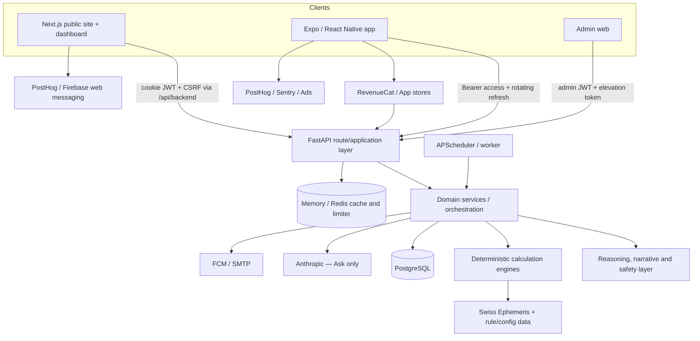
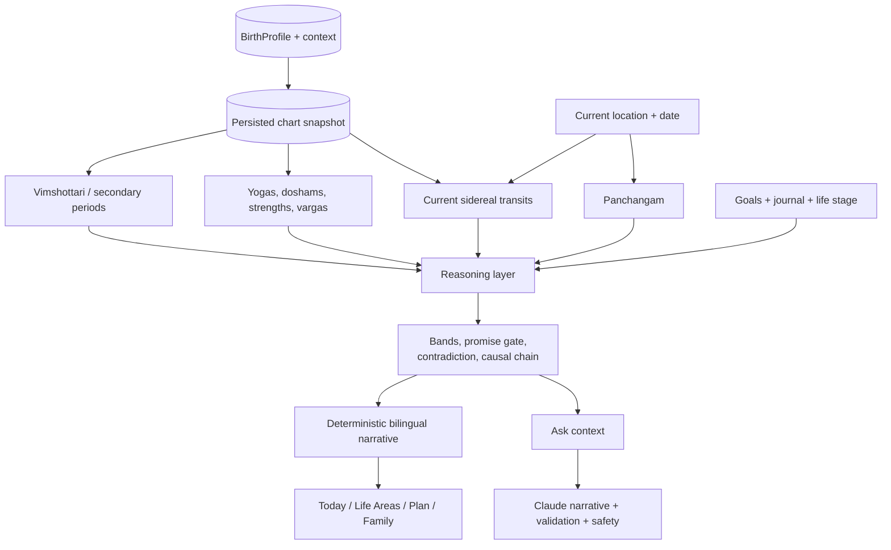
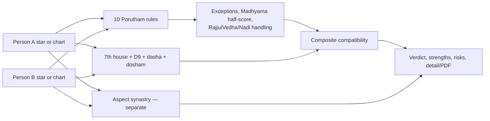

# Vinaadi — Product & Technical Capability Documentation

**Audit date:** 2026-10-06  
**Scope:** `app/`, `web/`, `mobile/`, `packages/shared/`, migrations, tests, deployment configuration, and current non-archived documentation  
**Authority:** the running implementation is authoritative where code and older documentation disagree

This document is the current product-and-technical source of truth for Vinaadi. It is a reverse-engineering record of what is implemented and connected, not a restatement of roadmap intent.

## 1. Executive summary

Vinaadi is a bilingual Tamil Jyothidam product delivered through a public Next.js website, an authenticated web dashboard, and an Expo/React Native mobile app. Its core is a deterministic Python astrology engine using Swiss Ephemeris with Lahiri sidereal ayanamsa, mean-node Rahu/Ketu, Whole-Sign houses, and Vimshottari dasha. That chart foundation feeds daily guidance, life-area readings, dasha and transit analysis, yogas and doshams, panchangam, muhurta, compatibility, family views, journaling, retrospective analysis, reports, notifications, numerology, and an AI-assisted question feature.

The product is broader than a horoscope generator. It contains a public acquisition layer with free calculators and educational content, a signed-in personal operating layer, a family-chart layer, native mobile engagement loops, and an admin/operations plane. Most user-facing prediction narratives are deterministic templates assembled from calculated facts. Ask Vinaadi is the important exception: it supplies deterministic chart context to Anthropic Claude and applies usage, safety, age, and output-validation controls.

The largest product caveats are equally important:

- Open beta currently grants premium-equivalent client and server access to signed-in users; nominal tier limits therefore do not describe the current signed-in beta experience.
- Pay-per-use report purchasing is not end-to-end live. Product cards and a purchase-intent API exist, but payment/fulfilment buttons are disabled and labelled “coming soon.”
- Birth-time rectification is an explicitly heuristic 30-minute sweep. Web removed it from the main Tools catalogue because results were unreliable, although setup/low-confidence paths and mobile still expose it.
- Numerology arithmetic is live on web, but interpretive prose is suppressed pending Tamil review. Baby-name output is marked draft and its production canon has an additional verification backstop.
- The desktop and mobile products are not equivalent: web has deeper chart readings, life-area reasoning, planning, numerology, and public SEO tools; mobile has native purchases, push/local reminders, haptics, offline persistence, ads, widgets, and a different tool catalogue.
- Some comments and older documentation are stale. Examples include “no Shadbala,” a seven-area description for a twelve-area service, the feature-flag comment describing an older five-minute reading, and a mobile header claiming 16 tools while the catalogue contains 20.

## 2. Audit method and status language

The audit followed the runtime paths rather than accepting filenames as evidence:

1. Mapped package manifests, workspace structure, deployment, CI, and environment configuration.
2. Read every registered FastAPI router in `app/main.py` and grouped the route contracts.
3. Mapped Next App Router pages, dashboard tabs and inline tools, Expo Router screens and bottom tabs.
4. Traced foundational chart creation through validation, timezone conversion, ephemeris, derived rules, persistence, and presentation.
5. Read the major calculation and service implementations, feature flags, ORM entities, shared API clients, hooks, and product gates.
6. Cross-searched backend routes against web/mobile consumers to distinguish code existence from accessibility.
7. Compared implementation with documentation and recorded disagreements in §37–39.

Status terms used throughout:

| Status | Meaning in this audit |
|---|---|
| **LIVE** | Implemented and reachable through a current user flow. It may still require authentication, a profile, a feature flag, or configuration. |
| **IMPLEMENTED BUT HIDDEN** | Functional backend/domain capability exists but no current product navigation exposes it, or it is exposed on only one platform while hidden on the other. |
| **PARTIALLY IMPLEMENTED** | A visible or callable slice exists, but the promised workflow, content approval, payment, fulfilment, or reliability bar is incomplete. |
| **INTERNAL / SUPPORTING** | Used by other capabilities or operations; not itself a user destination. |
| **DEAD / LEGACY / POSSIBLY UNUSED** | Superseded, explicitly called dead by current code, or not connected from the current application. |
| **PLANNED / TODO** | Only a stated future item; not counted as a current capability. |

“Desktop” below means the web product, including responsive browser pages. “Mobile” means the native Expo app, not a narrow browser viewport.

## 3. What Vinaadi is

Vinaadi serves four connected jobs:

- **Understand a chart:** create or save a jadhagam; inspect D1, D9 and other vargas, planets, houses, strengths, yogas, doshams, dashas, story readings, and astrologer-oriented detail.
- **Understand now:** combine the natal chart with Vimshottari periods, sidereal transits, panchangam, Chandrashtama and Sani-cycle context to generate daily and life-area guidance.
- **Choose and reflect:** find muhurta, compare options, log goals and life events, journal actual outcomes, review past events, and compare predictions against experience.
- **Understand relationships and family:** maintain family charts, switch the active person, calculate Porutham and synastry, monitor relationship/transit alerts, and view aggregate family guidance.

The public site also acts as an educational and acquisition product: it exposes free chart, Porutham, panchangam, muhurta, rasi-palan, numerology and content pages, then carries users into saved profiles and the dashboard.

## 4. Product capability map

```text
Vinaadi
├── Public discovery and education
│   ├── Marketing, trust, methodology, pricing and legal pages
│   ├── Free chart, Porutham, panchangam, muhurta and numerology tools
│   ├── Rasi, nakshatra, yoga, dosham, pariharam and temple libraries
│   └── Tamil calendar, festivals, holidays and share landings
├── Identity and personal data
│   ├── Web and mobile authentication
│   ├── Birth profiles, current location and life context
│   ├── Family Vault and profile switching
│   └── Consent, export, retention and deletion
├── Natal astrology
│   ├── D1 / lagna / planets / houses / nakshatra / pada
│   ├── D9 and divisional charts
│   ├── strengths, Shadbala and Ashtakavarga
│   ├── yogas, doshams and remedies
│   └── one-, five-minute, story and astrologer readings
├── Timing and prediction
│   ├── Vimshottari and secondary dashas
│   ├── current transits and Sani cycles
│   ├── daily guidance and activity timing
│   ├── twelve life-area readings and propensity cards
│   ├── what-if, decision brief and event windows
│   └── Varshaphala, Annual Wrapped and retrospective
├── Almanac and election
│   ├── daily/monthly panchangam and Tamil calendar
│   ├── hora and good/adverse intervals
│   ├── personalized and almanac-only muhurta
│   └── curated Muhurtham Naal lists
├── Relationships
│   ├── ten-Porutham matching and Nadi rules
│   ├── chart-composite compatibility intelligence
│   ├── synastry aspects and relationship alerts
│   ├── friendship compatibility
│   └── share tokens and PDFs
├── Numerology
│   ├── Chaldean core and object numbers
│   ├── favourable numbers and fortune alignment
│   ├── personal cycles and date scoring
│   ├── name sessions/correction and compatibility APIs
│   └── nakshatra-pada baby-name ranking
├── Engagement
│   ├── Ask Vinaadi
│   ├── goals, journal, context and life-event log
│   ├── notification inbox, push/email and local reminders
│   └── sharing, image cards and PDF export
├── Commercial layer
│   ├── guest / registered / premium entitlements
│   ├── open-beta override
│   ├── RevenueCat subscription purchase and restore
│   └── incomplete pay-per-use report catalogue
└── Operations
    ├── admin users, suspension, deletion and audit
    ├── feature/doctrine flags and prediction calibration
    ├── background jobs and broadcast notifications
    └── health/readiness, analytics, feedback and QA cases
```

## 5. Master functionality inventory

“Explanation” means the result supplies at least one rule/factor/reason, not merely a label.

| ID | Domain | Feature and user capability | Desktop | Mobile | Status | Main engine/service | Explanation |
|---|---|---|---:|---:|---|---|---:|
| ID-01 | Identity | Register, log in/out, reset password, inspect/update account | Yes | Yes | LIVE | `app/api/auth.py`, `mobile_auth.py` | N/A |
| ID-02 | Identity | Google OAuth sign-in | Yes | No native flow found | LIVE / web | `app/api/auth.py` | N/A |
| ID-03 | Profile | Create/edit/delete birth profiles and calculate charts | Yes | Yes | LIVE | `birth_profiles.py`, `birth_profile_service.py` | Yes |
| ID-04 | Profile | Select current residence separately from birthplace | Yes | Yes | LIVE | `location_service.py`, place controls | Yes |
| ID-05 | Context | Save marital, employment, children, life-focus and dated context | Yes | Simplified | LIVE | `context_service.py`, settings/onboarding | Limited |
| FAM-01 | Family | Create a vault, add relatives, switch active chart | Yes | Yes | LIVE | `family_vault_service.py` | Yes |
| AST-01 | Horoscope | Generate and persist a Lahiri sidereal jadhagam | Yes | Yes | LIVE | `_chart_build.py`, `chart_service.py` | Yes |
| AST-02 | Horoscope | Display D1, D9, planets, houses, nakshatra and pada | Yes | Yes | LIVE | chart schemas and chart UIs | Yes |
| AST-03 | Horoscope | View divisional charts beyond D9 | Yes | Yes | LIVE / gated | `divisional_charts.py`, Vargas panels/screens | Yes |
| AST-04 | Strength | Planet scores, dignity and holistic strength synthesis | Yes | Yes | LIVE | `chart_strength.py`, `_chart_planets.py` | Yes |
| AST-05 | Strength | Full Shadbala analysis | Yes | Yes | LIVE / advanced | `shadbala.py`, `shadbala_service.py` | Yes |
| AST-06 | Reading | Story/astrologer full-chart views | Yes | Simplified reading | LIVE | `reading_story.py`, chart explanation | Yes |
| AST-07 | Reading | One-minute and five-minute reading ladder | Yes | No UI found | LIVE / web | one/five-minute services | Yes |
| YOG-01 | Yogas | Detect, rank, explain and activate yoga catalogue | Yes | Yes | LIVE | `yoga_rules.py`, yoga detectors | Yes |
| DOS-01 | Doshams | Detect severity, evidence and cancellations | Yes | Yes | LIVE | dosham modules | Yes |
| REM-01 | Remedies | Show chart/context-aware and educational pariharam | Yes | Yes | LIVE | `remedies.py`, `remedy_service` route | Yes |
| DAS-01 | Dasha | Current Vimshottari maha/antar/pratyantar and timeline | Yes | Yes | LIVE | `dasha.py`, `dasha_service.py` | Yes |
| DAS-02 | Dasha | Sookshma/prana depth and event windows | Yes | Partial UI | LIVE | chart/dasha APIs | Yes |
| DAS-03 | Dasha | Yogini, Ashtottari, Kalachakra, Chara/Jaimini and conditional dashas | Yes | Several in Dasha screen | LIVE / advanced | dedicated services | Yes, with experimental labels where applicable |
| TRN-01 | Transit | Current graha gochara from Moon and Lagna | Yes | Yes | LIVE | `transit_service.py`, `transits.py` | Yes |
| TRN-02 | Transit | Ezharai/Janma/Ashtama/Ardhashtama/Kandaka Sani | Yes | Yes | LIVE | Sani-cycle classifiers | Yes |
| TRN-03 | Transit | Peyarchi reports and alerts | Yes | Yes | LIVE | `peyarchi_service.py`, alert job | Yes |
| DAY-01 | Daily | Personalized daily score and briefing | Yes | Yes | LIVE | `daily_guidance_service.py` | Yes |
| DAY-02 | Daily | Week-ahead/range and activity timing | Yes | Simplified | LIVE | daily-guidance APIs | Yes |
| PAN-01 | Panchangam | Tithi, nakshatra, yoga, karana, sunrise/sunset | Yes | Yes | LIVE | `panchangam.py` | Yes |
| PAN-02 | Panchangam | Rahu Kalam, Yamagandam, Kuligai, Abhijit, durmuhurtham, hora, Gowri | Yes | Yes | LIVE | `panchangam.py` | Yes |
| PAN-03 | Calendar | Monthly calendar, festivals, holidays, categories | Yes | Yes | LIVE | panchangam/calendar event services | Limited provenance in UI |
| LIFE-01 | Predictions | Twelve life-area scores and 6/12-month outlook | Yes | Summary-oriented | LIVE | `life_areas_service.py` | Yes |
| LIFE-02 | Predictions | Career, wealth, health, marriage specialist cards | Yes | Partial | LIVE | `career/wealth/health/marriage_service.py` | Yes |
| LIFE-03 | Predictions | Chances & Cautions propensity cards | Yes | No UI found | LIVE / web | `propensity_service.py` | Yes |
| PLAN-01 | Planning | Goals, event windows and life-event log | Yes | Yes | LIVE | goals/life-event services | Yes |
| PLAN-02 | Planning | What-if scenario analysis | Yes | No dedicated UI found | LIVE / web | `whatif_service.py` | Yes |
| PLAN-03 | Planning | Compare two options with a decision brief | Yes | No dedicated UI found | LIVE / web | `decisions_service.py` | Yes |
| MUH-01 | Muhurta | Personalized/generic election search and ranked windows | Yes | Yes | LIVE | `muhurta_service.py`, doctrine engine | Yes |
| MUH-02 | Muhurta | Curated auspicious wedding-day list | Yes | Yes | LIVE / time-bound data | `muhurtham_naal_service.py` | Yes |
| REL-01 | Compatibility | Ten Tamil Poruthams from stars or birth data | Yes | Yes | LIVE | `porutham.py` | Yes |
| REL-02 | Compatibility | Composite chart intelligence, D9, dasha, dosham and emotion | Yes | Yes | LIVE / gated | `compatibility_intelligence.py` | Yes |
| REL-03 | Compatibility | Synastry aspect matrix and relationship alerts | Yes | Yes | LIVE / gated | `synastry_service.py` | Yes |
| REL-04 | Compatibility | Friendship matching | Public web | Yes | LIVE | friendship service | Yes |
| NUM-01 | Numerology | Favourable numbers, fortune alignment, cycles and date scoring | Yes | No UI found | LIVE / web, gated | numerology services | Arithmetic yes; prose withheld |
| NUM-02 | Numerology | Name correction, saved sessions and person compatibility | Backend; correction partially surfaced | No | IMPLEMENTED BUT HIDDEN / PARTIAL | numerology naming services | Prose gated |
| NUM-03 | Numerology | Nakshatra-pada baby-name finder | Yes | No | PARTIALLY IMPLEMENTED | naming service/corpora | Draft warning |
| AI-01 | Assistant | Ask a personalized astrology question | Yes | Yes | LIVE if configured | `ask_vinaadi_service.py` + Anthropic | Yes |
| REF-01 | Reflection | Encrypted journal, prompts, anchors, correlations and CSV export | Yes | Yes, with local-first quick capture | LIVE | `journal_service.py` | Yes |
| REF-02 | Reflection | Retrospective event-to-dasha/transit analysis | Yes | Yes / gated | LIVE | `retrospective_service.py` | Yes |
| REF-03 | Reflection | Annual Wrapped | Yes | Yes / gated | LIVE when daily-score data exists | `annual_wrapped_service.py` | Yes |
| HOR-01 | Horary | Prasna by question time, place and topic | Yes | Yes | LIVE | `calculations/prasna.py` | Yes |
| REC-01 | Rectification | Estimate and apply a birth time from life events | Reduced discovery | Yes / gated | PARTIALLY IMPLEMENTED | `rectification_service.py` | Explicit heuristic disclaimer |
| SHR-01 | Sharing | Jadhagam/compatibility PDFs and public compare PDF | Yes | Native share of supported views | LIVE | `pdf_export_service.py` | Yes |
| SHR-02 | Sharing | Share cards, screenshots and tokenized Porutham/Panchangam links | Yes | Yes | LIVE | share-card services, view-shot/native share | Yes |
| NOT-01 | Notifications | Inbox, read/dismiss and channel preferences | Yes | Yes | LIVE | notification APIs/services | Yes |
| NOT-02 | Notifications | Daily, dasha, Pirantha Naal, peyarchi and relationship alerts | Yes | Yes | LIVE if configured | cron + FCM/email | Yes |
| NOT-03 | Notifications | Local Kalam reminders | No | Yes | LIVE / mobile | Expo Notifications | Yes |
| COM-01 | Subscription | Buy/restore premium subscription | Pricing page only | Yes | LIVE if RevenueCat configured | RevenueCat SDK/webhook | N/A |
| COM-02 | Reports | Purchase one-time report/top-up products | Catalogue | Catalogue | PARTIALLY IMPLEMENTED | `/reports/purchase`, shared catalogue | N/A |
| ADM-01 | Admin | Users, suspension/deletion, stats, jobs, flags, broadcast, audit | Yes, admin | No | LIVE / internal | `app/api/admin.py`, `/admin` | Yes |
| QA-01 | Quality | Golden cases and dev QA surface | Dev-only | No | INTERNAL | QA API/dashboard tab | Yes |

## 6. Desktop product

### Navigation and shell

The public Next.js site supplies global navigation across free tools, learning content, trust/methodology, pricing, legal and authentication pages. Signed-in users enter a catch-all dashboard route with nine addressable sections defined in `web/lib/dashboard-tabs.ts`:

1. **Today** (`/dashboard`) — personalized score/briefing, current dasha, panchangam windows, activity board, family glance, alerts and quick actions.
2. **Tools** — Jadhagam generator, Porutham, Annual Wrapped, retrospective, rasi palan, muhurta, activity timing, Varshaphala, compatibility/synastry, numerology and baby names; panchangam cross-navigates to Calendar.
3. **Goals / Plan** — goals, event windows, life-event log, what-if, option comparison, activity timing and wedding planning.
4. **Life Areas** — long-form area predictions, specialist cards, propensity insights, remedies and yoga/dosham context.
5. **Family & Charts** — owner/member switcher, chart reading ladder, D1/D9, planet tables, strengths, yogas/doshams, forecasts, family aggregate and advanced astrology.
6. **Calendar** — daily, weekly and monthly panchangam, focus/category days and day detail drawers.
7. **Journal** — write, edit/archive, prompts, correlations, reflections and export.
8. **Explore** — educational library, glossary and related chart content.
9. **Settings** — setup, account, life context, experience, appearance, notifications, journal/data retention, privacy and danger actions. A QA tab is added only in development.

`web/components/dashboard-workspace.tsx` is the principal orchestration component. It keeps navigation/tool/modal state in React, delegates remote state to domain hooks (`usePersonalData`, `useFamilyData`, `usePlanData`, `useJournalData`), dynamically imports heavy tab panes, and keeps visited panes mounted. TanStack Query is used for selected reusable data paths; older areas still call `apiFetchJson` directly through the Next proxy.

### Public desktop surface

The public site is a real product surface, not only marketing copy. Route families include:

- home, beta, pricing, about, methodology, privacy and terms;
- feature explanations for daily guidance, charts, family and timing;
- free Jadhagam, marriage Porutham, daily panchangam, muhurta, Chandrashtama, friendship, numerology, baby-name and rasi-palan tools;
- today/date panchangam and Tamil calendar category, festival, holiday and event pages;
- 27 nakshatra pages plus visual profiles, yoga and dosham libraries, pariharam and temple guides;
- tokenized Panchangam/Porutham share landings, glossary, notifications/widget pages and newsletter signup.

Many public APIs calculate real results without persistence and are separately rate-limited. Public chart preview/full/PDF, direct comparison, Porutham grids, panchangam, muhurta and numerology routes live in `app/api/public_tools.py` and related public routers.

### Desktop-specific strengths

- Richest chart-reading ladder and astrologer view.
- Full Life Areas and reasoning/propensity panels.
- Goal/decision/what-if workflow.
- Numerology and baby-name tools.
- CSV journal export and broad settings/privacy control.
- Deep public education/SEO corpus and shareable web landings.
- Admin application and development QA surface.

### Desktop interaction model

The dashboard uses persistent top-level panes, URL-addressable tab/tool state, inline panels, drawers and modal wizards. Chart/family selection propagates through hooks into downstream queries. The Ask Vinaadi launcher is a floating drawer. Date/location controls alter panchangam and daily/transit calculations without changing natal data. The Nova token system in CSS provides the current visual layer; older “Classic” panels are bridged inside scoped tool islands where not yet fully rebuilt.

## 7. Mobile product

### Navigation

Expo Router supplies five bottom tabs:

- **Today:** personalized snapshot, score, dasha, panchangam, journal quick capture, Ask entry, location prompt and notifications.
- **Panchangam:** current day and calendar views.
- **Insights:** dasha, daily score, wrapped, Varshaphala, transits, family, journal, goals, Vargas, retrospective, synastry, life-event log and learning entry points.
- **Tools:** grouped calculator/learning catalogue.
- **Me:** account/rasi selection, chart and profile management, wrapped, rectification, dasha, Varshaphala, transits, notification settings/inbox, legal and premium.

Stack screens add onboarding, auth, Jadhagam, reading, daily score, Chandrashtama, premium, Family Vault, Ask Vinaadi, dasha, transits, Varshaphala, rectification, wrapped, Vargas, Shadbala, goals, journal, retrospective, synastry, life-event log, reports, Muhurtham Naal, temple and learning screens.

### Tool catalogue

`mobile/app/(tabs)/tools/index.tsx` currently renders 20 entries even though its subtitle says “16 Jyotish tools”:

- Matching: Compatibility, Nakshatra, Friendship.
- Chart: Birth Chart, Dosha Check, Yoga Analysis, Remedies.
- Calendar: Daily Panchangam, Muhurtham Naal.
- Learn: 27 Nakshatras, Pancha Bhoota Sthalams, Arupadai Veedu.
- Timing: Muhurta, Prasna.
- Advanced: Dasha, Varshaphala, Rectification, Year Wrapped, Family Vault, Buy Reports.

Vargas and Shadbala have routed screens but are reached through deeper chart/insight flows rather than this catalogue. Numerology and baby names have no native screen.

### Mobile-specific behaviour

- Mobile stores access/refresh tokens in Secure Store and rotates refresh tokens through mobile-auth APIs.
- TanStack Query state can be persisted through an encrypted AsyncStorage persister; offline/cached reads and an offline indicator support intermittent connectivity.
- Native push notifications, locally scheduled Kalam reminders, haptics, swipe/bottom-sheet interactions, image capture and system sharing are implemented.
- RevenueCat purchasing/restoration, Google Mobile Ads and home-screen/widget support are native-only integrations.
- Today supports guest/rasi mode before a saved chart exists; authenticated personalized features progressively replace generic content.
- Quick journal capture is local-first and synchronizes authenticated entries through the journal API.

### Mobile simplifications and omissions

Mobile offers less long-form reasoning than desktop. It does not expose desktop’s numerology, baby names, option-comparison/what-if panels, full settings breadth, propensity panel, or one/five-minute reading ladder as dedicated native surfaces. Public SEO/education pages are represented by a smaller native Learn collection. Conversely, mobile is the operational home for purchases, ads, native share, haptics, offline persistence and local reminders.

## 8. Identity, onboarding, profiles and family

### Authentication

**Status:** LIVE — both; Google OAuth is web-only in the inspected flows.

Web uses an HTTP cookie JWT (`vinaadi_token`) and requires a CSRF header for mutating cookie-authenticated requests. Mobile uses short-lived Bearer access tokens plus rotating refresh tokens stored in Secure Store; reuse of a rotated token is treated as a theft signal. Passwords use bcrypt. Registration, login, logout, current-user, profile update, forgot/reset password and consent/deletion endpoints exist. Production API documentation can be disabled, CORS is configured, and authentication/public endpoints have dedicated throttles.

**Implementation:** `app/core/auth.py`, `app/core/auth_throttle.py`, `app/api/auth.py`, `app/api/mobile_auth.py`, web/mobile session providers.

### Birth profile and onboarding

**Status:** LIVE — both.

The user supplies display name, local birth date, birth time, birthplace, coordinates and IANA timezone. Authenticated forms can also capture current residence/coordinates/timezone, relationship, marital status, employment type, children, birth-time source and confidence. Place selection defaults to bundled place data; an explicit online fallback calls the server-side Nominatim proxy. Birth local time is converted with `zoneinfo` before ephemeris calculation.

Onboarding differs by platform. Mobile has rasi-first guest onboarding, birth-detail/location steps, a teaser and reveal. Web moves from public calculators/login into setup inside the dashboard. A birth time may be marked confirmed, approximate or rectified; downstream reading services withhold lagna-sensitive claims when confidence is insufficient.

### Family Vault

**Status:** LIVE — both; nominal capacity is tiered.

Users create a vault, add/edit/remove family members, assign relationships, calculate each member’s chart, switch the active person, compare members and see daily family summaries. Family data feeds compatibility, synastry, numerology on web, relationship alerts and family guidance. Ownership checks protect both vault and chart operations. Relationship-type safeguards prevent an inappropriate marriage-framed comparison for some family relationships.

**Implementation:** `app/api/family_vaults.py`, `app/services/family_vault_service.py`, `web/hooks/useFamilyData.ts`, `web/components/dashboard-family-charts-hybrid.tsx`, `mobile/app/family-vault.tsx`.

## 9. Horoscope / Jadhagam

**Status:** LIVE — both; desktop has the deepest presentation.

### User action to output

```mermaid
flowchart LR
    A[Birth date, time, place] --> B[Pydantic/form validation]
    B --> C[Place coordinates + IANA timezone]
    C --> D[Local time to UTC + Julian day]
    D --> E[Swiss Ephemeris<br/>Lahiri sidereal, mean node]
    E --> F[Graha longitudes + Lagna]
    F --> G[Rasi, nakshatra, pada,<br/>Whole-Sign houses]
    G --> H[D1, D9 and vargas]
    H --> I[Dasha, strengths,<br/>yogas, doshams, panchangam]
    I --> J[(Chart, planet, varga,<br/>dasha rows)]
    J --> K[Web/mobile chart and<br/>downstream services]
```



`app/services/_chart_build.py` converts profile input into an in-memory chart response. `app/calculations/ephemeris.py` uses bundled Swiss Ephemeris files when available and exposes a warning when forced to the lower-precision Moshier fallback. Rahu is the mean node and Ketu is exactly 180° opposite. Lagna establishes Whole-Sign houses. Each graha receives absolute longitude, rasi, within-sign degree, nakshatra/pada, house, dignity/condition and strength information.

The builder derives D1 and divisional positions, natal panchangam signature, Vimshottari periods, yogas/doshams, birth conditions and strength layers. Maandhi is calculated separately from Gulika. The facade split across `_chart_planets.py`, `_chart_build.py`, `_chart_persist.py`, `_chart_summary.py` prevents the route/service from becoming one monolith. Persisted entities include Chart, ChartPlanet, VargaPosition and DashaPeriod.

### What users see

- identity summary: Lagna, Chandra Rasi, nakshatra and pada;
- South-Indian-style D1/D9 chart grids;
- planet table with positions, houses, dignity, retrograde/combustion and strength context;
- house and chart summaries;
- yogas, doshams, cancellations and remedies;
- current dasha and timeline;
- story-mode prose, one/five-minute readings and an astrologer-oriented evidence view on web;
- advanced Vargas, Shadbala and alternate-dasha panels when unlocked;
- downloadable Jadhagam PDF and shareable chart/card outputs where the surface offers them.

The same saved chart is foundational to life areas, daily guidance, transits, muhurta personalization, compatibility, numerology alignment, Ask Vinaadi, goals, retrospective and alerts.

### Strength and interpretive layers

The base planet `strength_score` is a composite derived from sthana, directional, temporal, motion, natural and aspect-related inputs. A feature-controlled holistic pass adds functional lordship, conjunction company, neecha-bhanga and strength-weighted aspect relief within a bounded adjustment. This product score is not presented as a literal classical Shadbala value.

Full Shadbala is separately implemented in `app/calculations/shadbala.py` and exposed on web and mobile. Ashtakavarga/BAV/SAV also contributes to downstream life-area reasoning. Older documentation that says “No Shadbala” is obsolete.

### Reading ladder

The chart UI offers progressively deeper readings. The one-minute service composes a compact identity/current-period/horizon reading. The five-minute service currently implements an eleven-beat “descent” through nature, repeating pattern, internal tension, past period, current maha/antar period, near transit window, topic house/lord, next handover and one action. It has reduced output for a 13–17-year-old self-reading and refuses unsupported relationship registers. The feature-flag comment that still says four of eight beats is stale; the service implementation and tests are current.

### Limitations

- Accurate lagna, houses and divisional readings depend heavily on birth time; confidence gates suppress some claims but cannot repair bad input.
- Swiss Ephemeris licensing and ephemeris-file deployment remain operational/legal considerations.
- Advanced techniques have different maturity levels; Kalachakra is explicitly experimental and secondary dashas do not replace Vimshottari doctrine.

## 10. Yogas

**Status:** LIVE — both.

Yoga detection is chart-specific, not a static label lookup. The rule modules examine house/sign placement, lordship, conjunction/aspect relationships, dignity and cancellation conditions. The product then ranks meaningful formations, attaches strength/activation metadata and renders them in the chart reading, Yoga tool, Life Areas context and educational public pages.

The implemented catalogue includes Gaja Kesari variants, Raja/Yogakaraka, Dhana/supportive wealth formations, Neecha Bhanga and Neecha Bhanga Raja Yoga, retrograde-debilitated Raja cases, the five Pancha Mahapurusha yogas, Budha-Aditya, Vipareetha Raja, Parivartana, Chandra-Mangala, Sakata, Kemadruma and weakening/cancellation, Kartari, Guru-Chandala/node conjunctions, Amala, Adhi, Daridra, Lakshmi/Bhagya, Sunapha, Anapha, Durudhura and Vasumati. `app/calculations/yoga_rules.py` and associated yoga modules are the rule source.

For an applicable result the backend can supply:

- the formation name and family;
- involved planets/houses and an evidence string;
- strength/quality and weakening or cancellation factors;
- a bilingual practical effect;
- key planets used for activation;
- whether the running maha/antar dasha makes the natal formation active now.

This distinction matters: **presence** is a natal fact; **activation** is timing context. Web’s chart reading and yoga/dosham panels expose both more fully; mobile’s Yoga Analysis is more card-oriented. Public yoga pages teach generic definitions and are not evidence that a visitor has the yoga.

Known limitations include doctrine switches for still-reviewable variants and some product-authored strength/activation tiers. The rulebook and doctrine-option flags identify which parts are classical, product scoring, variants or unresolved.

## 11. Doshams and remedies

**Status:** LIVE — both.

The chart engine evaluates:

- **Sevvai/Manglik:** counts Mars from Lagna, Moon and Venus, records which references triggered, applies configured exemptions/cancellations and returns residual severity.
- **Rahu–Ketu conditions:** node-axis placements and contextual effects.
- **Pitru Dosham.**
- **Kala Sarpa Dosham.**
- **Kalathra Dosham:** marriage/7th-house factors.
- **Marana Karaka Sthana.**
- **Putra Sarpa Dosham.**
- **Badhaka conditions.**

The best surfaces answer more than “present/not present”: they show the causing planet/house, counted-from reference, evidence, cancellation or mitigation, remaining severity, timing/activation and practical interpretation. Web’s combined Yoga & Dosham panel is the fullest implementation; mobile Dosha Check is a focused summary. Life Areas and full readings reuse results in context. Public dosham pages are generic education.

Remedies are available as chart/context recommendations and as public/mobile educational libraries. Outputs can include temple, mantra, charity/discipline, weekday and gemstone-oriented guidance, but safety/tone rules prevent fatalistic or medical replacement language. `app/api/remedies.py`, calculation remedy mappings, `web` pariharam routes and `mobile/app/(tabs)/tools/pariharam.tsx` are the main surfaces.

## 12. Dasha and Bhukti

**Status:** LIVE — both.

Vimshottari is the primary timing doctrine. Natal Moon longitude establishes the starting balance; the engine can calculate the 120-year sequence and active Mahadasha, Antardasha/Bhukti, Pratyantardasha, Sookshma and Prana layers. Users see the current period, start/end dates, previous/next periods, expandable timelines, planet meanings, life-area affinities and yoga activation.

`app/calculations/dasha.py` is the base calculator. `app/services/dasha_service.py`, chart routes and reading services turn the timeline into product output. Daily guidance, life areas, what-if, decision briefs, Ask Vinaadi, retrospective, event windows and notifications all consume the current period rather than maintaining separate clocks.

Secondary systems are implemented as advanced comparison tools:

- Yogini Dasha (36-year cycle);
- Ashtottari (108-year, with applicability logic);
- Kalachakra (labelled experimental/display-oriented);
- Chara/Jaimini;
- conditional dashas;
- solar-return/Varshaphala year logic, which is an annual chart rather than a natal dasha.

Desktop places these in advanced Family & Charts panels. Mobile’s Dasha screen exposes Vimshottari plus several secondary tabs. They supplement, not replace, the doctrine’s Vimshottari baseline.

## 13. Transits and current influences

**Status:** LIVE — both.

The transit engine calculates current sidereal positions, retrograde state, combustion/cazimi, gandanta/sandhi and house from natal Moon; Lagna-relative placement is used as a cross-check/supplement. Vinaadi’s primary gochar reference remains Chandra Rasi.

User-facing outputs include:

- current graha positions and house meanings;
- Jupiter, Saturn, Rahu and Ketu movement/peyarchi context;
- Ezharai Sani phases, Janma Sani, Ashtama Sani and Ardhashtama/Kandaka classifications;
- phase/cycle end dates and selected murthi/transition detail;
- Chandrashtama status and windows;
- upcoming peyarchi and relationship alerts.

`app/calculations/transits.py`, `app/services/transit_service.py`, `peyarchi_service.py` and `peyarchi_alert_service.py` form the core. A scheduled job refreshes peyarchi and relationship alerts; ambient-alert APIs merge them for dashboard consumption. Web and mobile expose standalone transit views, while Today and Life Areas consume smaller slices.

## 14. Daily guidance

**Status:** LIVE — both.

Daily guidance answers “what is the quality of this day for this chart and location?” It combines five main inputs:

1. natal Moon/chart context;
2. running Vimshottari periods;
3. Moon and major-planet gochar;
4. local panchangam and time windows;
5. user goals/context and, when enough data exists, journal correlations.

The service returns a 0–100 product score, component breakdown, reasons, best and caution windows, remedy focus, action/caution suggestion, emotional weather, nakshatra perspective, current dasha, Chandrashtama, and an optional synthesized briefing. It also supports a date range, week-ahead, per-activity timing, a batch activity board and journal correlation data. `app/services/daily_guidance_service.py` orchestrates scoring helpers in `_dg_*` modules; persisted `DailyScore` rows are versioned and cached.

The score is a calibrated product composite, not a named classical measure. Explainability is strong: the UI can show contributing Moon transit, dasha, panchangam, gochar, cautions and remedial support. The current-location resolver uses residence when set and otherwise falls back to birthplace, so local almanac windows do not silently remain tied to a birthplace after relocation.

Web Today gives the broadest board and deep-dive drawers. Mobile Today emphasizes the score, compact current signals and actions. Annual Wrapped depends on accumulated DailyScore rows and returns 404 when the selected year has none.

## 15. Panchangam and calendar

**Status:** LIVE — both and public web.

For a date, coordinates and timezone, the engine calculates:

- tithi with spans/end time;
- nakshatra and pada with transitions;
- nitya yoga and karana;
- weekday/vara and lord;
- sunrise, sunset and Moon phase;
- Rahu Kalam, Yamagandam and Kuligai from the actual daylight interval;
- durmuhurtham and Abhijit;
- 24 planetary horas;
- Gowri and Nalla Neram/Subha Muhurtham windows;
- Chandrashtama star/rasi windows;
- daylight lagna schedule;
- Tamil solar date/month and observances/festivals.

The calculator is in `app/calculations/panchangam.py`; service and cache layers are in `app/services/panchangam_service.py`, `panchangam_events_service.py` and `panchangam_prewarm.py`. Repeated calculations use a Postgres cache; a daily prewarm job fills common locations/dates. Web exposes today, arbitrary-date, calendar and share-card pages. Mobile has a bottom tab, date calendar, standalone Daily Panchangam tool and local Kalam reminders.

Calendar categories and event content include curated datasets in addition to calculations. Some copy/data is year-specific (notably 2026 categories and a mobile “2027 auspicious wedding dates” label), so content freshness is a release responsibility rather than an automatically evergreen property.

## 16. Life Areas, specialist predictions and propensity insights

**Status:** LIVE — desktop richest; mobile consumes selected summaries.

Despite an old seven-area docstring, `life_areas_service.py` currently produces twelve keys:

1. career;
2. money;
3. health;
4. relationships/married-life harmony;
5. education;
6. spiritual;
7. family harmony;
8. children;
9. property;
10. foreign matters;
11. litigation;
12. spirituality.

The simultaneous `SPIRITUAL` and `SPIRITUALITY` keys are a real taxonomy duplication and should be rationalized.

### Processing

Each area combines natal promise and a promise gate, relevant houses and karakas, planet strength, divisional charts (for example D2/D4/D7/D9/D10/D20/D24/D30), Ashtakavarga, running maha/antar dasha, Moon-based transits, Sani cycles, Chandrashtama, dasha activation, double-transit signals, age/maturation/life stage and active goals. Marital/age gates change language and suppress inappropriate claims. Health language is preventive and carries a safety notice.

Outputs include current, six-month and twelve-month scores, trend, confidence, a causal chain, supporting/blocking factors, primary driver, narrative, remedy, 30-day outlook, caution, next-improvement date/window, reading classification and score band. These are product reasoning scores, not classical Shadbala.

Specialist career, wealth, health and marriage endpoints produce focused cards. The “Chances & Cautions” propensity panel adds sensitive, directional tendencies with explicit disclaimers, minimum-age/content controls and opt-out/reduced-content handling. It is live on the web Life Areas surface behind `propensity_insights`; no native consumer was found.

## 17. Goals, planning, decisions and reflection

### Goals and event windows

**Status:** LIVE — both.

Users create/deactivate active goals by life area. Goals feed daily and life-area prioritization rather than existing only as a checklist. Planning panels request multi-year event windows for marriage, career and finance and connect them to dasha/transit support. Mobile provides a focused Goals screen; web integrates goals into the Plan tab.

### What-if simulator

**Status:** LIVE on web; implemented API/service without a dedicated mobile surface.

The user selects a scenario and target date. `whatif_service.py` evaluates three independent pillars: natal promise, dasha timing and gochar support, with local panchangam as additional timing context. Scenarios include job change, business start, marriage, education, property, health, travel, spiritual practice, family harmony, money, child birth, foreign settlement and litigation. Output includes per-pillar strength, score/band, contradiction classification, causal chain, chart signature and cautious recommendation. Safety filters prohibit deterministic health/loss language.

### Decision brief

**Status:** LIVE on web; no dedicated mobile UI found.

Users compare option A and B with labels/descriptions, a priority and target date. The service infers a scenario from priority/text, reuses what-if evidence, adjusts for option-specific stability/risk markers, cites the scenario’s karakas, and returns scores, alignment notes, risks, a recommendation or DEFER, confidence and a real dasha reassessment point. A former fabricated +21/+45-day “optimal window” was replaced by the computed Antardasha boundary.

### Journal and context

**Status:** LIVE — both.

Journal entries include date, area, mood/note and an astrology anchor captured for that date: active maha/antar/pratyantar, Moon/Saturn houses and signs. The service derives tags from note text, provides context-sensitive prompts, supports edit/soft-delete, retention dry run/apply, family-vault summary, correlation analysis after a minimum sample, and CSV export on web. Note content is encrypted at rest. Mobile adds a local-first quick-capture path and folds journal rhythm into Insights and Wrapped.

### Retrospective and life-event log

**Status:** LIVE — both; tier-gated outside open beta.

Retrospective accepts a dated past event and category, calculates the historical Vimshottari period and transits, ranks sensitive-house signatures from Moon and Lagna, explains the correlation and scans the next two years monthly for similar patterns. It stores the analysis and history. It explicitly lacks historical event location and uses the profile timezone. The separate life-event log records real outcomes and can join the prediction-calibration spine.

## 18. Muhurta and Muhurtham Naal

**Status:** LIVE — web, mobile and public web.

### Inputs and modes

Muhurta accepts activity, date range (capped at 60 days), event location/timezone, and optionally a subject’s birth details/saved chart. Marriage can use both people’s charts. Public and dashboard flows support personalized ephemeral input without necessarily saving a profile; an almanac-only marriage mode is also available.

### Engine

```mermaid
flowchart LR
    A[Activity + dates + event place] --> B[Daily panchangam]
    C[Optional natal chart(s)] --> D[Tara/Chandra bala,<br/>Chandrashtama, dasha]
    B --> E[Activity-specific sourced rules]
    D --> E
    E --> F[Hard vetoes]
    E --> G[Bonuses and penalties]
    F --> H[Candidate day/window]
    G --> H
    H --> I[Lagna + hora + Gowri<br/>minus bad kalams/Kuligai]
    I --> J[Ranked top five:<br/>BEST/GOOD/USABLE/NOT RECOMMENDED]
    J --> K[Reasons, factors, citations,<br/>cautions and missing dimensions]
```

`app/services/muhurta_service.py` orchestrates a provenance-carrying rule engine. It applies panchangam conditions, hard vetoes, penalties/bonuses, personal Tara and Chandra bala, Chandrashtama vetoes, activity-specific rules, dasha support, karaka dignity, elected lagna, and the intersection of hora/Gowri windows with adverse intervals. Marriage adds two-chart and Jupiter-gochar context. Output shows score, recommendation band, exact windows, positive/negative factors, citations, cautions and dimensions the engine did not score.

### Activity coverage

The rule registry includes generic job start, marriage, exam, travel, investment, medical, purchase and spiritual events, plus sourced activities such as naming, first feeding, Annaprasana, ear boring, treasure storage, gold/gem/grain/land/cattle purchase or possession, tonsure, Upanayanam, Seemantham, lying-in chamber, Vidyarambham/education/Veda/mantra initiation, bath, harvest/ingathering, agriculture/tillage/sowing/new-grain meal, new clothes and ornaments. The exact picker differs by surface: public web is broad, mobile exposes most sourced activities, and the dashboard Quick Scan is intentionally smaller.

### Limitations

- Some generic activity rules are explicitly product heuristics/unsourced; provenance identifies this.
- Karana transition handling is narrower than a full interval search in some paths.
- Results surface unscored dimensions rather than claiming complete classical election.
- `Muhurtham Naal` is a separate curated wedding-date list, not the personalized ranking engine; its year-labelled content requires maintenance.

## 19. Compatibility, Porutham and synastry

**Status:** LIVE — both and public web.

### Ten-Porutham system

Inputs can be two nakshatra/pada pairs, two sets of birth details, or two saved charts. The engine evaluates Dinam, Gana, Mahendra, Sthree Dheergam, Yoni, Rasi, Rasiyathipathi, Vasya, Rajju, Vedha and Nadi-related rules. Although commonly described as “10 Poruthams,” Nadi is also evaluated as a critical dosha/cancellation dimension in the broader matching flow.

`app/calculations/porutham.py` uses three grades—Uttama, Madhyama and Adhama. Madhyama contributes 0.5 where applicable; Rajju/Vedha can act as hard vetoes. Gender direction is applied where explicitly supplied. The `/10` total maps to display bands with upward tie handling. Each row can contain band/pass state, rule detail and cancellation/exception information rather than only a tick.

### Composite compatibility intelligence

Birth-detail/saved-chart comparisons can add a 100-point composite in `compatibility_intelligence.py`:

- Porutham: 35;
- the two charts’ 7th-house condition: 20 combined;
- Navamsa: 15;
- dasha harmony: 15;
- dosham balance/cancellation: 10;
- emotional/Moon layer: 5.

It returns strengths, risks, chart factors, Sevvai cancellation, D9/dasha/emotional context and a narrative verdict. The current cutoffs pre-date the Porutham reweighting and are awaiting anchor-case calibration; this is a known doctrine/product risk.

### Synastry and relationship alerts

Synastry is a distinct layer. It computes conjunction/trine/sextile/opposition/square relationships for semantic planet pairs and a harmony score. Western-style aspect geometry is used for this view but contributes zero to the Tamil composite headline, keeping the systems separate. Family relationship alerts are recalculated by a scheduled job and surfaced with peyarchi alerts.

### Surfaces and export

Public web supports by-star grid/match, direct birth-detail comparison and PDF. Authenticated web supports Porutham, family/member comparison, synastry matrix, detailed compatibility and share links. Mobile offers Porutham, friendship and synastry screens. Tokenized Porutham shares support public viewing and revocation/view controls through `porutham_share_service.py`.

## 20. Numerology and baby names

### Numerology engine

**Status:** LIVE on web behind `numerology_engine`; IMPLEMENTED BUT HIDDEN on mobile.

The arithmetic follows Chaldean mappings. Implemented capabilities include birth/root and destiny numbers, name/compound numbers, object numbers, favourable numbers, a chart-linked Fortune Alignment layer, personal year/month/day cycles, date ranking, compatibility, name-correction alternatives and saved name sessions. The chart bridge reads Lagna, graha strengths, node signs, birth date and Moon nakshatra/pada so a number does not silently override natal astrology.

The web Numerology panel exposes favourable numbers, Fortune Alignment, personal cycle and date scoring for the owner or family members. Backend routes also implement name correction, saved sessions, person compatibility and marriage-date ranking; not all have a current frontend. No native numerology screen was found.

Interpretive prose is independently gated by `numerology_content.CONTENT_REVIEWED` and currently suppressed because the Tamil corpus has not received native review. Numeric results and graha names can ship while prose remains null. This is deliberate partial release, not an API failure.

### Baby Name Finder

**Status:** PARTIALLY IMPLEMENTED — public/authenticated web only.

The user can supply raw birth details or a chart. The engine derives janma nakshatra/pada, filters names by pada akshara, calculates Chaldean values and ranks within the astrology-valid set using Fortune Alignment. `pada_first` is the doctrine default: numerology cannot override the nakshatra syllable. A weighted sibling mode exists as a flag option; a numerology-first mode intentionally does not.

The UI explicitly labels results as draft/pending astrologer and native-speaker review. The akshara canon and name corpus contain verification warnings, and production code includes an unusable-canon backstop. Therefore the visible workflow exists, but content readiness is incomplete.

**Implementation:** `app/services/numerology_*`, `app/api/numerology.py`, public numerology routes, `web/components/dashboard-numerology-panel-nova.tsx`, `dashboard-tools-baby-names-nova.tsx`.

## 21. Ask Vinaadi: deterministic context plus LLM narrative

**Status:** LIVE on both when an Anthropic API key is configured.

Ask Vinaadi is not a free-form astrologer that calculates its own chart. The service first loads an owned chart and constructs a deterministic context containing age/life context, Lagna, Moon, nakshatra, current Vimshottari maha/antar, life focus, current sidereal transits, Jupiter/Saturn houses, Sani/Kandaka/Chandrashtama, top yogas and birth-time caveats.

That context plus the question is sent to `claude-sonnet-4-6` with a structured JSON contract. The prompt requires natal promise + dasha + gochar, restricts verdicts to GO/WAIT/CAUTION/MIXED/NA, prohibits invented placements and enforces bilingual, non-fatalistic safety language. The Anthropic client has a 30-second timeout, one retry and a 1,400-token cap.

After generation Vinaadi validates the schema, confidence and verdict, combines deterministic/model signals, runs the central safety pass, and logs material high/medium predictions for calibration. Age gates redirect marriage, career or sensitive health/fertility questions when inappropriate. Usage is stored in Postgres and consumed only after a successful answer, making limits consistent across workers.

If the key is absent or the provider errors, the API returns a controlled unavailable/error response; there is no pretend deterministic fallback. Web uses a floating drawer with suggestion chips. Mobile uses a full Ask screen. Current nominal limits are tier-specific, but open beta lifts signed-in feature gates.

## 22. Horary / Prasna

**Status:** LIVE — both.

The user selects one of job, marriage, health, finance, property, travel, legal, children or general and submits at the current/chosen local time and place. The engine casts a Lahiri sidereal Prasna Lagna and current grahas, identifies the topic karaka and relevant houses, checks karaka house quality, Moon’s applying relationship, Lagna-lord and Moon dusthana conditions, and returns FAVOURABLE, UNFAVOURABLE, DELAY or MIXED with positive/negative indicators.

The implementation is compact and heuristic; its “Itthasala-type” applying test is a broad angular-direction rule, not a full Tajaka horary system. Both the web deep-dive drawer and mobile Horary screen display Lagna, Moon nakshatra, karaka house and evidence. The Prasna route is one of the few intentionally flat response contracts rather than the common envelope.

## 23. Birth-time rectification

**Status:** PARTIALLY IMPLEMENTED.

The user chooses a saved profile and supplies dated/yeared life events such as marriage, career break/change, relocation, major health event or parent/family event. The current estimator sweeps 48 birth times in 30-minute steps, computes candidate Lagnas, applies a coarse event/house match and returns the best three unique Lagna signs with weights. Applying a result writes the chosen time, marks the source `ESTIMATED_RECTIFIED` and sets 30-minute confidence.

This is explicitly labelled “heuristic, not classical” and estimates approximately 30–60 minutes. The current initial scoring helper is much simpler than its introductory comment implies: it does not truly recalculate event-year dasha per candidate and reduces the match to candidate-Lagna/event-house membership. A later validation path can compare events with a chart, but that does not make the initial rank a classical rectification.

Web removed “Find Birth Time” from its Tools catalogue with an inline note that results were unreliable, while still opening the wizard from setup/low-confidence chart paths. Mobile exposes a direct Rectification tool and route when tier gates allow it. The public web page is explanatory/acquisition content rather than an anonymous rectification calculator.

Applying a time changes the profile; consumers must ensure dependent charts are recalculated rather than assuming an existing persisted chart changed automatically. This workflow needs a stronger invalidation/recalculation contract.

## 24. Sharing, reports and export

### Live sharing/export

- Jadhagam PDF generation through ReportLab.
- Compatibility/Porutham PDF, including public direct-compare export.
- Chart/share-card data and client-rendered cards.
- Panchangam share card and public landing.
- Tokenized Porutham public share.
- Mobile `react-native-view-shot` plus native share sheet for supported cards/Wrapped.
- Web CSV journal export.
- Browser print/download behaviour on applicable reports/pages.

The system share sheet may include WhatsApp when installed, but there is no verified direct WhatsApp API/provider. No SMS provider is implemented.

### Pay-per-use reports

**Status:** PARTIALLY IMPLEMENTED.

Shared constants define 1/3/5/10-page Jadhagam products, 1/3-page Porutham products and a 10-question Ask top-up with INR fallback prices and RevenueCat product IDs. Mobile exposes a Buy Reports screen; web has report catalogue/entry routes. The UI disables purchase and says payment processing is coming soon. `POST /reports/purchase` validates entitlement/product and records a purchase intent/reference; its own docstring says payment and fulfilment are not live. Product descriptions therefore must not be treated as delivered report formats.

## 25. Notifications and background jobs

**Status:** LIVE when channel providers are configured.

Users have an inbox with unread/read/dismiss state, device-token registration and preferences for morning guidance, dasha, Pirantha Naal, other alerts, channel/timezone/morning time and smart silence. Web uses Firebase Web Messaging with a service worker; mobile uses Expo/native notification plumbing and FCM. SMTP email is an optional parallel dispatch channel. Delivery services include retries and failure handling.

The daily scheduler is leader-locked and can also run as a dedicated worker. Registered jobs include:

- daily peyarchi refresh at 02:00;
- relationship alerts at 02:05;
- hourly delivery scan respecting each user’s local morning time;
- panchangam cache prewarm at 02:10;
- journal retention purge at 03:00 only when retention is configured.

Pirantha Naal is calculated from the natal star and the star at local sunrise with a documented transition rescue rule. Mobile additionally schedules local Kalam reminders. Admin can inspect/trigger jobs; destructive job actions require elevation.

## 26. Subscription and monetisation

### Nominal tiers

The shared source of truth is `packages/shared/src/constants/tiers.ts`:

| Capability | Guest | Registered | Premium |
|---|---:|---:|---:|
| Saved birth profiles | 0 | 3 | Unlimited |
| Family members | 0 | 1 | 5 |
| Active goals | 0 | 3 | Unlimited |
| Rasi-palan window | Today | ±7 days | ±30 days |
| Ask Vinaadi | 2/day | 7/day | 30/month + top-up eligible |
| Dasha | None | Current only | Full |
| Included detailed/Porutham reports | 0/0 | 0/0 | 5/3 monthly |
| Ads | Yes | Yes | No |
| Advanced features | Mostly off | Selected engagement | Broadly on |

Monthly premium is configured at ₹149 and annual at ₹999, both with a seven-day trial and an advertised 44% annual saving. Mobile’s Premium screen loads RevenueCat offerings, can purchase a package and restore purchases. A signed webhook updates server subscription records. Missing SDK keys/Expo Go cause the client to trust backend tier instead of crashing.

### Open-beta override

The server’s open-beta setting is on by default in the inspected configuration, and shared `effectiveTier()` maps any signed-in account to premium for feature gating while preserving the factual subscription tier. Guests are not elevated. Product/QA discussions must distinguish **nominal plan design** from **current beta access**.

### Advertising

Google Mobile Ads is installed for applicable guest/registered mobile tiers. No web advertising integration was verified.

## 27. Settings, localisation, privacy and accessibility

### Settings

Web exposes account/profile setup, current place and life context, language, appearance, notification channels/times, journal retention and review reminders, consent/privacy and account deletion. Mobile exposes language/theme through providers, profile management, notifications, legal pages and premium state, but not the full web settings rail.

### Localisation

Tamil and English are first-class display modes. Shared mobile strings live in `packages/shared/src/i18n`; web has its own dashboard/public catalogues and generated dashboard catalogue. Backend schemas frequently return bilingual objects and language-free enum keys. The rendering contract is important: clients must localize keys rather than display backend English `*Name`/`*Code` fields. Duplication between shared and web catalogues remains a drift risk.

### Privacy and data lifecycle

Birth-profile sensitive fields and journal note text use Fernet-backed encrypted types/payloads, with key-rotation support. Account deletion, consent timestamps, soft deletion, journal retention/dry-run, exports and admin deletion auditing are implemented. Logs intentionally avoid raw geocoding queries at normal info level. Public endpoints are rate-limited separately from the global limiter.

### Accessibility

Both clients use labelled controls and semantic roles in many current components; web includes aria/title handling and mobile includes accessibility labels/roles. Automated UX checks do not prove Tamil rendering comprehensively and historically only walked top-level web tab panes, so accessibility/localisation completeness still needs manual cross-language testing.

## 28. Admin, analytics, feedback and internal tools

**Status:** INTERNAL / SUPPORTING, with a live web admin UI.

Admin functions include aggregate stats, paginated users and detail, suspension/unsuspension, privacy deletion, background-job listing/manual execution, push broadcast, feature-flag list/set/reset, prediction-calibration reports, audit log and detailed service health. Sensitive mutations require a short-lived elevation token obtained by re-entering the admin’s password; OAuth-only admins without a password are refused elevation rather than bypassed.

Feature flags are process-memory runtime overrides over code defaults. They cover rollout, limits, reasoning layers, numerology, reading ladders and doctrine options. Runtime doctrine override is restricted by environment because in-memory multiworker flags are not a durable policy store.

PostHog is integrated on web and mobile and no-ops when keys are absent. Mobile integrates Sentry runtime error capture; the web Docker build supports Sentry source-map upload when configured. Feedback and newsletter endpoints/models are live supporting acquisition and product operations. QA Golden Cases have API/admin/dev-dashboard support but are not a consumer feature.

## 29. Technology stack

| Layer | Verified technology |
|---|---|
| Workspace | pnpm workspace, pnpm 11.8.0 |
| Web | Next.js 15 App Router, React 19, TypeScript |
| Web data/forms | TanStack Query 5, React Hook Form, Zod, direct typed fetch adapters |
| Web UI | Hand-written CSS/Nova tokens, Framer Motion, Lucide, Sonner; no Tailwind/component-suite dependency |
| Mobile | Expo 54, React Native 0.81.5, Expo Router 6, TypeScript |
| Mobile data/native | TanStack Query persistence, AsyncStorage, Secure Store, Expo Notifications/Location/Haptics, Reanimated, bottom sheet, view-shot, widgets |
| API | Python 3.11+, FastAPI 0.136.1, Pydantic 2.13, Uvicorn |
| Persistence | PostgreSQL 16, SQLAlchemy 2.0.49, Alembic |
| Astrology | `pyswisseph` / Swiss Ephemeris FFI compatibility, bundled ephemeris files, deterministic Python rule modules |
| Jobs | APScheduler in API leader mode or dedicated worker |
| Cache/rate limit | Postgres panchangam cache; in-process or Redis 7 backends with bounded timeouts/fallback |
| PDF | ReportLab; PDF inspection/tooling dependencies in development |
| AI | Anthropic Python SDK, Claude Sonnet model configured in Ask service |
| Push/email | Firebase Cloud Messaging HTTP v1/web SDK, Expo/native notifications, SMTP |
| Analytics/errors | PostHog web/mobile, Sentry mobile and optional web source maps |
| Commerce | RevenueCat native SDK and signed webhook; Google Mobile Ads |
| Place lookup | Bundled GeoNames-derived place dataset; explicit Nominatim server proxy fallback |
| Testing | Pytest against isolated Postgres, web unit tests, Playwright E2E, mobile Jest, Ruff, mypy, ESLint, TypeScript |

## 30. System architecture



The Next server is a presentation/proxy boundary, not a second business backend. FastAPI owns application contracts, authorization and orchestration. Services compose deterministic calculations and database state. Calculation modules are largely pure functions over dates, longitudes and chart snapshots. The reasoning layer turns scores/signals into bands, promise gates, contradiction readings, causal chains and safe bilingual narratives. External LLM generation is isolated to Ask Vinaadi.

Deployment uses Docker images and Compose services for Postgres, Redis, API, web, optional worker, Nginx TLS edge and Certbot. The raw API is intended to remain loopback/internal behind the Next/Nginx edge. Health, liveness and readiness endpoints distinguish process health from dependency readiness.

## 31. Frontend architecture

### Web

Next App Router separates public server-rendered/SEO routes from the client-heavy dashboard. The dashboard is component-based and organized by product area rather than strict atomic design. Dynamic imports defer heavy panes. Providers cover query caching, language, beta state and deferred PostHog. Domain hooks aggregate API calls and state; `dashboard_bundle_service.py` replaced many per-chart requests with server-side bundles for Today/family paths.

The web API layer is transitional: some panels use `packages/shared/src/api`, while many use `web/lib/api` and local types/direct fetch. This coexistence is functional but creates contract-drift risk. Dashboard navigation uses plain React state synchronized to routes rather than a formal state machine.

### Mobile

Expo Router supplies file-based navigation, nested stacks and tabs. Providers/hooks manage session, theme, i18n, query persistence and analytics. Shared package API clients/types/constants are used more consistently than on web. Screens are feature-oriented; native interaction primitives add bottom sheets, haptics, offline state, image capture and share. Mobile still contains some local stores (notably quick journal) alongside server data, so synchronization and conflict behaviour must remain explicit.

## 32. Backend, calculation and data architecture

### Backend/service boundaries

Routes validate/authenticate and call services. Services commonly access SQLAlchemy `Session` directly, enforce ownership where not done in routes, load snapshots, call calculations and construct Pydantic responses. There is a real service layer, but no consistent repository abstraction and no full domain-driven aggregate boundary.

Responses usually use `{success,data,meta}`-style Pydantic envelopes with camelCase aliases and calculation version/generated time. A few legacy/special routes, such as Prasna, are flat. Central middleware provides request IDs/logging, security headers, maintenance mode, global limiting, CORS and safe unhandled-error envelopes.

### Astrology engine

The engine is a functional core built from reusable modules: astro/time conversion, ephemeris, panchangam, Vargas, house lords/aspects/dignities, Vimshottari and secondary dashas, chart strength/Shadbala/Ashtakavarga, yoga/dosham, transits, Tajaka, Porutham, muhurta, numerology and Prasna. Doctrine options are centralized and validated. Configuration-driven rule tables carry provenance in the most sensitive engines.

### Reasoning architecture

`app/reasoning` and selected services implement natal-promise gates, timing votes, contradiction classes, verdict/band caps, dominant chart signatures and calibration. `narrative_engine.py` and service-local bilingual tables transform evidence into user language. `safety_filter.py` performs serve-time health/fatalism/tone protection. Prediction logs connect served claims to later outcomes for admin calibration.

### Principal data entities

| Area | Main entities |
|---|---|
| Identity | User, reset token, refresh token, consent/subscription state, admin audit |
| Natal | BirthProfile, Chart, ChartPlanet, VargaPosition, DashaPeriod |
| Daily/family | DailyScore, FamilyVault, FamilyMember, FamilyDailyScore |
| Reflection/planning | JournalEntry, UserContext, UserGoal, UserLifeEvent, RetrospectiveEntry |
| Notifications | Notification, DeviceToken, UserNotificationPreference, PeyarchiAlert, RelationshipAlert |
| Reasoning | PredictionLog, InterpretationOutput, TransitSnapshot, QA Golden Case |
| Numerology/share | NumerologyNameSession, PoruthamShare |
| Supporting | PanchangamCache, Place, Feedback, NewsletterSubscriber, AskVinaadiUsage |

Alembic migrations own schema evolution and are tested up/down/up in CI. Production/development uses PostgreSQL; test safety explicitly refuses SQLite and the real development database.

## 33. External integrations and operational dependencies

| Integration | Purpose | Behaviour when absent / important constraint |
|---|---|---|
| Swiss Ephemeris | Planetary and Lagna calculations | Bundled files preferred; Moshier fallback warns. Licence/deployment must be managed. |
| Nominatim / OpenStreetMap | Explicit online place search fallback | Server proxy, rate/error controls; bundled place dataset is default. |
| Anthropic | Ask Vinaadi narrative | Ask returns unavailable/error; other astrology remains deterministic and unaffected. |
| Firebase Cloud Messaging | Web/native push delivery | Push no-ops/fails gracefully when credentials are absent. |
| SMTP | Email notifications/reset flows | Optional; service checks configuration before sending. |
| RevenueCat | Native subscription purchase, restore and entitlement webhook | Premium screen uses fallback prices/no SDK path in dev; PPU fulfilment is not live. |
| Apple/Google stores | Billing behind RevenueCat | Native deployment concern; not used for web checkout. |
| PostHog | Opt-in/product analytics | Providers no-op without public keys; properties pass an allowlist. |
| Sentry | Mobile runtime errors and optional web source-map pipeline | Disabled without DSN/build variables. |
| Google Mobile Ads | Ads for eligible mobile tiers | Native only; premium disables ads. |
| Redis | Shared cache/rate limits in multiworker deployments | Lazily loaded; bounded calls fall back to process memory. Memory limiting is per worker. |

There is no verified SMS, direct WhatsApp messaging, external astrologer marketplace, cloud object storage or web payment gateway.

## 34. Design and engineering patterns actually used

| Pattern | Evidence | How it is used / benefit |
|---|---|---|
| Component-based UI | `web/components`, feature-oriented Expo screens | Composes complex dashboard/mobile surfaces from reusable visual and domain panels. |
| Feature/domain modules | API/service/calculation files grouped by charts, daily, muhurta, numerology, etc. | Keeps most domain change localized even though some shared tables cross modules. |
| Service layer | `app/services/*` between routers and calculations/models | Centralizes ownership, orchestration, caching and response construction. |
| Functional core / imperative shell | Calculation modules accept dates/chart snapshots; services persist/call external systems | Makes core astronomy/rules testable and keeps side effects near routes/services. |
| Rule engine / configuration-driven evaluation | Muhurta rule registry, yoga/dosham tables, doctrine options, Porutham tables | Supports provenance, variants and review without duplicating imperative branches. |
| Pipeline | chart build; Ask context → LLM → validation → safety; daily scoring → synthesis | Makes derived stages and failure boundaries visible. |
| Adapter/facade | chart service facade, shared API client, notification providers, cache backend | Shields callers from persistence/provider details and supports memory/Redis or web/mobile transports. |
| Dependency injection | FastAPI `Depends` for DB/auth/CSRF/admin | Consistent request-scoped authorization and session handling. |
| Hooks/providers | web/mobile session, query, theme, i18n and domain hooks | Shares client state and isolates remote-data orchestration. |
| Strategy-like runtime selection | cache/rate-limit backends, doctrine string modes, numerology epoch/basis | Chooses a validated implementation using configuration. It is not always formal classes. |
| Event/scheduled processing | APScheduler job registry, notification dispatch, RevenueCat webhook | Moves time-based and provider-driven work out of request UI flows. |
| Soft-delete/retention | journal/vault/profile lifecycle | Preserves recoverability/audit while supporting privacy cleanup. |
| Calibration feedback loop | prediction log + outcome joins + admin report | Allows observed hit rates to inform later thresholds without letting an LLM change rules. |

Vinaadi is **not** consistently MVC, does **not** implement a repository pattern across the backend, and is **not** a pure DDD system. SQLAlchemy sessions are frequently used directly in services, and the web dashboard is a large orchestration component rather than a formal state machine.

## 35. Core data flows and feature dependency map

### Personalized reading flow



### Compatibility flow



### Foundation-to-consumer dependency map

```text
Location/time conversion + Swiss Ephemeris
└── Chart snapshot
    ├── Dasha ──┬── readings, daily guidance, event windows, Ask
    │           └── yoga activation, retrospective, notifications
    ├── Vargas / strengths / Ashtakavarga
    │           └── chart reading, life areas, compatibility, numerology alignment
    ├── Yogas / doshams ── chart, remedies, Life Areas, Ask
    ├── Moon/Rasi ── transits, Chandrashtama, panchangam personalization
    └── Family relationships ── Porutham, synastry, family aggregate, alerts

Date + event location
└── Panchangam ── Today, Calendar, daily score, muhurta, reminders, share cards

User context + goals + journal
└── prioritization, safety/age gates, correlations, Wrapped and calibration
```

Foundational correctness therefore has broad blast radius: a chart, timezone, localization-key or doctrine-table defect can affect many superficially independent screens.

## 36. Cross-surface behaviour and explainability

### Reused information by surface

| Result | Full chart / Family | Today / Life Areas | Dedicated tool | Public/educational |
|---|---|---|---|---|
| Yoga | Ranked formation, evidence, strength, activation | Top supporting/blocking context | Yoga cards with formation/effect | Generic definition; no personal claim |
| Dosham | Evidence, counted-from source, cancellation, residual | Relevant caution/remedy | Focused severity cards | Generic rule/remedy education |
| Dasha | Full hierarchy and alternate systems | Current chapter/driver | Dedicated timeline | Mostly explanatory content |
| Transit/Sani | Position and chart context | Current driver/alert | Transit detail screen | Chandrashtama/rasi-palan utilities |
| Panchangam | Natal signature only | Current windows/activity board | Calendar/day planner | Full public daily/date pages |
| Porutham | Family/direct detailed comparison | Alerts/relationship context | Ten-row score and composite | Anonymous star/birth calculators |
| Journal | Chart-dated entries/anchors | Prompt/correlation snippets | Journal workspace | Not public |

### Explainability matrix

Legend: **Full** = directly available; **Partial** = some surfaces or only a factor list; **No** = not meaningfully provided.

| Capability | What? | Why? | How strong? | When? | Practical meaning? |
|---|---:|---:|---:|---:|---:|
| Birth chart position | Full | Full (degree/sign/house) | Partial | Natal | Full |
| Planet strength | Full | Full on advanced view | Full | Natal | Full |
| Yoga | Full | Full | Full | Full activation | Full |
| Dosham | Full | Full | Full residual severity | Partial/activation | Full |
| Dasha | Full | Full period basis | Full/level | Full dates | Full |
| Transit/Sani | Full | Full house/reference | Partial | Full dates/phases | Full |
| Daily guidance | Full | Full factor breakdown | Full score/band | Full day/windows | Full |
| Life area | Full | Full causal chain | Full scores/confidence | Current/6m/12m | Full |
| Muhurta | Full | Full factors/vetoes/citations | Full score/band | Full windows | Full |
| Porutham | Full | Full per factor on detailed surfaces | Full grade/score | Natal compatibility | Full |
| Synastry | Full | Full aspect pair | Full harmony/tension | Natal | Full |
| Numerology | Full numeric result | Full arithmetic/factors | Full numeric score | Cycles/dates | **Partial: prose withheld** |
| Prasna | Full verdict | Full indicator lists | Coarse verdict only | Question moment | Full |
| Rectification | Full candidates | Partial coarse matches | Weight/confidence note | Birth-time candidates | Full disclaimer |
| Ask Vinaadi | Full verdict | Full cited deterministic factors | Confidence | Current/future question | Full, LLM-authored |
| Annual Wrapped | Full summary | Partial aggregate basis | Full statistics | Selected year | Full |

Explainability is one of Vinaadi’s strongest architectural traits. The weak spots are rectification’s simplistic evidence, numerology’s intentionally suppressed prose, and summary mobile cards that sometimes omit detail available on web.

## 37. Desktop versus mobile capability matrix

| Feature | Desktop | Mobile | Behaviour difference |
|---|---|---|---|
| Public free tools/content | Extensive | Small native Learn set | Web owns SEO/acquisition breadth. |
| Auth/onboarding | Cookie session; Google OAuth | Access/refresh tokens; rasi-first native flow | Different security/session and guest entry models. |
| Birth chart | Deep hybrid chart workspace | Dedicated Jadhagam/reading screens | Web has one/five-minute and richer advanced panels. |
| Family Vault | Integrated Family & Charts tab | Standalone vault + Insight links | Web more comparison-centric; mobile more screen-centric. |
| Daily guidance | Dense board and drawers | Compact native Today | Mobile adds haptics, bottom sheets, local capture. |
| Panchangam | Today/date/month/category pages | Tab + calendar + tool | Mobile can schedule local reminders. |
| Life Areas | Full 12-area reasoning + propensities | Selected insights/cards | Web exposes causal depth and trends. |
| Goals/planning | Goals, event windows, what-if, decision brief, wedding planning | Goals/life-event screens | Option comparison/what-if not found natively. |
| Dasha | Full chart-linked and advanced panels | Strong standalone Dasha screen | Both expose alternate dashas, with different depth. |
| Vargas/Shadbala | Advanced panels | Routed standalone screens | Less discoverable in mobile Tools. |
| Muhurta | Public + dashboard personalized forms | Native tool | Picker/activity coverage differs. |
| Porutham/synastry | Public, dashboard, share/PDF | Porutham/friendship/synastry | Web has richer export and family matrix. |
| Numerology | Live numbers-only panel and public calculator | None found | Desktop-only user capability. |
| Baby names | Public and dashboard draft tool | None found | Desktop-only, partial content readiness. |
| Rectification | Removed from Tools; setup/low-confidence wizard | Direct Advanced tool | Same heuristic backend, different discoverability. |
| Journal | Full CRUD, prompts, correlations, CSV, retention | Local-first capture + journal screen | Mobile prioritizes quick capture; web has lifecycle controls. |
| Wrapped | Web slides | Native visual/share experience | Mobile integrates local journal rhythm and native share. |
| Notifications | Web push + settings/inbox | Native push + settings/inbox + local reminders | Mobile is richer operationally. |
| Subscription | Pricing/entitlement display | RevenueCat buy/restore | Purchase is native-only. |
| Ads | No | Yes for eligible tier | Mobile-only. |
| Offline | Browser/cache defaults | Persisted query cache/offline indicator | Explicit mobile feature. |
| Admin/QA | Admin and dev QA | None | Internal web-only. |

## 38. Route and screen inventory

The table groups large static families (for example 27 nakshatra pages) rather than repeating every slug.

| Route / screen family | Platform | Purpose | Main capabilities/components |
|---|---|---|---|
| `/`, `/features/*`, `/about`, `/methodology`, `/pricing`, `/beta` | Web public | Discovery/trust/conversion | Marketing, methodology, tiers, CTAs |
| `/login`; password reset flows | Web | Account entry | Cookie auth, OAuth, reset |
| `/dashboard[/<tab>[/<tool>]]` | Web auth | Main product shell | Nine tabs, URL-addressed tools, Ask drawer |
| `/admin` | Web admin | Operations | Users, jobs, flags, calibration, health, audit |
| `/tools/jadhagam-generator` | Web public | Anonymous chart | Preview/full chart and PDF conversion |
| `/tools/marriage-porutham-calculator`, `/share/porutham/[token]` | Web public | Matching/share | Star/direct matching, public token result |
| `/tools/daily-panchangam-planner`, `/panchangam/today`, `/panchangam/[date]` | Web public | Almanac | Date/place panchangam and planning |
| `/tools/muhurta-calculator` | Web public | Election | Generic/personalized muhurta |
| `/tools/chandrashtama`, `/tools/indraiya-rasipalan` | Web public | Current astrology | Chandrashtama and 12-rasi palan |
| `/tools/friendship-compatibility` | Web public | Non-marriage match | Friendship calculation |
| `/tools/numerology-calculator`, `/tools/baby-name-finder` | Web public | Numerology/naming | Numeric profile; draft name ranking |
| `/tools/birth-time-rectification` | Web public | Education/acquisition | Explains workflow; authenticated action |
| `/natchathiram/*`, `/yogam/*`, `/dosham/*`, `/pariharam/*`, `/temples/*` | Web public | Knowledge library | Generic content and cross-links |
| `/tamil-calendar/*`, festivals/holidays/events | Web public | Calendar content | Curated events/categories |
| `/notifications`, `/widget/panchangam` | Web | Push/widget entry | Web notification setup and widget |
| `(auth)/login`, `register`, `forgot-password`, `reset-password` | Mobile | Account entry | Native mobile-auth flow |
| `(onboarding)/rasi-picker`, `birth-details`, `location`, teaser/reveal | Mobile | Progressive onboarding | Guest rasi → saved personalized chart |
| `(tabs)/today` | Mobile | Home | Score, dasha, panchangam, journal, alerts, Ask |
| `(tabs)/panchangam`, `/calendar` | Mobile | Almanac | Day and month views |
| `(tabs)/insights` | Mobile | Insight hub | Advanced feature links/summaries |
| `(tabs)/tools` and child screens | Mobile | Tool catalogue | 20 launcher entries and calculators |
| `(tabs)/me` | Mobile | Account hub | Profile, chart, premium, settings/legal |
| `/jadhagam/[id]`, `/reading/[id]`, `/daily-score` | Mobile | Chart/readings | Natal chart and daily detail |
| `/dasha`, `/transits`, `/varshaphala`, `/vargas`, `/shadbala` | Mobile | Advanced astrology | Timelines, gochar, annual chart, strengths |
| `/family-vault`, `/synastry`, `/goals`, `/life-event-log` | Mobile | Family/planning | Member charts, relationship and goals |
| `/journal`, `/retrospective`, `/wrapped` | Mobile | Reflection | Capture, historical analysis, year review |
| `/rectification` | Mobile | Birth-time estimate | Heuristic candidates/apply |
| `/ask-vinaadi` | Mobile | AI assistant | Contextual questions/answers |
| `/notifications/inbox`, `/notifications/settings` | Mobile | Engagement controls | Inbox and preferences |
| `/premium`, `/reports` | Mobile | Monetisation | Live subscription; partial PPU catalogue |
| `/learn/*`, `/temples/*`, `/muhurtham-naal` | Mobile | Education/calendar | Native articles, temple guides, curated wedding days |

### Backend route families

FastAPI registers health; auth/mobile auth; users; profiles/charts; daily guidance/snapshot; panchangam/calendar; family; goals/context/journal/life areas/events; Ask; muhurta; numerology; wrapped/share/rectification/QA; relationships/Porutham shares/synastry; retrospective/what-if/decisions; transits/predictions/prasna/remedies; notifications/preferences; settings; reports; feedback/newsletter/public tools/stats; admin/analytics; geo/places; and RevenueCat webhook routers under `/api/v1` except health.

## 39. Implemented, hidden, partial, legacy and planned capability register

| Capability | Implementation exists | UI exists | Accessible | Classification | Recommendation |
|---|---:|---:|---:|---|---|
| Numerology compatibility API | Yes | No current panel found | API only | IMPLEMENTED BUT HIDDEN | Add to web only after prose/content decision; do not silently expose on mobile. |
| Numerology name sessions/correction | Yes | Partial web traces | Limited | PARTIAL/HIDDEN | Complete a reviewed workflow or remove navigation promises. |
| Numerology lucky/marriage-date routes | Yes | Web panel intentionally omits some | API only/limited | IMPLEMENTED BUT HIDDEN | Decide whether they duplicate muhurta before exposing. |
| Numerology on mobile | Shared API/types exist | No screen | No | IMPLEMENTED BUT HIDDEN on mobile | Build only after content review and IA decision. |
| Baby-name ranking | Yes | Web | Yes with warnings/backstop | PARTIALLY IMPLEMENTED | Complete 108-row canon and native/astrologer review before calling production-ready. |
| Pay-per-use reports | Catalogue + intent API | Web/mobile catalogue | Purchase disabled | PARTIALLY IMPLEMENTED | Implement store/web payment, signed receipt verification and fulfilment before advertising delivery. |
| Rectification | Yes | Web wizard/mobile screen | Yes | PARTIALLY IMPLEMENTED | Replace coarse scoring, recalculate/invalidate charts, and keep heuristic label. |
| One/five-minute readings | Yes | Web | Web only | LIVE / hidden mobile | Decide whether mobile omission is intentional. |
| Propensity insights | Yes | Web Life Areas | Web only | LIVE / hidden mobile | Retain web-only if depth does not fit mobile; document parity. |
| What-if and decision brief | Yes | Web Plan | Web only | LIVE / hidden mobile | Expose a compact native flow only if validated demand exists. |
| Shadbala | Yes | Web/mobile | Yes | LIVE | Update stale docs that prohibit/deny it. |
| Conditional/alternate dashas | Yes | Web/mobile subsets | Advanced paths | LIVE / partially discoverable | Keep Vimshottari primary and label maturity consistently. |
| Vargas/Shadbala mobile launcher | Yes | Routed screens | Via deeper links | IMPLEMENTED BUT LOW-DISCOVERABILITY | Add to Advanced catalogue or document nesting. |
| Pirantha Naal | Yes | Preference only | Delivered as alert | INTERNAL→LIVE notification | Add an explanation/history destination if users need auditability. |
| Prediction calibration | Yes | Admin | Admin only | INTERNAL | Maintain minimum-sample rules; never auto-tune silently. |
| Classic web tool components | Some remain | Scoped islands | Selected reuse | LEGACY / TRANSITIONAL | Migrate deliberately; do not delete while active islands import them. |
| `tool-card.tsx` / `tools-grid.tsx` | Files/code | Current Nova says dead | No | DEAD / POSSIBLY UNUSED | Confirm with build/reference scan then remove. |
| Tools recent-results card | UI placeholder | Yes | Shows “coming soon” | PLANNED / TODO | Either add actual run history model or remove the misleading card. |
| Mobile Jadhagam upsell purchase handler | Stub comment | Screen | Not wired there | PARTIAL/LEGACY path | Route to the live Premium purchase flow or delete duplicate upsell logic. |
| SMS/direct WhatsApp | No provider | Share sheet only | No direct service | NOT IMPLEMENTED | Do not describe system share as a WhatsApp integration. |

## 40. Product quality audit

### Strengths

- A genuinely broad deterministic foundation is reused across products instead of asking the LLM to invent astrology.
- Doctrine is explicit: Lahiri, mean nodes, Whole-Sign houses, Vimshottari and Moon-first gochar are consistent architectural constraints.
- Explainability is unusually strong in daily guidance, life areas, muhurta, yogas/doshams and compatibility.
- Web and mobile are purpose-built rather than naive responsive clones; native capabilities are used where they add value.
- Privacy controls, encrypted sensitive fields, ownership checks, CSRF, refresh rotation, admin elevation and audit logging are production-minded.
- Rule provenance, safety filters, age/life-stage gates and calibration logging recognize that prediction products need controls beyond type safety.
- Public tools, education and share routes form a coherent acquisition loop into the authenticated product.
- CI covers database migrations, isolated Postgres tests, lint/type/build, Docker boot, design-token ratchets and optional browser tests.

### Product gaps and UX inconsistencies

1. Rectification is visible beyond its current reliability and has inconsistent discoverability between platforms.
2. Pay-per-use catalogues describe products that cannot yet be bought/fulfilled.
3. Numerology is fragmented: live web arithmetic, hidden backend capabilities, no mobile surface and unreviewed prose.
4. The baby-name tool is visible while its canon/corpus remain draft.
5. Desktop/mobile explanation depth differs materially without an explicit “view full detail on web” handoff.
6. Mobile Tools says 16 while rendering 20 and omits routed Vargas/Shadbala from the catalogue.
7. The duplicated `SPIRITUAL`/`SPIRITUALITY` life-area taxonomy can create two cards for one user concept.
8. Annual Wrapped fails when score history is absent; the UI must explain data prerequisites before selection.
9. Time-bound calendar/Muhurtham labels require an annual content-refresh owner.
10. Open beta masks real monetization/gating behaviour; entitlement QA must also run with beta disabled.

### Architecture risks and technical debt

1. **Contract duplication:** web local types/direct fetch coexist with the shared API package; backend response drift can affect one client only.
2. **Localization duplication:** shared and web catalogues plus backend English display names create multiple naming sources. Every rendered server-chosen name is a regression risk.
3. **Large orchestration components:** `dashboard-workspace.tsx` and some hybrid panels own substantial state/branching, increasing regression scope.
4. **In-memory flags:** admin changes are process-local and disappear on restart; multiworker doctrine changes can diverge. They are unsuitable as durable production configuration.
5. **Memory fallback in multiworker:** cache/rate limiting becomes per-process when Redis is unavailable; effective limits multiply and cached state diverges.
6. **Broad foundation blast radius:** strength/doctrine/chart changes feed many screens. Version/cache invalidation must accompany scoring changes.
7. **Custom scores resemble classical metrics:** daily/life-area/composite outputs need persistent product-score labelling to avoid doctrinal overclaim.
8. **Mixed response shapes:** envelope conventions have exceptions, increasing client adapter/test burden.
9. **Provider-dependent features:** Ask, push, email, analytics and purchase silently become unavailable when keys are missing; readiness/observability must make this visible to operators.
10. **Historical-location gap:** retrospective uses profile timezone, not the event’s location.
11. **Rectification dependency invalidation:** applying a time can leave persisted chart expectations ambiguous.
12. **Stale comments/docs:** code comments have already contradicted current implementations; generated capability/route checks would reduce trust decay.

## 41. Recommendations

### P0 — truth, safety and incomplete commerce

1. Treat report purchase/fulfilment and baby-name review as explicit release gates; keep “partial” labels until receipts, fulfilment and reviewed corpora are proven end to end.
2. Rework rectification before promoting it: score each candidate against dated event dashas/transits, version the method, require chart recalculation after apply, and add golden cases.
3. Merge `SPIRITUAL` and `SPIRITUALITY` through a versioned API migration and update both clients together.
4. Persist production feature/doctrine flags in a shared audited store or make them deploy-time only; do not rely on process memory for multiworker policy.

### P1 — platform and contract coherence

5. Move web route types/calls toward `packages/shared`, or generate clients from the live OpenAPI contract. Add parity gates for paths, aliases and rendered localization keys.
6. Publish a deliberate parity policy: “native compact / web full evidence” is acceptable if every summary links or explains where full evidence lives.
7. Correct the mobile Tools count and either surface Vargas/Shadbala in Advanced or document their chart-level location.
8. Add an entitlement test matrix with open beta on and off, provider configured/unconfigured and guest/registered/premium states.

### P2 — maintainability and observability

9. Split dashboard orchestration by bounded domain while retaining one navigation owner; avoid a second source of tab/tool truth.
10. Generate a route/capability manifest in CI and flag backend routes with no consumer, client calls with no route, stale year labels and feature-flag comments that contradict service metadata.
11. Expose provider readiness (Anthropic, FCM, SMTP, RevenueCat, Redis) in admin health without leaking secrets.
12. Add historical event location to retrospective and make location provenance visible wherever current vs birth place changes a result.
13. Keep score provenance in response metadata—classical measure, product composite, heuristic or LLM narrative—so downstream UIs cannot erase the distinction.

## Appendix A — feature-to-code map

| Domain | Backend / engine | Web | Mobile / shared |
|---|---|---|---|
| Auth/profile | `app/api/auth.py`, `mobile_auth.py`, `birth_profiles.py`; `core/auth.py` | login/dashboard setup/session | auth/onboarding/profile manager; shared auth clients |
| Chart | `services/_chart_*.py`, `chart_service.py`; `calculations/ephemeris.py`, `astro.py`, divisional/strength modules | family/chart hybrid, chart reading, report panel | Jadhagam and reading screens |
| Yogas/doshams | `calculations/yoga_rules.py`, yoga/dosham modules; remedies API | yoga-dosham and chart panels; public libraries | Tools yoga/dosham/pariharam |
| Dasha | `calculations/dasha.py`; dasha and alternate-dasha services | chart/advanced/dasha panels | `/dasha` |
| Transit | `calculations/transits.py`; transit/peyarchi services | Today/Life Areas/transit consumers | `/transits`, Today |
| Daily | `daily_guidance_service.py`, `_dg_*`, `daily_snapshot.py` | Today, activity board, hooks | Today, daily-score |
| Panchangam | `calculations/panchangam.py`; panchangam services/cache | Calendar/public panchangam/share | Panchangam tab/tool/calendar |
| Life areas | `life_areas_service.py`, prediction specialist/propensity services | Life Areas panels | Insights summaries |
| Planning | goals, life-event, what-if, decisions services/APIs | Plan panels | goals/life-event screens |
| Muhurta | `muhurta_service.py`, rule/doctrine modules, Muhurtham Naal service | public tool, dashboard, calendar | Tools muhurta, Muhurtham Naal |
| Relationships | `porutham.py`, compatibility/synastry/share services | public/direct/dashboard/share/PDF | porutham/friendship/synastry |
| Numerology | `services/numerology_*`, `api/numerology.py`, public routes | numerology and baby-name panels/public tools | shared API only; no native screen |
| Ask | `ask_vinaadi_service.py`, usage/safety/prediction log | floating Ask drawer | `/ask-vinaadi` |
| Journal/reflection | journal, retrospective, wrapped services | Journal/Tools/settings | journal/retrospective/wrapped |
| Notifications | notification/push/email/FCM services, daily cron, preferences APIs | settings/inbox/Firebase worker | inbox/settings/local reminders |
| Commerce | subscription core, reports API, RevenueCat webhook | pricing/report catalogue | premium/report screens, RevenueCat SDK |
| Admin/ops | admin/analytics/QA/health routes, job registry | `/admin`, dev QA | none |

## Appendix B — authoritative starting points for maintainers

- Workspace rules: `CLAUDE.md`, `AGENTS.md`, `docs/AGENT_INSTRUCTIONS.md`.
- API composition: `app/main.py`.
- Configuration and flags: `app/core/config.py`, `app/services/feature_flags.py`.
- Doctrine: `docs/DOCTRINE_DECISIONS_V1.md` and current doctrine-option code.
- Chart pipeline: `app/services/_chart_build.py` and sibling facade modules.
- Web product navigation: `web/lib/dashboard-tabs.ts`, `web/components/dashboard-workspace.tsx`.
- Mobile navigation: `mobile/app/_layout.tsx`, `mobile/app/(tabs)/_layout.tsx`, `mobile/app/(tabs)/tools/index.tsx`.
- Cross-client types/gates: `packages/shared/src/types`, `packages/shared/src/api`, `packages/shared/src/constants/tiers.ts`.
- Schema/migrations: `app/models`, `alembic/versions`.
- Deployment/verification: `docker-compose.yml`, Dockerfiles, `.github/workflows`, test suites.

When this document and code diverge, update the document in the same change that alters the capability, status, route or doctrine. A route, function, enum or translation alone is never sufficient evidence that a feature is live.

